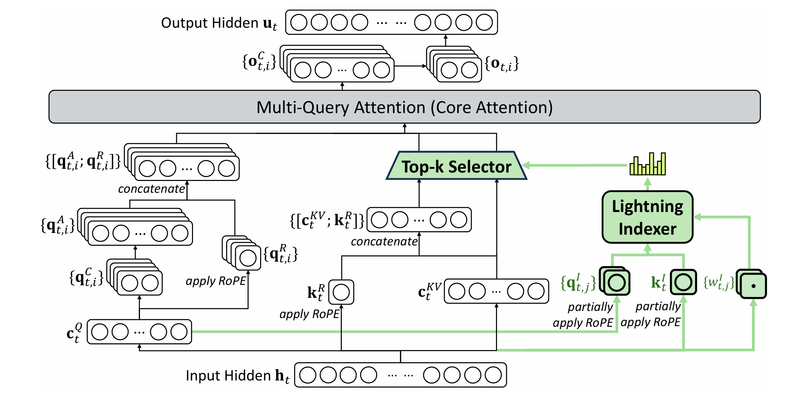

>注：本次作业中所有的用这种环境渲染的内容都是标注，起到辅助阅读的作用，不属于Technical Paper的内容

# DeepSeek-V3.2 架构解析：基于Lightning Indexer的DSA与MoE

**蔡天卓 数31 2023011246**

#### 摘要

DeepSeek-V3.2 是一款以超长上下文推理效率为核心目标的大规模语言模型。其核心创新体现在两条技术主线之上：基于 DeepSeek Sparse Attention (DSA) 的结构化稀疏注意力机制，通过 Lightning Indexer 与 Fine-grained Token Selection，在保持高质量注意力分布的同时，将注意力复杂度从 $O(L^2)$ 降至 $O(Lk)$；继承并强化自 DeepSeek-V2 的 DeepSeekMoE 架构，通过细粒度专家拆分、共享专家隔离与负载均衡机制，在 236B 总参数规模下实现仅 21B 激活参数的高效推理。本文系统性地解析 DeepSeek-V3.2 的模型结构、训练流程与计算复杂度优势，并阐明这些架构创新如何服务于其在长上下文推理与智能体任务中的卓越表现。

## 1. DeepSeek 稀疏注意力（DSA）与Lightning Indexer

>Explain the prototype of DSA, which consists of two main components: a lightning indexer and a fine-grained token selection mechanism.

### 1.1 DSA 的设计动机与总体原型

在标准 Transformer 中，自注意力的计算复杂度随序列长度 $L$ 呈二次增长，具有 $
\mathcal{O}(L^2)$ 复杂度。这在长上下文（如 $10^5$ 级别 token）推理时成为主要瓶颈。DeepSeek Sparse Attention（DSA）的核心思想是：并非所有历史 token 对当前查询 token 都同等重要，因此可以仅对最相关的少量 token 执行完整注意力计算。

DSA 原型由两个紧密耦合的组件构成：Lightning Indexer，一个轻量级、高吞吐的相关性评估模块，用于快速估计查询 token 与历史 token 的重要性；Fine-grained Token Selection，基于 Indexer 分数，仅选取 Top-k 的键值对参与完整注意力计算。这一架构实现了“先粗筛，再精算”的计算结构，将大部分计算从高维注意力空间转移到低成本的索引空间。


<center>图1. Lightning Indexer的实现原理，来自https://arxiv.org/pdf/2512.02556</center>
</br>

>Detail the function of the lightning indexer. Its purpose is to compute an index score \(I_{t,s}\) between a query token \(\mathbf{h}_t\) and preceding tokens \(\mathbf{h}_s\) to determine which tokens should be selected for attention. The score is calculated as:\[I_{t,s} = \sum_{j = 1}^{H^l}w_{t,j}^l\cdot \mathrm{ReLU}\left(\mathbf{q}_{t,j}^l\cdot \mathbf{k}_s^l\right),\] where \(H^l\) is the number of indexer heads, and \(\mathbf{q}_{t,j}^l\) , \(w_{t,j}^l\) , and \(\mathbf{k}_s^l\) are derived from the query and key tokens. ReLU is used for activation to improve throughput.

### 1.2 Lightning Indexer 的功能与数学形式

设第 $l$ 层中，第 $t$ 个查询 token 的隐状态为 $\mathbf{h}_t$，历史中第 $s$ 个 token 的隐状态为 $\mathbf{h}_s$。Lightning Indexer 的目标是计算一个非负索引分数 $I_{t,s}$，用于衡量 $\mathbf{h}_s$ 对 $\mathbf{h}_t$ 的潜在注意力贡献。其定义如下：
$$
I_{t,s}=\sum_{j=1}^{H^l}w_{t,j}^l\cdot\mathrm{ReLU}\left(\mathbf{q}_{t,j}^l\cdot \mathbf{k}_s^l\right),
$$

其中：$H^l$ 是索引器头（index heads）的数量；$\mathbf{q}_{t,j}^l$ 是由查询 token $\mathbf{h}_t$ 投影得到的第 $j$ 个索引查询向量；$\mathbf{k}_s^l$ 是由历史 token $\mathbf{h}_s$ 投影得到的索引键向量；$w_{t,j}^l$ 是与查询相关的可学习权重；$\mathrm{ReLU}(\cdot)$ 用于截断负相关性，强制无关 token 的索引分数为零，保证索引分数的稀疏性与数值稳定性。Lightning Indexer 本质上是一个低秩的注意力近似器，其目标是为后续的 Top-$k$ 选择提供排序。

上述参数的生成思路与代码如下（完整代码详见附录1，对构造函数的分析详见附录1中注释，以下略去）：

#### 1.2.1 Query 构造 + RoPE 编码

该板块的作用是构造最终用于索引的Query。相应的代码如下：

```python
q = self.wq_b(qr)
q = q.view(bsz, seqlen, self.n_heads, self.head_dim)
q_pe, q_nope = torch.split(...)
q_pe = apply_rotary_emb(...)
q = torch.cat(...)
```

`wq_b()`是一个从低维（LoRA低秩维数）到高维（头数×头维数）的线性层。这一版块先通过LoRA B投影得到完整的Q（图1中的 $\mathbf{c}_t^Q$ ），然后reshape成多头格式，接着进一步拆分，一部分参与RoPE（Rotary Position Embedding，在复数空间中旋转 $m\theta$，从而添加上绝对位置信息，参与的部分维数为q_pe），剩下部分不参与。接下来对相应部分应用 RoPE，最后将分开处理的两部分拼接回完整Q。

#### 1.2.2 Key 构造 + RoPE 编码

该板块的作用是构造最终用于索引的Key。相应的代码如下：

```python
k = self.wk(x)
k = self.k_norm(k)
k_pe, k_nope = torch.split(...)
k_pe = apply_rotary_emb(...)
k = torch.cat(...)
```

这一部分与上一部分类似，区别是 Key 是共享的，不像 Q 那样按 head 拆分。

#### 1.2.3 rotate激活 + FP8 + Key Cache 更新

该板块的作用主要是进行一次优化，其中`rotate_activation`的操作是对 Q/K 进行正交旋转，`act_quant`的操作是进行 FP8 量化，从而在低精度下得到更好的效率和效果。相应的代码如下：

```python
q = rotate_activation(q)
k = rotate_activation(k)
q_fp8, q_scale = act_quant(...)
k_fp8, k_scale = act_quant(...)
self.k_cache[:bsz, start_pos:end_pos] = k_fp8
self.k_scale_cache[:bsz, start_pos:end_pos] = k_scale
```

#### 1.2.4 Index Score 计算 + Mask、Top-K 选择与多卡同步

该板块的作用是按照1.2中公式计算Lightning Index $I_{t,s}$，这里Deepseek 独到地对Q和K使用FP8计算精度，对weights使用FP32计算精度，用自定义 CUDA 核 `fp8_index`，保证了Lightning Index的快速计算。最后在需要的情况下进行掩码，对每个 query 选出 top-k key 位置，多卡广播确保一致性。相应的代码如下：

```python
weights = self.weights_proj(x.float()) * self.n_heads ** -0.5
weights = weights.unsqueeze(-1) * q_scale * self.softmax_scale
index_score = fp8_index(...)
if mask is not None:
    index_score += mask
topk_indices = index_score.topk(...)
dist.broadcast(...)
```

这里的 weights 即为 1.2 公式中的 $\mathbf{q}_{t,j}^{l}$

> Describe the fine-grained token selection mechanism. This component retrieves only the key-value entries \(\{\mathbf{c}_s\}\) corresponding to the top-\(k\) index scores. The final attention output \(\mathbf{u}_t\) for token \(\mathbf{h}_t\) is then computed using standard attention on this sparse set:\[\mathbf{u}_t = \mathrm{Attn}(\mathbf{h}_t,\{\mathbf{c}_s\mid I_{t,s}\in \mathrm{Top - k}(I_{t,:})\}).\]

### 1.3 Fine-grained Token Selection 与稀疏注意力计算

在获得索引分数向量 $I_{t,:}$ 后，DSA 仅保留分数最高的 $k$ 个历史 token：
$$
\mathcal{S}_t= \left\{ s \,\middle| \, I_{t,s} \in \mathrm{Top-k}(I_{t,:})\right\}.
$$

随后，仅在这一稀疏子集上执行标准多头注意力，得到最终输出：
$$
\mathbf{u}_t=\mathrm{Attn}\big(\mathbf{h}_t,{\mathbf{c}_s \mid s \in \mathcal{S}_t}\big) = \sum\limits_{s\in \mathcal{S}_t}\alpha_{t,s}v_s,
$$

其中 $\mathbf{c}_s$ 表示对应 token 的键值（Key-Value）缓存，$\alpha_{t,s} = \text{softmax}_{s\in S_t}(\frac{h_t\cdot k_s}{\sqrt{d_k}})$。这一机制保证了注意力计算仍然保持原生 Transformer 的表达能力，同时让推理阶段的主要计算量正比于 $k$ 而非 $L$。详细的实现方式将在1.4中讲解。


>Clarify how DSA is instantiated within the framework of Multi-Head Latent Attention (MLA) (from DeepSeek-V2). For computational efficiency, DSA is implemented based on the Multi-Query Attention (MQA) mode of MLA, where a single latent key-value vector is shared across all query heads.

### 1.4 DSA 在多头潜在注意力（MLA）中的实例化

为了进一步提升效率，DSA 并未直接作用于标准多头注意力（MHA），而是建立在 Multi-head Latent Attention (MLA) 框架之上。MLA 的关键特性是所有查询头共享单一潜在键值表示，键值缓存维度显著降低，同时也适配多查询注意力（MQA）模式。以下详细解释在DSA的思路下MLA是如何实现的：

#### 1.4.1 MLA 类定义和初始化

```python
class MLA(nn.Module):
    def __init__(self, args: ModelArgs):
        super().__init__()
        self.dim = args.dim  # 输入维度
        self.n_heads = args.n_heads  # 注意力头数
        self.n_local_heads = args.n_heads // world_size  # 分布式系统中的本地头数
        
        # 低秩投影参数
        self.q_lora_rank = args.q_lora_rank  # 查询的低秩秩
        self.kv_lora_rank = args.kv_lora_rank  # 键值的低秩秩
        
        # 头维度配置
        self.qk_nope_head_dim = args.qk_nope_head_dim  # 非位置编码的头维度
        self.qk_rope_head_dim = args.qk_rope_head_dim  # RoPE位置编码的头维度
        self.qk_head_dim = args.qk_nope_head_dim + args.qk_rope_head_dim  # 总查询/键维度
        self.v_head_dim = args.v_head_dim  # 值的头维度
```

与传统Transformer的多头注意力不同，MLA通过低秩投影技术显著减少了计算复杂度。在初始化中，首先设置基础参数，包括输入维度、注意力头数，并计算分布式环境下的本地头数（支持模型并行）。低秩投影参数定义了查询和键值的低秩维度，这是MLA能够实现高效计算的关键。之后MLA将查询和键的维度分为两部分：`qk_nope_head_dim`（非位置编码部分）和`qk_rope_head_dim`（旋转位置编码部分），这种处理在Indexer类中已经介绍过，此处就不多赘述。

#### 1.4.2 投影层

```python
        # 查询投影（两阶段低秩投影）
        self.wq_a = Linear(self.dim, self.q_lora_rank)  # 第一阶段：降维
        self.q_norm = RMSNorm(self.q_lora_rank)  # 归一化
        self.wq_b = ColumnParallelLinear(self.q_lora_rank, self.n_heads * self.qk_head_dim)  # 第二阶段：升维
        
        # 键值投影（两阶段低秩投影）
        self.wkv_a = Linear(self.dim, self.kv_lora_rank + self.qk_rope_head_dim)  # 同时生成低秩KV和RoPE键
        self.kv_norm = RMSNorm(self.kv_lora_rank)  # 归一化
        self.wkv_b = ColumnParallelLinear(self.kv_lora_rank,self.n_heads * (self.qk_nope_head_dim + self.v_head_dim))
        
        # 输出投影
        self.wo = RowParallelLinear(self.n_heads * self.v_head_dim, self.dim)
```

对于查询投影，首先通过`wq_a`将高维输入（dim）压缩到低秩空间（q_lora_rank），经过RMSNorm归一化后，再通过`wq_b`将低秩表示扩展到多头注意力的维度。键值投影的设计更加巧妙：`wkv_a`同时生成低秩键值表示和RoPE位置编码键，避免了额外的位置编码计算。投影层还采用了分布式训练支持：`ColumnParallelLinear`将矩阵按列分割到不同GPU，`RowParallelLinear`按行分割，这使得MLA能够有效利用多GPU资源进行模型并行训练。

这种两阶段低秩投影显著减少了注意力计算中的中间维度，从而降低了内存占用和计算复杂度，特别适合处理长序列。

#### 1.4.3 缩放因子和索引器

```python
        # 注意力缩放因子
        self.softmax_scale = self.qk_head_dim ** -0.5  # 标准缩放
        self.scale_fmt = args.scale_fmt
        
        # 长度外推时的缩放调整
        if args.max_seq_len > args.original_seq_len:
            mscale = 0.1 * args.mscale * math.log(args.rope_factor) + 1.0
            self.softmax_scale = self.softmax_scale * mscale * mscale
        
        # 索引器（用于稀疏注意力）
        self.indexer = Indexer(args)
```

接下来MLA采用缩放因子调整，同时使用上文提到的稀疏注意力索引。缩放因子遵循Transformer的标准设计（$\frac{1}{\sqrt{d_k}}$），同时增加了长度外推支持，当推理序列长度超过训练长度时，使用公式`0.1 * args.mscale * math.log(args.rope_factor) + 1.0`进行对数缩放，保证模型在长上下文时的稳定性。然后通过上文的`Indexer`实现稀疏注意力，此处不多赘述。

#### 1.4.4 缓存

```python
        # KV缓存（低秩表示）
        self.register_buffer("kv_cache", 
                           torch.zeros(args.max_batch_size, args.max_seq_len, self.kv_lora_rank),
                           persistent=False)
        
        # 位置编码缓存
        self.register_buffer("pe_cache",
                           torch.zeros(args.max_batch_size, args.max_seq_len, self.qk_rope_head_dim),
                           persistent=False)
        
        # 去量化的权重缓存
        self.dequant_wkv_b = None
```

在缓存部分，MLA创新性地缓存低秩表示，使得缓存大小显著减少（从dim维度减少到kv_lora_rank维度）。缓存分为两个部分：`kv_cache`存储低秩键值表示，`pe_cache`存储旋转位置编码键，通过分离存储保证解码阶段可以灵活组合位置信息。

#### 1.4.5 前向传播 - 输入处理

```python
    def forward(self, x: torch.Tensor, start_pos: int, freqs_cis: torch.Tensor, mask: Optional[torch.Tensor]):
        bsz, seqlen, _ = x.size()
        end_pos = start_pos + seqlen
        
        # 查询处理
        qr = self.q_norm(self.wq_a(x))  # 低秩查询表示
        q = self.wq_b(qr)  # 完整查询
        q = q.view(bsz, seqlen, self.n_local_heads, self.qk_head_dim)
        q_nope, q_pe = torch.split(q, [self.qk_nope_head_dim, self.qk_rope_head_dim], dim=-1)
        q_pe = apply_rotary_emb(q_pe, freqs_cis)  # 应用RoPE
        
        # 键值处理
        kv = self.wkv_a(x)
        kv, k_pe = torch.split(kv, [self.kv_lora_rank, self.qk_rope_head_dim], dim=-1)
        kv = self.kv_norm(kv)
        k_pe = apply_rotary_emb(k_pe.unsqueeze(2), freqs_cis)  # 应用RoPE
        
        # 模拟FP8 KV缓存
        kv_fp8, kv_scale = act_quant(kv, block_size, self.scale_fmt)
        kv = (kv_fp8.view(-1, block_size).float() * kv_scale.view(-1, 1)).to(kv.dtype).view_as(kv)
```

前向传播部分首先计算序列的结束位置，保证正确更新缓存。之后的查询处理先通过低秩投影`wq_a`得到压缩表示`qr`，再通过`wq_b`恢复到多头维度，最后分离出非位置编码部分和位置编码部分。键值处理通过`wkv_a`一次计算同时得到低秩键值表示和RoPE位置键。位置编码通过`apply_rotary_emb`函数应用旋转位置编码到查询和键的位置部分。最后通过`act_quant`函数将低秩键值量化为FP8格式，然后再反量化回原始精度。这样可以在训练阶段模拟推理时FP8缓存的效果，让模型学习适应量化带来的精度损失。

#### 1.4.6 前向传播 - 缓存更新

```python
        # 更新缓存
        self.kv_cache[:bsz, start_pos:end_pos] = kv  # 存储低秩KV
        self.pe_cache[:bsz, start_pos:end_pos] = k_pe.squeeze(2)  # 存储位置编码
```

这里MLA采用缓存低秩表示，带来了显著的内存节省。对于批大小为`bsz`、序列长度为`seqlen`的情况，传统缓存需要存储`bsz × seqlen × n_heads × head_dim`的数据，而MLA只需要存储`bsz × seqlen × kv_lora_rank`的数据，其中`kv_lora_rank`通常远小于`n_heads × head_dim`。然后更新缓存，通过`k_pe.squeeze(2)`操作移除多余的维度（从形状`[bsz, seqlen, 1, qk_rope_head_dim]`变为`[bsz, seqlen, qk_rope_head_dim]`）。这种低秩缓存策略也是为了保证长文本下的内存节省。

#### 1.4.7 前向传播 - 预填充阶段（Prefill）

```python
        if mask is not None:    # MHA预填充
            # 构建完整查询和键
            q = torch.cat([q_nope, q_pe], dim=-1)
            kv = self.wkv_b(kv)  # 完整KV投影
            kv = kv.view(bsz, seqlen, self.n_local_heads, self.qk_nope_head_dim + self.v_head_dim)
            k_nope, v = torch.split(kv, [self.qk_nope_head_dim, self.v_head_dim], dim=-1)
            k = torch.cat([k_nope, k_pe.expand(-1, -1, self.n_local_heads, -1)], dim=-1)
            
            # 计算注意力分数
            scores = torch.einsum("bshd,bthd->bsht", q, k).mul_(self.softmax_scale)
            
            # 应用索引器（稀疏注意力）
            topk_indices = self.indexer(x, qr, start_pos, freqs_cis, mask)
            index_mask = torch.full((bsz, seqlen, seqlen), float("-inf"), device=x.device)
            index_mask = index_mask.scatter_(-1, topk_indices, 0)
            index_mask += mask
            scores += index_mask.unsqueeze(2)
            
            # Softmax和注意力输出
            scores = scores.softmax(dim=-1)
            x = torch.einsum("bsht,bthd->bshd", scores, v)
```

这一部分是Prefill阶段DSA的实现。这一阶段处理完整的输入序列（如用户输入的prompt），因此要使用标准的全注意力计算（MHA）。前半部分通过`wkv_b`将低秩键值表示恢复到完整维度，然后分别构建键的非位置编码部分和位置编码部分这利用了位置编码在多头间共享的特性减少计算量）。后半部分使用`Indexer`根据输入内容动态选择top-k最重要的注意力位置，创建稀疏掩码，同时结合因果掩码（防止关注未来token），形成最终的注意力掩码，通过稀疏化减少长prompt的计算复杂度。

#### 1.4.8 前向传播 - 解码阶段（Decode）

```python
        else:                   # MQA解码
            # 权重量化处理
            if self.dequant_wkv_b is None and self.wkv_b.scale is not None:
                self.dequant_wkv_b = weight_dequant(self.wkv_b.weight, self.wkv_b.scale)
            
            wkv_b = self.wkv_b.weight if self.dequant_wkv_b is None else self.dequant_wkv_b
            wkv_b = wkv_b.view(self.n_local_heads, -1, self.kv_lora_rank)
            
            # 计算注意力分数（使用缓存）
            q_nope = torch.einsum("bshd,hdc->bshc", q_nope, wkv_b[:, :self.qk_nope_head_dim])
            scores = (torch.einsum("bshc,btc->bsht", q_nope, self.kv_cache[:bsz, :end_pos]) +
                     torch.einsum("bshr,btr->bsht", q_pe, self.pe_cache[:bsz, :end_pos])) * self.softmax_scale
            
            # 应用索引器
            topk_indices = self.indexer(x, qr, start_pos, freqs_cis, mask)
            index_mask = torch.full((bsz, 1, end_pos), float("-inf"), device=x.device)
            index_mask = index_mask.scatter_(-1, topk_indices, 0)
            scores += index_mask.unsqueeze(2)
            
            # Softmax和注意力输出
            scores = scores.softmax(dim=-1)
            x = torch.einsum("bsht,btc->bshc", scores, self.kv_cache[:bsz, :end_pos])
            x = torch.einsum("bshc,hdc->bshd", x, wkv_b[:, -self.v_head_dim:])

        # 最终输出投影
        x = self.wo(x.flatten(2))
        return x
```

这一部分是解码阶段（逐token生成）DSA的实现。这里MLA在解码时利用低秩缓存直接在压缩空间计算，同时`scores`的计算也采用了MQA的思想，所有头共用一套键值缓存，从而保证了内存的高效运用，避免了高维张量的大规模运算。最后应用稀疏注意力，掩码形状为`[bsz, 1, end_pos]`（因为解码时只关注当前单个token与历史所有token的关系）。这种设计使得MLA在自回归生成时的计算复杂度从O(n²d)降低到约O(nk + nrd)，其中r是低秩维度，k是稀疏注意力选择的token数。

>Explain the two-stage continued pre-training process used to integrate DSA into the base model (DeepSeek-V3.1-Terminus):
(a) Dense Warm-up Stage: All model parameters are frozen except for the lightning indexer, which is trained for 1000 steps using a KL-divergence loss to align its output distribution with that of the main model's dense attention.
(b) Sparse Training Stage: The fine-grained token selection is activated, and all model parameters are optimized to adapt to the sparse attention pattern. The indexer is trained with a loss calculated only over the selected top-\(k\) tokens.

### 1.5 两阶段持续预训练策略

为了在不破坏原模型能力的前提下引入 DSA，DeepSeek-V3.2 采用了两阶段持续预训练（Continual Pretraining）流程。密集预热阶段通过KL散度对齐，确保新技术与原有能力的平滑衔接；稀疏训练阶段通过全模型微调，实现计算效率与模型性能的最佳平衡。

#### 1.5.1 密集预热阶段（Dense Warm-up）

这一阶段的主要目标是让Lightning Indexer学习模仿原始密集注意力的行为模式，确保在启用稀疏注意力之前，索引器已经具备了合理选择重要token的能力。具体实施方法如下：
1. 参数冻结：冻结基础模型（DeepSeek-V3.1-Terminus）的所有参数，只训练Lightning Indexer的参数，确保基础模型的表征能力不受干扰。

2. 训练目标函数：这一部分训练的损失函数是原始密集注意力的输出分布 $P_{\text{dense}}$ 与基于索引器选择的稀疏注意力的输出分布 $P_{\text{sparse}}$ 之间的KL散度，即 $$\mathcal{L}^I = \sum_t D_{KL}(P_{\text{dense}} \| P_{\text{sparse}}) = \sum_t D_{KL}(p_{t,:}\|\text{Softmax}(I_{t,:}))$$其中KL散度 $D_{KL} (P\|Q)= \int P(x)\cdot \log\left(\frac{P(x)}{Q(x)}\right)\mathrm{d} x$ 衡量了两个概率分布之间的差异。当索引器选择的token子集能够近似重现密集注意力的输出分布时，KL散度最小

3. 训练细节：
   - 训练步数：1000步（相对较少，属于快速预热）
   - 批次大小和序列长度保持与原始预训练一致
   - 使用相同的优化器和学习率调度

经过密集预热阶段后，Lightning Indexer学会了识别对注意力计算关键的token，同时保证稀疏注意力的输出与原始密集注意力高度一致

#### 1.5.2 稀疏训练阶段（Sparse Training）

这一阶段的目标是让整个模型适应稀疏注意力模式，优化所有参数以在稀疏计算环境下保持最佳性能。具体实施方法如下：
1. 参数解冻策略：解除所有模型参数的冻结状态，包括注意力层、前馈网络、嵌入层等所有组件，Lightning Indexer继续训练

2. 细粒度token选择激活：启用完整的动态稀疏注意力机制，对于每个查询，Lightning Indexer选择top-k个最相关的键值对

3. 专门的索引器训练：索引器的损失函数仅基于选定的top-k token计算：$$\mathcal{L}^I = \sum_t D_{KL}(p_{t,\mathcal{S}_t}\|\text{Softmax}(I_{t,\mathcal{S}_t}))$$ 这样索引器被激励选择那些如果被忽略会导致损失显著增加的token。

4. 训练策略调整：使用较低的学习率（通常为原始预训练的10%-50%），使用更长的训练时间（数万到数十万步），同时逐渐增加稀疏度

经过稀疏训练阶段后，模型完全适应了稀疏注意力计算模式，Lightning Indexer的选择准确性大幅提升，模型在保持性能的同时，获得了显著的效率优势

>Discuss the efficiency gains: DSA reduces the core attention complexity from \(O(L^2)\) to \(O(Lk)\) (where \(k \ll L\) ), leading to significant inference speedups for long-context sequences.

### 1.6 复杂度与效率分析

在 Transformer 的自注意力机制中，复杂度主要来源于查询（Query）和键（Key）的交互计算。在序列长度为 $L$、选取 $k \ll L$ 的情况下，对标准注意力而言，对于序列中的每个查询位置 $t$（共 $L$ 个查询），都需要计算该查询与序列中所有 $L$ 个键位置的点积得分，形成注意力权重。因此总计算量为 $L \times L = L^2$ 次。若忽略向量维度 $d$ 的影响，则核心复杂度为 $\mathcal{O}(L^2)$。而 DSA 实现了稀疏化，仅在每个查询与对应的 $k$ 个键之间进行，因此总计算量为 $L \times k$ 次，核心复杂度为 $\mathcal{O}(Lk)$。而 DSA 的额外开销（如Indexer计算）复杂度为 $\mathcal{O}(LH^I)$，通常远低于 $\mathcal{O}(L^2)$，不影响整体优势。因此 DSA 将二次复杂度降为线性，极大地提升了速度，在超长上下文中具有明显优势。

## 2. Mixture-of-Experts 架构（DeepSeekMoE）

>Describe the core principle of the DeepSeekMoE architecture used in DeepSeek-V2, which is a foundational component of the V3 series.

### 2.1 DeepSeekMoE 的基本原理

DeepSeek-V3.2 继承并强化了 DeepSeek-V2 中提出的 DeepSeekMoE 架构。其核心思想是：通过条件计算（Conditional Computation），让不同 token 仅激活模型参数的一个小子集。

DeepSeekMoE架构的核心思想基于一个朴素而深刻的认知：并非所有输入都需要模型的全套能力来处理。传统的密集模型对每个输入都激活所有参数，这在计算资源上存在显著浪费。DeepSeekMoE则将这种"一刀切"的计算模式转变为条件化的智能计算分配。

在技术实现上，模型被划分为多个专家网络，每个专家都是相对独立的前馈神经网络，专门处理特定类型或模式的数据，代码如下：

```python

class Expert(nn.Module):
    def __init__(self, dim: int, inter_dim: int):
        super().__init__()
        self.w1 = Linear(dim, inter_dim)
        self.w2 = Linear(inter_dim, dim)
        self.w3 = Linear(dim, inter_dim)

    def forward(self, x: torch.Tensor) -> torch.Tensor:
        return self.w2((F.silu(self.w1(x).float()) * self.w3(x).float()).type_as(x))
        # 通过训练动态形成Experts的专业性，使得模型能够自适应数据分布，这是相比固定架构的显著优势。
```

与传统MoE不同的是，DeepSeekMoE采用了更加精细和高效的设计策略。对于每个输入token，一个轻量级的门控网络会动态评估其特征，并选择最相关的少数几个专家来参与计算。这种选择性激活机制使得模型总参数量可以达到千亿级别，而实际计算成本仅相当于几十亿参数的密集模型。

DeepSeekMoE的门控系统是其智能性的关键体现。门控网络通常是一个简单的线性层，它将输入的隐状态映射到专家选择概率分布。为了实现更好的效果，DeepSeekMoE在这一部分引入了多项创新技术，比如细粒度专家分割、共享专家隔离、负载均衡机制等，以后会详细介绍。

这里的门控系统由Gate类实现，其实现方式如下：

#### 2.1.1 Gate 初始化

```python
def __init__(self, args: ModelArgs):
    super().__init__()
    self.dim = args.dim
    self.topk = args.n_activated_experts
    self.n_groups = args.n_expert_groups
    self.topk_groups = args.n_limited_groups
    self.score_func = args.score_func
    self.route_scale = args.route_scale
    self.weight = nn.Parameter(torch.empty(args.n_routed_experts, args.dim))
    self.bias = nn.Parameter(torch.empty(args.n_routed_experts, dtype=torch.float32)) if self.dim == 7168 else None
```

1. `self.dim = args.dim` - 保存输入特征的维度，用于后续的形状匹配和计算
2. `self.topk = args.n_activated_experts` - 每个输入激活的专家数量，控制稀疏度
3. `self.n_groups = args.n_expert_groups` - 专家分组数量，用于两级路由机制
4. `self.topk_groups = args.n_limited_groups` - 限制路由的组数，减少计算复杂度
5. `self.score_func = args.score_func` - 评分函数类型（softmax或sigmoid），决定如何计算专家权重
6. `self.route_scale = args.route_scale` - 路由权重缩放因子，控制专家输出的贡献程度
7. `self.weight = nn.Parameter(...)` - 可学习的专家权重矩阵，形状为`[n_routed_experts, dim]`，每个专家有一个dim维的偏好向量
8. `self.bias = nn.Parameter(...) if self.dim == 7168 else None` - 条件偏置项，仅在特定维度(7168)时启用，为专家提供基础优先级

#### 2.1.2 前向传播 - 基础评分

```python
def forward(self, x: torch.Tensor) -> Tuple[torch.Tensor, torch.Tensor]:
    scores = linear(x.float(), self.weight.float())
    if self.score_func == "softmax":
        scores = scores.softmax(dim=-1)
    else:
        scores = scores.sigmoid()
    original_scores = scores
    if self.bias is not None:
        scores = scores + self.bias
```

这一部分的作用是计算每个输入与所有专家的基础匹配分数。首先通过 `linear(x.float(), self.weight.float())` 执行矩阵乘法，将输入x(形状`[batch_size, dim]`)与专家权重(形状`[n_routed_experts, dim]`)相乘，得到形状为`[batch_size, n_routed_experts]`的分数矩阵，每个元素`scores[i,j]`表示第i个输入与第j个专家的匹配度。接下来对原始分数进行归一化处理，当使用softmax时，将每个输入的专家分数转换为概率分布（总和为1）；当使用sigmoid时，每个专家独立计算激活概率（0-1之间）。最后添加条件偏置项，如果启用了偏置（`dim == 7168`），将偏置向量加到分数上。这一偏置可以为每个专家提供基础优先级，可以防止某些专家在路由中被完全忽略。

#### 2.1.3 前向传播 - 分组路由机制

```python
        if self.n_groups > 1:
            scores = scores.view(x.size(0), self.n_groups, -1)
            if self.bias is None:
                group_scores = scores.amax(dim=-1)
            else:
                group_scores = scores.topk(2, dim=-1)[0].sum(dim=-1)
            indices = group_scores.topk(self.topk_groups, dim=-1)[1]
            mask = scores.new_ones(x.size(0), self.n_groups, dtype=bool).scatter_(1, indices, False)
            scores = scores.masked_fill_(mask.unsqueeze(-1), float("-inf")).flatten(1)
```

这一部分的作用是启动分组路由机制（仅在分组数大于1时），先将分数矩阵重塑为三维张量（形状从`[batch_size, n_routed_experts]`变为`[batch_size, n_groups, experts_per_group]`）。然后计算每个组的得分，无偏置情况下取每个组内所有专家的最大分数作为组分数，有偏置情况下取每个组内top2专家的分数之和作为组分数。接着选择每个输入的前`topk_groups`个最高分组（返回的是组索引，形状为`[batch_size, topk_groups]`）。之后创建组掩码以屏蔽未选中的组：先创建全为True的掩码矩阵，形状`[batch_size, n_groups]`，再将选中的组位置设为False，未选中的保持True。最后应用掩码并展平回原始形状。

#### 2.1.4 前向传播 - 专家选择与权重计算

```python
        indices = scores.topk(self.topk, dim=-1)[1]
        weights = original_scores.gather(1, indices)
        if self.score_func == "sigmoid":
            weights /= weights.sum(dim=-1, keepdim=True)
        weights *= self.route_scale
        return weights, indices
```

这一部分首先选择每个输入要激活的专家（返回的是专家索引，形状为`[batch_size, topk]`），然后从原始分数中提取选中专家的权重（形状为`[batch_size, topk]`）。接下来进行sigmoid模式下的权重归一化，使每个输入的所有选中专家权重之和为1。再将所有权重乘以缩放因子，控制MoE层输出的幅度。最后返回路由结果，其中`weights`对应每个选中专家的路由权重；`indices`对应每个选中专家的索引。

>Highlight its key features designed for economical training and efficient inference:
> - Fine-grained Expert Segmentation: Experts are divided into smaller, more numerous units to allow for more specialized and flexible routing.
> - Shared Expert Isolation: A subset of experts is designated as "shared" and is always activated, ensuring stability and retaining common knowledge.
> - Load Balancing Mechanisms: Strategies like auxiliary loss and token-dropping are employed to ensure experts are utilized evenly during training.

### 2.2 关键设计特性

#### 2.2.1 细粒度专家分割

传统 MoE 将整个前馈网络作为一个“专家”，数量有限（例如 8 或 64 个），导致每个专家仍需学习广泛而杂乱的知识，专业化程度不足。对此，DeepSeekMoE 将一个稠密的前馈网络在参数层面进行分割，创建出数量众多的小型专家（以 DeepSeek-V2 为例，其有 64 个专家）。代码如下（整体的代码分析见附录3中的注释）：

```python
class MoE(nn.Module):
    def __init__(self, args: ModelArgs):
        # 专家分割的关键参数
        self.n_routed_experts = args.n_routed_experts  # 64-256
        self.n_local_experts = args.n_routed_experts // world_size
        self.n_activated_experts = args.n_activated_experts  # 2-4
```

在这样的做法下，更多专家可以提供更精细的语义划分，每个令牌能找到更匹配的专家组合，从而提高路由灵活度；同时由于小专家参数少，梯度更新更稳定，不易过拟合，因此训练更稳定；同时更多的小专家也可以保证每个专家的专业性，单个专家的问题也不会影响总体，鲁棒性更强。

#### 2.2.2 共享专家隔离

纯粹的稀疏化存在一个风险——如果每个令牌只激活高度专业化的专家，一些通用、基础的知识和语言建模能力可能会在专家之间“丢失”或变得不一致，即存在知识遗忘或训练不稳定等问题。为此 DeepSeekMoE 固定地将一部分专家（例如，64 个中的 2 个）设置为“共享专家”。对于每一个输入token，无论路由器如何决策，这些共享专家都会被激活：

```python
self.shared_experts = MLP(args.dim, args.n_shared_experts * args.moe_inter_dim, reduce_output=False)

def forward(self, x):
    y = ...  # 稀疏专家计算结果
    y += self.shared_experts(x)  # 共享专家始终激活
    return y
```

共享专家作为常驻计算单元，可以提供一个始终存在的“知识基底”，确保了模型的稳定性和通用能力，防止知识遗忘。当稀疏专家的路由还不稳定时，共享专家也可以承担主要计算任务，避免训练初期的不稳定。同时，激活共享专家增加的参数量远小于激活一个大型专家，却换来了显著的性能提升和训练稳定性，效率更高。

#### 2.2.3 负载均衡机制

```python
def forward(self, x: torch.Tensor) -> torch.Tensor:
    # 门控网络产生的路由结果
    weights, indices = self.gate(x)
    
    # 统计每个专家的负载
    counts = torch.bincount(indices.flatten(), minlength=self.n_routed_experts).tolist()
    
    # 分布式环境下的本地计算
    for i in range(self.experts_start_idx, self.experts_end_idx):
        if counts[i] == 0:
            continue  # 跳过未被选中的专家
        expert = self.experts[i]
        idx, top = torch.where(indices == i)
        y[idx] += expert(x[idx]) * weights[idx, top, None]
    
    # 跨设备结果聚合
    if world_size > 1:
        dist.all_reduce(y)
```

在 MoE 训练中，路由器容易陷入“赢者通吃”的困境，即少数几个专家处理了绝大多数token，而其他专家得不到充分训练（专家僵化）。对此，DeepSeekMoE 采取了以下措施：
* 辅助负载均衡损失：在训练损失函数中增加一项，专门惩罚token在不同专家间分布不均的情况，鼓励路由器更平均地利用所有专家：
```python
# 伪代码：负载均衡损失
def load_balancing_loss(expert_loads, router_probs):
    # 专家负载的方差损失
    load_variance = torch.var(expert_loads.float())
    # 路由器概率的熵损失
    router_entropy = -torch.sum(router_probs * torch.log(router_probs + 1e-9))
    return load_variance + 0.01 * router_entropy
```
* token丢弃与容量因子：设置专家处理token的容量上限，并引入轻微的随机性（如令牌丢弃），防止路由器总是将令牌硬塞给最热门的专家，迫使流量向未被充分利用的专家分散。

>Specify the scale: DeepSeek-V2 has 236B total parameters but activates only 21B per token, dramatically reducing computational costs during inference compared to dense models of similar total size.

### 2.3 规模与计算效率

以 DeepSeek-V2 为例，其总参数量为236B，每 token 激活参数量约 21B（每次前向传播，每个令牌仅激活约 210亿参数）。这种“大模型容量、小推理开销”的特性实现了Deepseek的经济性：训练时虽然总参数很大，但由于稀疏激活，每次迭代所需的计算量（FLOPs）和显存（仅需加载激活的专家）远小于同等规模的稠密模型；推理时实际需要加载到 GPU 显存和进行计算的参数大大减少，这使得部署如此大规模的模型成为可能，并且延迟和吞吐量接近一个 21B 的稠密模型，却拥有远胜于后者的性能。

>Explain how this MoE design, combined with MLA, enables DeepSeek models to achieve top-tier performance while maintaining high training and inference efficiency.

### 2.4 MoE 与 MLA 的协同效应

DeepSeek 系列模型将MoE架构与MLA注意力机制深度结合：MoE 降低前馈网络（FFN）计算成本，在模型宽度（FFN 维度）上实现稀疏化，以极低的计算成本扩展了模型的知识容量和表达能力；MLA 降低注意力与 KV 缓存开销，在序列长度维度上优化了注意力计算，通过分组查询注意力和滑动窗口等技术，在极低的内存和计算开销下支持超长的上下文（如 128K tokens）。最终的效果是，DeepSeekMoE 解决了模型参数巨大导致计算昂贵的问题，而 MLA 解决了上下文超长导致注意力计算爆炸的问题。这使得 DeepSeek 模型能够在保持训练和推理的高效性（更少的计算资源、更快的速度、更低的成本）的同时，在知识容量、长上下文理解、复杂任务处理等方面达到顶级性能。


## 附录1：Indexer 类代码

```python
class Indexer(torch.nn.Module):
     def __init__(self, args: ModelArgs): 
        super().__init__()
        self.dim: int = args.dim
        self.n_heads: int = args.index_n_heads  # 索引头的总数
        self.n_local_heads = args.index_n_heads // world_size  # 每个GPU上的本地头数
        self.head_dim: int = args.index_head_dim  # 每个头的维度
        self.rope_head_dim: int = args.qk_rope_head_dim  # 应用RoPE的头的维度
        self.index_topk: int = args.index_topk  # top-k数量
        self.q_lora_rank: int = args.q_lora_rank  # 查询向量的LoRA低秩维度
        self.wq_b = Linear(self.q_lora_rank, self.n_heads * self.head_dim)  # 查询投影层
        self.wk = Linear(self.dim, self.head_dim)  # 键投影层
        self.k_norm = LayerNorm(self.head_dim)  # 键向量的层归一化
        # 权重投影层，用于生成注意力权重，使用fp32精度以便计算
        self.weights_proj = Linear(self.dim, self.n_heads, dtype=torch.float32)
        self.softmax_scale = self.head_dim ** -0.5  # softmax缩放因子，1/√d_k
        self.scale_fmt = args.scale_fmt  # 量化缩放因子的格式


    def forward(self, x: torch.Tensor, qr: torch.Tensor, start_pos: int, freqs_cis: torch.Tensor, mask: Optional[torch.Tensor]):
        bsz, seqlen, _ = x.size()
        end_pos = start_pos + seqlen
        q = self.wq_b(qr)
        q = q.view(bsz, seqlen, self.n_heads, self.head_dim)
        q_pe, q_nope = torch.split(q, [self.rope_head_dim, self.head_dim - self.rope_head_dim], dim=-1)
        # rope in indexer is not interleaved
        q_pe = apply_rotary_emb(q_pe, freqs_cis, False)
        q = torch.cat([q_pe, q_nope], dim=-1)
        k = self.wk(x)
        k = self.k_norm(k)
        k_pe, k_nope = torch.split(k, [self.rope_head_dim, self.head_dim - self.rope_head_dim], dim=-1)
        # rope in indexer is not interleaved
        k_pe = apply_rotary_emb(k_pe.unsqueeze(2), freqs_cis, False).squeeze(2)
        k = torch.cat([k_pe, k_nope], dim=-1)
        q = rotate_activation(q)
        k = rotate_activation(k)
        q_fp8, q_scale = act_quant(q, block_size, self.scale_fmt)
        k_fp8, k_scale = act_quant(k, block_size, self.scale_fmt)
        self.k_cache[:bsz, start_pos:end_pos] = k_fp8
        self.k_scale_cache[:bsz, start_pos:end_pos] = k_scale
        weights = self.weights_proj(x.float()) * self.n_heads ** -0.5
        weights = weights.unsqueeze(-1) * q_scale * self.softmax_scale
        index_score = fp8_index(q_fp8.contiguous(), weights, self.k_cache[:bsz, :end_pos].contiguous(), self.k_scale_cache[:bsz, :end_pos].contiguous())
        if mask is not None:
            index_score += mask
        topk_indices = index_score.topk(min(self.index_topk, end_pos), dim=-1)[1]
        topk_indices_ = topk_indices.clone()
        dist.broadcast(topk_indices_, src=0)
        assert torch.all(topk_indices == topk_indices_), f"{topk_indices=} {topk_indices_=}"
        return topk_indices
```

## 附录2：MLA 类代码

```python
class MLA(nn.Module):
    """
    Multi-Head Latent Attention (MLA) Layer.

    Attributes:
        dim (int): Dimensionality of the input features.
        n_heads (int): Number of attention heads.
        n_local_heads (int): Number of local attention heads for distributed systems.
        q_lora_rank (int): Rank for low-rank query projection.
        kv_lora_rank (int): Rank for low-rank key/value projection.
        qk_nope_head_dim (int): Dimensionality of non-positional query/key projections.
        qk_rope_head_dim (int): Dimensionality of rotary-positional query/key projections.
        qk_head_dim (int): Total dimensionality of query/key projections.
        v_head_dim (int): Dimensionality of value projections.
        softmax_scale (float): Scaling factor for softmax in attention computation.
    """
    def __init__(self, args: ModelArgs):
        super().__init__()
        self.dim = args.dim
        self.n_heads = args.n_heads
        self.n_local_heads = args.n_heads // world_size
        self.q_lora_rank = args.q_lora_rank
        self.kv_lora_rank = args.kv_lora_rank
        self.qk_nope_head_dim = args.qk_nope_head_dim
        self.qk_rope_head_dim = args.qk_rope_head_dim
        self.qk_head_dim = args.qk_nope_head_dim + args.qk_rope_head_dim
        self.v_head_dim = args.v_head_dim

        self.wq_a = Linear(self.dim, self.q_lora_rank)
        self.q_norm = RMSNorm(self.q_lora_rank)
        self.wq_b = ColumnParallelLinear(self.q_lora_rank, self.n_heads * self.qk_head_dim)
        self.wkv_a = Linear(self.dim, self.kv_lora_rank + self.qk_rope_head_dim)
        self.kv_norm = RMSNorm(self.kv_lora_rank)
        self.wkv_b = ColumnParallelLinear(self.kv_lora_rank, self.n_heads * (self.qk_nope_head_dim + self.v_head_dim))
        self.wo = RowParallelLinear(self.n_heads * self.v_head_dim, self.dim)
        self.softmax_scale = self.qk_head_dim ** -0.5
        self.scale_fmt = args.scale_fmt
        if args.max_seq_len > args.original_seq_len:
            mscale = 0.1 * args.mscale * math.log(args.rope_factor) + 1.0
            self.softmax_scale = self.softmax_scale * mscale * mscale

        self.indexer = Indexer(args)

        self.register_buffer("kv_cache", torch.zeros(args.max_batch_size, args.max_seq_len, self.kv_lora_rank), persistent=False)
        self.register_buffer("pe_cache", torch.zeros(args.max_batch_size, args.max_seq_len, self.qk_rope_head_dim), persistent=False)
        self.dequant_wkv_b = None

    def forward(self, x: torch.Tensor, start_pos: int, freqs_cis: torch.Tensor, mask: Optional[torch.Tensor]):
        """
        Forward pass for the Multi-Head Latent Attention (MLA) Layer.

        Args:
            x (torch.Tensor): Input tensor of shape (batch_size, seq_len, dim).
            start_pos (int): Starting position in the sequence for caching.
            freqs_cis (torch.Tensor): Precomputed complex exponential values for rotary embeddings.
            mask (Optional[torch.Tensor]): Mask tensor to exclude certain positions from attention.

        Returns:
            torch.Tensor: Output tensor with the same shape as the input.
        """
        bsz, seqlen, _ = x.size()
        end_pos = start_pos + seqlen
        qr = self.q_norm(self.wq_a(x))
        q = self.wq_b(qr)
        q = q.view(bsz, seqlen, self.n_local_heads, self.qk_head_dim)
        q_nope, q_pe = torch.split(q, [self.qk_nope_head_dim, self.qk_rope_head_dim], dim=-1)
        q_pe = apply_rotary_emb(q_pe, freqs_cis)
        kv = self.wkv_a(x)
        kv, k_pe = torch.split(kv, [self.kv_lora_rank, self.qk_rope_head_dim], dim=-1)
        kv = self.kv_norm(kv)
        k_pe = apply_rotary_emb(k_pe.unsqueeze(2), freqs_cis)
        # we use fp8 kv cache in actual deployment, so here we simulate the precision by casting kv to fp8 and then back to bf16.
        kv_fp8, kv_scale = act_quant(kv, block_size, self.scale_fmt)
        kv = (kv_fp8.view(-1, block_size).float() * kv_scale.view(-1, 1)).to(kv.dtype).view_as(kv)
        self.kv_cache[:bsz, start_pos:end_pos] = kv
        self.pe_cache[:bsz, start_pos:end_pos] = k_pe.squeeze(2)
        if mask is not None:    # MHA prefill
            q = torch.cat([q_nope, q_pe], dim=-1)
            kv = self.wkv_b(kv)
            kv = kv.view(bsz, seqlen, self.n_local_heads, self.qk_nope_head_dim + self.v_head_dim)
            k_nope, v = torch.split(kv, [self.qk_nope_head_dim, self.v_head_dim], dim=-1)
            k = torch.cat([k_nope, k_pe.expand(-1, -1, self.n_local_heads, -1)], dim=-1)
            scores = torch.einsum("bshd,bthd->bsht", q, k).mul_(self.softmax_scale)

            # indexer
            topk_indices = self.indexer(x, qr, start_pos, freqs_cis, mask)
            index_mask = torch.full((bsz, seqlen, seqlen), float("-inf"), device=x.device).scatter_(-1, topk_indices, 0)
            index_mask += mask
            scores += index_mask.unsqueeze(2)

            scores = scores.softmax(dim=-1)
            x = torch.einsum("bsht,bthd->bshd", scores, v)
        else:                   # MQA decode
            if self.dequant_wkv_b is None and self.wkv_b.scale is not None:
                self.dequant_wkv_b = weight_dequant(self.wkv_b.weight, self.wkv_b.scale)
            wkv_b = self.wkv_b.weight if self.dequant_wkv_b is None else self.dequant_wkv_b
            wkv_b = wkv_b.view(self.n_local_heads, -1, self.kv_lora_rank)
            q_nope = torch.einsum("bshd,hdc->bshc", q_nope, wkv_b[:, :self.qk_nope_head_dim])
            scores = (torch.einsum("bshc,btc->bsht", q_nope, self.kv_cache[:bsz, :end_pos]) +
                      torch.einsum("bshr,btr->bsht", q_pe, self.pe_cache[:bsz, :end_pos])) * self.softmax_scale

            # indexer
            topk_indices = self.indexer(x, qr, start_pos, freqs_cis, mask)
            index_mask = torch.full((bsz, 1, end_pos), float("-inf"), device=x.device).scatter_(-1, topk_indices, 0)
            scores += index_mask.unsqueeze(2)

            scores = scores.softmax(dim=-1)
            x = torch.einsum("bsht,btc->bshc", scores, self.kv_cache[:bsz, :end_pos])
            x = torch.einsum("bshc,hdc->bshd", x, wkv_b[:, -self.v_head_dim:])
        x = self.wo(x.flatten(2))
        return x
```

## 附录3：Gate, Expert, MoE 类代码

```python
class Gate(nn.Module):
    """
    Gating mechanism for routing inputs in a mixture-of-experts (MoE) model.

    Attributes:
        dim (int): Dimensionality of input features.
        topk (int): Number of top experts activated for each input.
        n_groups (int): Number of groups for routing.
        topk_groups (int): Number of groups to route inputs to.
        score_func (str): Scoring function ('softmax' or 'sigmoid').
        route_scale (float): Scaling factor for routing weights.
        weight (torch.nn.Parameter): Learnable weights for the gate.
        bias (Optional[torch.nn.Parameter]): Optional bias term for the gate.
    """
    def __init__(self, args: ModelArgs):
        """
        Initializes the Gate module.

        Args:
            args (ModelArgs): Model arguments containing gating parameters.
        """
        super().__init__()
        self.dim = args.dim
        self.topk = args.n_activated_experts
        self.n_groups = args.n_expert_groups
        self.topk_groups = args.n_limited_groups
        self.score_func = args.score_func
        self.route_scale = args.route_scale
        self.weight = nn.Parameter(torch.empty(args.n_routed_experts, args.dim))
        self.bias = nn.Parameter(torch.empty(args.n_routed_experts, dtype=torch.float32)) if self.dim == 7168 else None

    def forward(self, x: torch.Tensor) -> Tuple[torch.Tensor, torch.Tensor]:
        """
        Forward pass for the gating mechanism.

        Args:
            x (torch.Tensor): Input tensor.

        Returns:
            Tuple[torch.Tensor, torch.Tensor]: Routing weights and selected expert indices.
        """
        scores = linear(x.float(), self.weight.float())
        if self.score_func == "softmax":
            scores = scores.softmax(dim=-1)
        else:
            scores = scores.sigmoid()
        original_scores = scores
        if self.bias is not None:
            scores = scores + self.bias
        if self.n_groups > 1:
            scores = scores.view(x.size(0), self.n_groups, -1)
            if self.bias is None:
                group_scores = scores.amax(dim=-1)
            else:
                group_scores = scores.topk(2, dim=-1)[0].sum(dim=-1)
            indices = group_scores.topk(self.topk_groups, dim=-1)[1]
            mask = scores.new_ones(x.size(0), self.n_groups, dtype=bool).scatter_(1, indices, False)
            scores = scores.masked_fill_(mask.unsqueeze(-1), float("-inf")).flatten(1)
        indices = scores.topk(self.topk, dim=-1)[1]
        weights = original_scores.gather(1, indices)
        if self.score_func == "sigmoid":
            weights /= weights.sum(dim=-1, keepdim=True)
        weights *= self.route_scale
        return weights, indices


class Expert(nn.Module):
    """
    Expert layer for Mixture-of-Experts (MoE) models.

    Attributes:
        w1 (nn.Module): Linear layer for input-to-hidden transformation.
        w2 (nn.Module): Linear layer for hidden-to-output transformation.
        w3 (nn.Module): Additional linear layer for feature transformation.
    """
    def __init__(self, dim: int, inter_dim: int):
        """
        Initializes the Expert layer.

        Args:
            dim (int): Input and output dimensionality.
            inter_dim (int): Hidden layer dimensionality.
        """
        super().__init__()
        self.w1 = Linear(dim, inter_dim)
        self.w2 = Linear(inter_dim, dim)
        self.w3 = Linear(dim, inter_dim)

    def forward(self, x: torch.Tensor) -> torch.Tensor:
        """
        Forward pass for the Expert layer.

        Args:
            x (torch.Tensor): Input tensor.

        Returns:
            torch.Tensor: Output tensor after expert computation.
        """
        return self.w2((F.silu(self.w1(x).float()) * self.w3(x).float()).type_as(x))


class MoE(nn.Module):
    """
    Mixture-of-Experts (MoE) module.

    Attributes:
        dim (int): Dimensionality of input features.
        n_routed_experts (int): Total number of experts in the model.
        n_local_experts (int): Number of experts handled locally in distributed systems.
        n_activated_experts (int): Number of experts activated for each input.
        gate (nn.Module): Gating mechanism to route inputs to experts.
        experts (nn.ModuleList): List of expert modules.
        shared_experts (nn.Module): Shared experts applied to all inputs.
    """
    def __init__(self, args: ModelArgs):
        """
        Initializes the MoE module.

        Args:
            args (ModelArgs): Model arguments containing MoE parameters.
        """
        super().__init__()
        self.dim = args.dim
        # 分布式专家分配：确保专家总数能被世界大小整除
        assert args.n_routed_experts % world_size == 0, f"Number of experts must be divisible by world size (world_size={world_size})"
        self.n_routed_experts = args.n_routed_experts
        self.n_local_experts = args.n_routed_experts // world_size
        self.n_activated_experts = args.n_activated_experts
        # 分布式计算：每个GPU只负责一部分专家
        self.experts_start_idx = rank * self.n_local_experts
        self.experts_end_idx = self.experts_start_idx + self.n_local_experts
        self.gate = Gate(args)
        # 专家列表：每个GPU只实例化自己负责的专家
        self.experts = nn.ModuleList([Expert(args.dim, args.moe_inter_dim) if self.experts_start_idx <= i < self.experts_end_idx else None
                                      for i in range(self.n_routed_experts)])
        # 共享专家：始终激活，确保稳定性
        self.shared_experts = MLP(args.dim, args.n_shared_experts * args.moe_inter_dim, reduce_output=False)

    def forward(self, x: torch.Tensor) -> torch.Tensor:
    shape = x.size()
    x = x.view(-1, self.dim)  # 展平为 (batch*seq_len, dim)
    
    # 1. 路由决策：获取权重和专家索引
    weights, indices = self.gate(x)
    
    # 2. 初始化输出张量
    y = torch.zeros_like(x, dtype=torch.float32)
    
    # 3. 统计每个专家被选中的次数（用于负载均衡监控）
    counts = torch.bincount(indices.flatten(), minlength=self.n_routed_experts).tolist()
    
    # 4. 稀疏激活：只处理本地GPU负责的专家
    for i in range(self.experts_start_idx, self.experts_end_idx):
        if counts[i] == 0:  # 该专家未被选中，跳过
            continue
        expert = self.experts[i]
        idx, top = torch.where(indices == i)  # 找出选中该专家的token位置
        y[idx] += expert(x[idx]) * weights[idx, top, None]  # 加权求和
    
    # 5. 添加共享专家输出（始终激活）
    y += self.shared_experts(x)
    
    # 6. 分布式通信：聚合所有GPU的计算结果
    if world_size > 1:
        dist.all_reduce(y)
    
    return y.type_as(x).view(shape)
```
