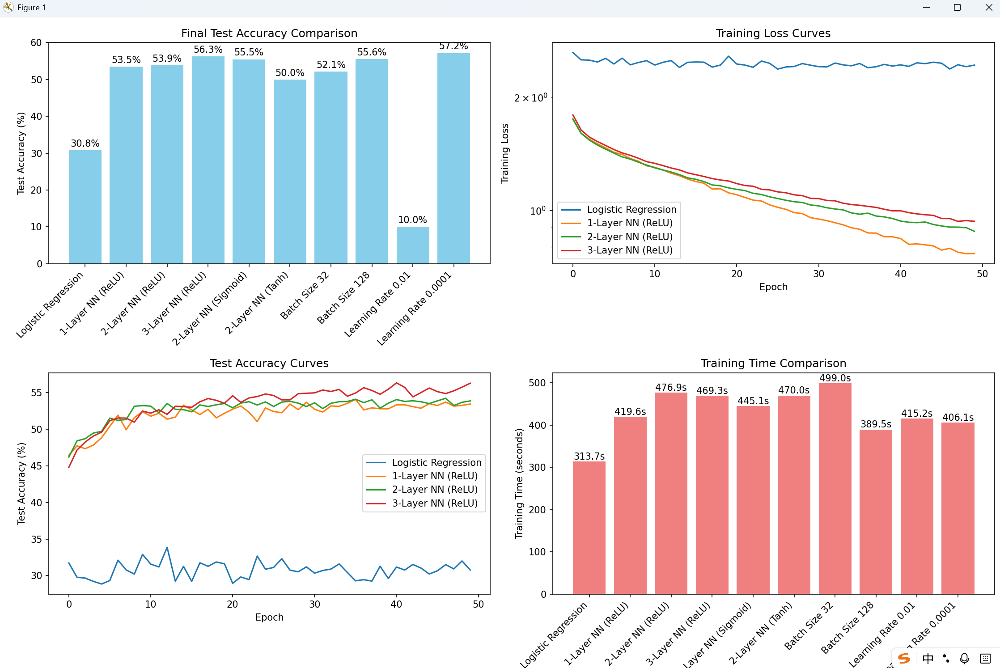

## 1 岭回归
考虑在参数向量 \(w\) 上使用高斯先验且正则化参数为 \(\lambda\geq 0\) 的岭回归。给定数据点 \((x_{1},y_{1}),\ldots,(x_{N},y_{N})\)，其中每个 \(x_{i}\) 是一个 \(D\) 维向量：
(a) 计算参数 \(\omega\) 的精确解，使用贝叶斯估计中最大后验概率对应的损失函数。

### **Solution**

岭回归的损失函数:$E(w; D, \lambda) = \sum_{n=1}^{N} (y_n - w^T x_n)^2 + \lambda \|w\|_2^2$.设:
$$X := \begin{bmatrix}x_1 \\ \vdots \\ x_n \end{bmatrix}\in \mathbb{R}^{N\times D},Y := \begin{bmatrix}y_1\\ 
\vdots\\ y_n \end{bmatrix}\in \mathbb{R}^{N}$$
此时
$$
E(w; D, \lambda) = (Y - X w)^T (Y - X w) + \lambda w^T w
$$
对$w$求导并令其为零:$\nabla_w J(w) = -2 X^T (Y - X w) + 2 \lambda w = 0$,所以:$X^T (Y - X w) = \lambda w$,所以:$X^T Y - X^T X w = \lambda w$,所以:$X^T Y = (X^T X + \lambda I) w$
故岭回归的 MAP 解（精确解）为:$\hat{w} = (X^T X + \lambda I)^{-1} X^T Y$

---

## 2 神经网络分析
考虑以下神经网络：
(a) 计算每个隐藏层神经元和输出层神经元的预激活值和激活值。
(b) 给定一个数据点 \((\vec{x},t)\)，计算均方误差损失。
(c) 计算每个神经元的误差项（使用 MSE 损失）。
(d) 计算网络中每个参数的梯度。

### **Solution**
(a) 
$$
a_{h1} = w_{11} x_1 + w_{21} x_2 + b_{h1} b_1,z_{h1} = h_1(a_{h1})
$$

$$
a_{h2} = w_{12} x_1 + w_{22} x_2 + b_{h2} b_1,z_{h2} = h_2(a_{h2})
$$

$$
a_o = w_{31} z_{h1} + w_{32} z_{h2} + b_o b_2,z_o = y(a_o)
$$

(b)均方误差:$L(\hat y,t) = \big(\hat y - t\big)^2$,其中$\hat y = z_o$,代入(a)中结果,$L = \Big(y(a_o) - t\big)^2 = \big(y\big(w_{31} h_1(w_{11} x_1 + w_{21} x_2 + b_{h1} b_1) + w_{32} h_2(w_{12} x_1 + w_{22} x_2 + b_{h2} b_1) + b_o b_2\big) - t\Big)^2$


(c)
对于角标y,$\delta_y = \frac{\partial L}{\partial a_y}$,对于输出层,
$$
\delta_o = \frac{\partial L}{\partial a_o}
= \frac{\partial L}{\partial z_o}\cdot \frac{\partial z_o}{\partial a_o}
= 2(z_o - t) y'(a_o).
$$
对于隐藏层,
$$
\delta_{h1} = \frac{\partial L}{\partial a_{h1}}
= \frac{\partial L}{\partial a_o}\cdot\frac{\partial a_o}{\partial z_{h1}}\cdot\frac{\partial z_{h1}}{\partial a_{h1}}
= \delta_o \cdot w_{31} \cdot h_1'(a_{h1}).
$$
同理
$$
\delta_{h2} = \delta_o \cdot w_{32} \cdot h_2'(a_{h2}).
$$

(d)
$$
\frac{\partial L}{\partial w_{31}} = \delta_o \cdot z_{h1}\qquad
\frac{\partial L}{\partial w_{32}} = \delta_o \cdot z_{h2}\qquad
\frac{\partial L}{\partial b_o} = \delta_o \cdot 1 = \delta_o
$$

$$
\frac{\partial L}{\partial w_{11}} = \delta_{h1}\cdot x_1\qquad
\frac{\partial L}{\partial w_{21}} = \delta_{h1}\cdot x_2\qquad
\frac{\partial L}{\partial w_{12}} = \delta_{h2}\cdot x_1\qquad
\frac{\partial L}{\partial w_{22}} = \delta_{h2}\cdot x_2
$$

$$
\frac{\partial L}{\partial b_{h1}} = \delta_{h1},\qquad
\frac{\partial L}{\partial b_{h2}} = \delta_{h2}.
$$

---

## 3 分类神经网络
考虑以下用于分类的神经网络：

(a) 计算每个隐藏层神经元和输出层神经元的预激活值和激活值。
(b) 使用 softmax 函数计算输出概率。
(c) 给定一个数据点 \((x,t)\)，计算交叉熵损失。
(d) 使用随机生成的数据点（4 个样本）和初始权重，学习率 \(\eta=0.001\)，计算五个训练步骤后的权重更新值。
### **Solution**

(a)
对于隐藏层,
$$
a^{(1)}_j = w^{(1)}_{j1}x_1 + w^{(1)}_{j2}x_2 + b_h, \quad j=1,2, \quad z^{(1)}_j = h_j(a^{(1)}_j)
$$
对于输出层,
$$
a^{(2)}_k = w^{(2)}_{k1}z^{(1)}_1 + w^{(2)}_{k2}z^{(1)}_2 + b_o, \quad k=1,2,3 \quad z^{(2)}_k = y_k(a^{(2)}_k)
$$
对于分类神经网络而言,$y_k$通常取softmax函数

(b)
$$
p_k = \frac{e^{a_k^{(2)}}}{\sum_{m=1}^3 e^{a^{(2)}_m}}
$$

(c)
若$t = (t_1, t_2, t_3)$,
$$
L = - \sum_{k=1}^3 t_k \log p_k = - \sum_{k=1}^3 t_k \log \frac{e^{a_k^{(2)}}}{\sum_{m=1}^3 e^{a^{(2)}_m}} 
$$

(d)
运行附件中的```ML-HW2-T3.py```,运行结果如下.该结果说明,该模拟合模型并不是一个好的模型

```
输入层->隐藏层权重:
 tensor([[0.1000, 0.2000, 0.3000],
        [0.4000, 0.5000, 0.6000]])
隐藏层->输出层权重:
 tensor([[0.7000, 0.8000, 0.9000],
        [1.0000, 1.1000, 1.2000],
        [1.3000, 1.4000, 1.5000]])

训练数据:
输入 X (x1, x2):
 tensor([[-0.3950, -0.0862],
        [-0.2278, -0.9520],
        [ 1.4946,  0.3161],
        [ 0.7009,  0.0694]])
目标 y (y1, y2, y3):
 tensor([[-1.0586, -0.6861,  0.7917],
        [-0.4262,  0.9636, -0.4745],
        [ 1.6127,  1.2553,  2.0991],
        [ 2.1587, -0.2273,  0.7859]])

开始训练...

=== 步骤 1 ===
损失: 4.120886
输入层->隐藏层权重:
tensor([[0.0990, 0.1998, 0.3002],
        [0.3990, 0.4999, 0.6003]])
隐藏层->输出层权重:
tensor([[0.6993, 0.7996, 0.8996],
        [0.9987, 1.0993, 1.1992],
        [1.2986, 1.3993, 1.4992]])

第一次迭代的梯度:
输入层->隐藏层权重梯度:
tensor([[ 1.0004,  0.1778, -0.2383],
        [ 1.0045,  0.1014, -0.2736]])
隐藏层->输出层权重梯度:
tensor([[0.7362, 0.3515, 0.3650],
        [1.3285, 0.7104, 0.8210],
        [1.4411, 0.7416, 0.8319]])

=== 步骤 2 ===
损失: 4.105270
输入层->隐藏层权重:
tensor([[0.0980, 0.1996, 0.3005],
        [0.3980, 0.4998, 0.6005]])
隐藏层->输出层权重:
tensor([[0.6985, 0.7993, 0.8993],
        [0.9973, 1.0986, 1.1984],
        [1.2971, 1.3985, 1.4983]])

=== 步骤 3 ===
损失: 4.089734
输入层->隐藏层权重:
tensor([[0.0970, 0.1995, 0.3007],
        [0.3970, 0.4997, 0.6008]])
隐藏层->输出层权重:
tensor([[0.6978, 0.7989, 0.8989],
        [0.9960, 1.0979, 1.1975],
        [1.2957, 1.3978, 1.4975]])

=== 步骤 4 ===
损失: 4.074281
输入层->隐藏层权重:
tensor([[0.0960, 0.1993, 0.3009],
        [0.3960, 0.4996, 0.6011]])
隐藏层->输出层权重:
tensor([[0.6971, 0.7986, 0.8985],
        [0.9947, 1.0972, 1.1967],
        [1.2943, 1.3970, 1.4967]])

=== 步骤 5 ===
损失: 4.058911
输入层->隐藏层权重:
tensor([[0.0950, 0.1991, 0.3012],
        [0.3950, 0.4995, 0.6014]])
隐藏层->输出层权重:
tensor([[0.6963, 0.7983, 0.8982],
        [0.9934, 1.0965, 1.1959],
        [1.2928, 1.3963, 1.4959]])

训练完成!

最终预测结果:
tensor([[1.5696, 2.1710, 2.7792],
        [1.4268, 1.9790, 2.5377],
        [1.8962, 2.6100, 3.3313],
        [1.7578, 2.4238, 3.0971]])

目标值:
tensor([[-1.0586, -0.6861,  0.7917],
        [-0.4262,  0.9636, -0.4745],
        [ 1.6127,  1.2553,  2.0991],
        [ 2.1587, -0.2273,  0.7859]])
```

---

## 4. 编程任务

使用 PyTorch 实现神经网络和逻辑回归，并在 CIFAR-10 数据集上进行分类比较。

数据集：https://docs.pytorch.org/vision/main/generated/torchvision.datasets.CIFAR10.html#torchvision.datasets.CIFAR10

优化以下超参数以达到最佳测试准确率：
*   网络架构（隐藏层数、每层节点数、激活函数）
*   批次大小
*   训练周期数
*   学习率

总结这些参数如何影响模型性能。

### **Solution**
经过多次调试,我们找到了这样一组参数认为是较好的:
```
'hidden_sizes': [1024, 512, 256],
'batch_size': 64,
'learning_rate': 0.0005,
'num_epochs': 200,
'activation': 'ReLU',
```
参数对模型性能的影响:
1. 网络架构:神经网络层数越多,隐藏层数与节点数越多,准确率越高.

2. 激活函数影响:ReLU的性能最佳，训练速度也较快;Tanh性能中等;Sigmoid介于二者中间

3. 批大小影响:批大小较小时,训练更稳定但速度较慢;批大小较大时,训练更快但结果较差

4. 学习率影响:学习率较高时收敛性较差;学习率较低时收敛稳定但速度较慢

代码见附件,图片如下:

