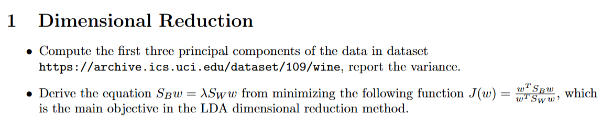
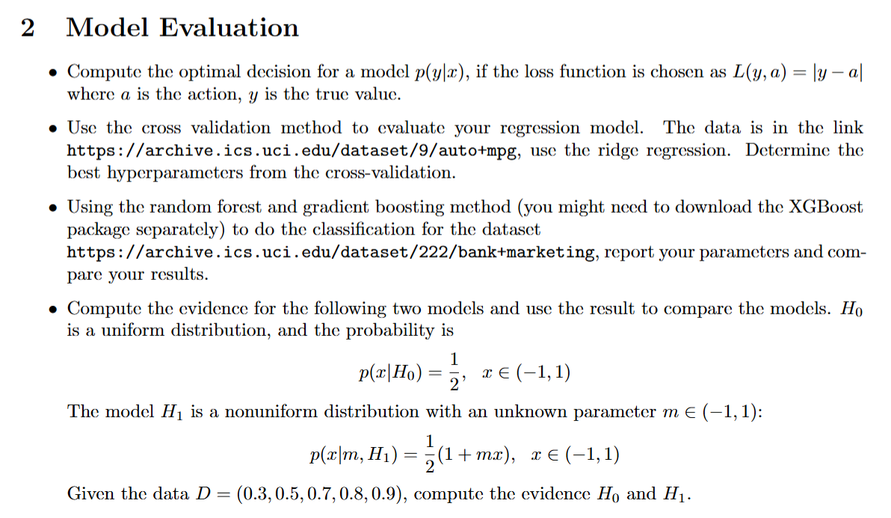
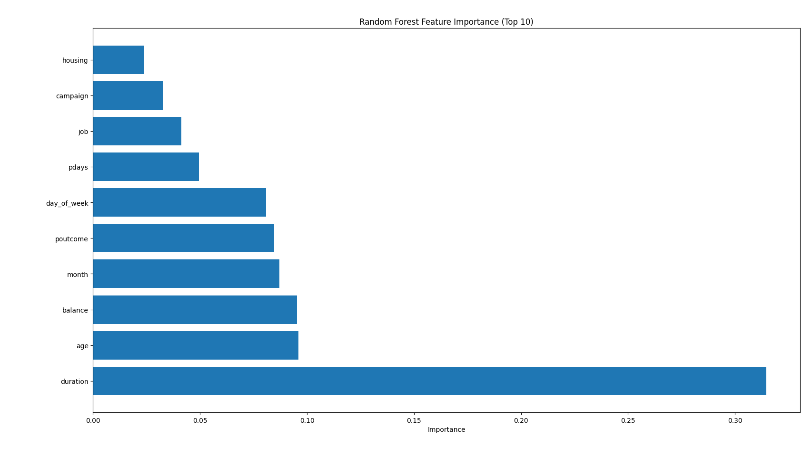
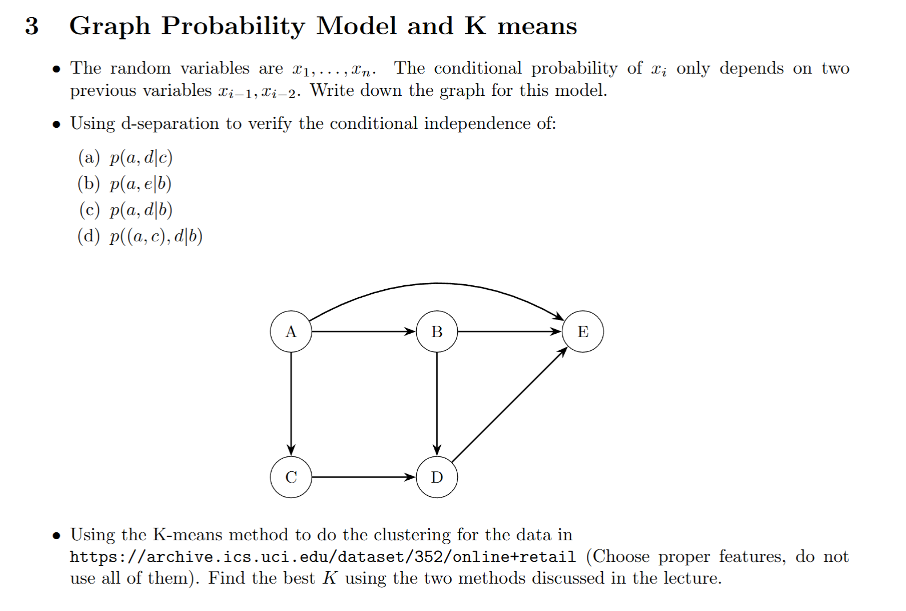
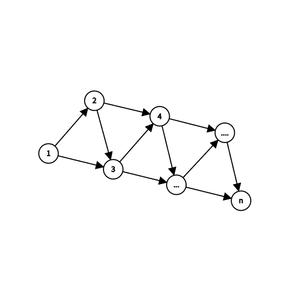
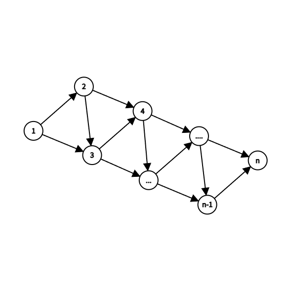
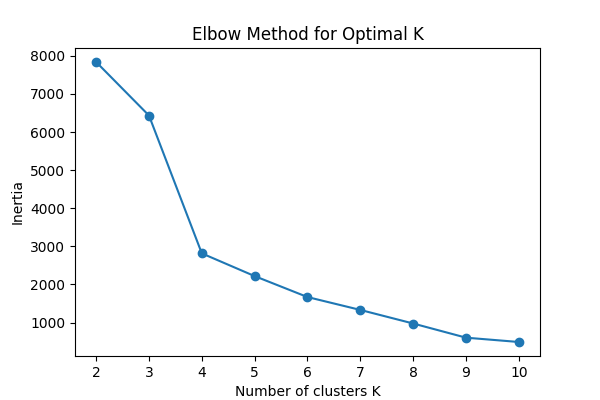
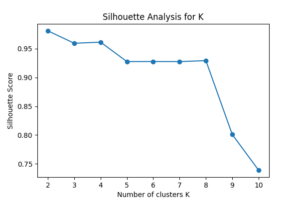

#### T1.1

PCA的计算过程即为对样本点矩阵(每行对应一个样本, 每列对应一个特征)标准化后求协方差矩阵, 协方差矩阵中绝对值前三大的特征值即为前三个主成分的方差, 对应的特征向量即为前三个主成分. 代码如下: 
```python
import numpy as np
from ucimlrepo import fetch_ucirepo 

# 1. 加载葡萄酒数据集
wine = fetch_ucirepo(id=109) 
X = wine.data.features 
y = wine.data.targets 

print(f"数据集形状: {X.shape}")

# 2. 数据标准化
X_std = (X - np.mean(X, axis=0)) / np.std(X, axis=0)

# 3. 计算协方差矩阵
cov_matrix = np.cov(X_std, rowvar=False)

# 4. 计算特征值和特征向量
eigenvalues, eigenvectors = np.linalg.eig(cov_matrix)

# 5. 按特征值大小排序
idx = eigenvalues.argsort()[::-1]
eigenvalues = eigenvalues[idx]
eigenvectors = eigenvectors[:, idx]

# 6. 提取前三个主成分和对应的方差
pc1 = eigenvectors[:, 0]
pc2 = eigenvectors[:, 1]
pc3 = eigenvectors[:, 2]

variance_pc1 = eigenvalues[0]
variance_pc2 = eigenvalues[1]
variance_pc3 = eigenvalues[2]

# 7. 输出结果
print(f"\n前三个主成分的方差:")
print(f"PC1: {variance_pc1:.4f}")
print(f"PC2: {variance_pc2:.4f}")
print(f"PC3: {variance_pc3:.4f}")

# 8. 输出前三个主成分向量
print(f"\n第一主成分向量 (PC1):")
print(pc1)

print(f"\n第二主成分向量 (PC2):")
print(pc2)

print(f"\n第三主成分向量 (PC3):")
print(pc3)
```
结果如下:
```
数据集形状: (178, 13)

前三个主成分的方差:
PC1: 4.7324
PC2: 2.5111
PC3: 1.4542

第一主成分向量 (PC1):
-0.1443, 0.2452, 0.0021, 0.2393, -0.1420, -0.3947, -0.4229, 0.2985, -0.3134, 0.0886, -0.2967, -0.3762, -0.2868

第二主成分向量 (PC2):
0.4837, 0.2249, 0.3161, -0.0106, 0.2996, 0.0650, -0.0034, 0.0288, 0.0393, 0.5300, -0.2792, -0.1645, 0.3649

第三主成分向量 (PC3):
-0.2074, 0.0890, 0.6262, 0.6121, 0.1308, 0.1462, 0.1507, 0.1704, 0.1495, -0.1373, 0.0852, 0.1660, -0.1267
PS C:\Users\caiti\Desktop\机器学习的数学原理\Machine-Learning> & C:/Users/caiti/AppData/Local/Programs/Python/Python313/python.exe c:/Users/caiti/Desktop/机器学习的数学原理/Machine-Learning/代码/tmp.py
数据集形状: (178, 13)

前三个主成分的方差:
PC1: 4.7324
PC2: 2.5111
PC3: 1.4542

第一主成分向量 (PC1):
[-0.1443294   0.24518758  0.00205106  0.23932041 -0.14199204 -0.39466085
 -0.4229343   0.2985331  -0.31342949  0.0886167  -0.29671456 -0.37616741
 -0.28675223]

第二主成分向量 (PC2):
[ 0.48365155  0.22493093  0.31606881 -0.0105905   0.299634    0.06503951
 -0.00335981  0.02877949  0.03930172  0.52999567 -0.27923515 -0.16449619
  0.36490283]

第三主成分向量 (PC3):
[-0.20738262  0.08901289  0.6262239   0.61208035  0.13075693  0.14617896
  0.1506819   0.17036816  0.14945431 -0.13730621  0.08522192  0.16600459
 -0.12674592]
```

---

#### T1.2

不妨令 $w^T S_W w = 1$ , 此时问题转化为：

$$
\min_w w^T S_B w \quad \text{subject to} \quad w^T S_W w = 1
$$

注意到:

$$
S_W = \sum_{i=1}^{c} \sum_{x \in D_i} (x - \mu_i)(x - \mu_i)^T
$$

$$
S_B = \sum_{i=1}^{c} n_i (\mu_i - \mu)(\mu_i - \mu)^T
$$

均为实对称矩阵(事实上,至少是实对称半正定矩阵). 设拉格朗日函数:

$$
L(w, \lambda) = w^T S_B w - \lambda (w^T S_W w - 1)
$$

对 $ w $ 求梯度并令其为零: 

$$
\frac{\partial L}{\partial w} = 2 S_B w - 2 \lambda S_W w = 0
$$

化简即可得到:
$$
S_B w = \lambda S_W w
$$

---



#### T2.1

对于损失函数 \( L(y, a) = |y - a| \)，最优决策 $a =  \argmin\limits_{a}\mathbb{E}[L(y, a) | x] $ . 而: 

$$
\mathbb{E}[L(y, a) | x] = \int |y - a| p(y|x) dy
$$

由概率论知识, $ a $ 是条件分布 $ p(y|x) $ 的中位数. 具体证明如下:

$$
\begin{aligned}
f(a) :=& E|X-a| = \int_{-\infty}^{\infty} |x-a| f(x) dx \\
=& \int_{-\infty}^{a} (a-x) f(x) dx + \int_{a}^{\infty} (x-a) f(x) dx
\end{aligned}
$$

$$
f'(a) = \frac{d}{da} \left[ \int_{-\infty}^{a} (a-x) f(x) dx + \int_{a}^{\infty} (x-a) f(x) dx \right]
$$

使用莱布尼茨积分法则：
$$
f'(a) = \int_{-\infty}^{a} f(x) dx - \int_{a}^{\infty} f(x) dx = F(a) - [1 - F(a)] = 2F(a) - 1
$$

上式关于 $a$ 单调不减, 故当 $f(a)$ 取到最大值时, $F(a) = \frac{1}{2}$ , 即 $a$ 为中位数

#### T2.2

代码如下: 

```python
import numpy as np
import pandas as pd
from ucimlrepo import fetch_ucirepo 
from sklearn.model_selection import train_test_split

# 加载数据
auto_mpg = fetch_ucirepo(id=9) 
X = auto_mpg.data.features 
y = auto_mpg.data.targets 

# 处理缺失值
X = X.dropna()
y = y.loc[X.index]

# 选择数值型特征
numerical_features = ['cylinders', 'displacement', 'horsepower', 'weight', 'acceleration', 'model_year', 'origin']
X = X[numerical_features]

# 转换为numpy数组
X = X.values
y = y.values.flatten()

# 分割数据
X_train, X_test, y_train, y_test = train_test_split(X, y, test_size=0.2, random_state=42)

# 标准化函数
def standardize(X):
    mean = np.mean(X, axis=0)
    std = np.std(X, axis=0)
    return (X - mean) / std, mean, std

# 岭回归
class RidgeRegression:
    def __init__(self, alpha=1.0):
        self.alpha = alpha
        self.weights = None
        self.bias = None
    
    def fit(self, X, y):
        # 添加偏置项
        X_with_bias = np.column_stack([np.ones(X.shape[0]), X])
        
        # 岭回归闭式解: w = (X^T X + alpha * I)^(-1) X^T y
        n_features = X_with_bias.shape[1]
        identity_matrix = np.eye(n_features)
        # 不对偏置项进行正则化
        identity_matrix[0, 0] = 0
        
        XTX = X_with_bias.T @ X_with_bias
        regularization = self.alpha * identity_matrix
        XTy = X_with_bias.T @ y
        
        # 求解权重
        self.weights = np.linalg.inv(XTX + regularization) @ XTy
        self.bias = self.weights[0]
        self.weights = self.weights[1:]
    
    def predict(self, X):
        return X @ self.weights + self.bias

# 交叉验证
def cross_validate_ridge(X, y, alphas, k_folds=5):
    n_samples = X.shape[0]
    fold_size = n_samples // k_folds
    
    # 打乱数据
    indices = np.random.permutation(n_samples)
    X_shuffled = X[indices]
    y_shuffled = y[indices]
    
    best_alpha = None
    best_mse = float('inf')
    
    for alpha in alphas:
        fold_mses = []
        
        for fold in range(k_folds):
            # 划分训练集和验证集
            val_start = fold * fold_size
            val_end = (fold + 1) * fold_size
            
            X_val = X_shuffled[val_start:val_end]
            y_val = y_shuffled[val_start:val_end]
            
            X_train_fold = np.concatenate([X_shuffled[:val_start], X_shuffled[val_end:]], axis=0)
            y_train_fold = np.concatenate([y_shuffled[:val_start], y_shuffled[val_end:]], axis=0)
            
            # 标准化
            X_train_scaled, mean, std = standardize(X_train_fold)
            X_val_scaled = (X_val - mean) / std
            
            # 训练模型
            model = RidgeRegression(alpha=alpha)
            model.fit(X_train_scaled, y_train_fold)
            
            # 预测并计算MSE
            y_pred = model.predict(X_val_scaled)
            mse = np.mean((y_pred - y_val) ** 2)
            fold_mses.append(mse)
        
        # 计算平均MSE
        avg_mse = np.mean(fold_mses)
        print(f"Alpha: {alpha}, Average MSE: {avg_mse:.4f}")
        
        if avg_mse < best_mse:
            best_mse = avg_mse
            best_alpha = alpha
    
    return best_alpha, best_mse

# 标准化训练数据
X_train_scaled, train_mean, train_std = standardize(X_train)
X_test_scaled = (X_test - train_mean) / train_std

# 定义要测试的alpha值
alphas = [0.01, 0.1, 1, 10, 100]

best_alpha, best_mse = cross_validate_ridge(X_train, y_train, alphas, k_folds=5)
print(f"\n最佳超参数 alpha: {best_alpha}")
print(f"交叉验证最佳MSE: {best_mse:.4f}")

# 使用最佳alpha在完整训练集上训练最终模型
final_model = RidgeRegression(alpha=best_alpha)
final_model.fit(X_train_scaled, y_train)

# 在测试集上评估
y_pred_test = final_model.predict(X_test_scaled)
test_mse = np.mean((y_pred_test - y_test) ** 2)
print(f"测试集MSE: {test_mse:.4f}")

# 计算R²分数
def r2_score(y_true, y_pred):
    ss_res = np.sum((y_true - y_pred) ** 2)
    ss_tot = np.sum((y_true - np.mean(y_true)) ** 2)
    return 1 - (ss_res / ss_tot)

r2 = r2_score(y_test, y_pred_test)
print(f"测试集R²分数: {r2:.4f}")

# 显示模型系数
print(f"\n模型系数: {final_model.weights}")
print(f"模型偏置: {final_model.bias:.4f}")
```

输出结果如下: 
```
Alpha: 0.01, Average MSE: 11.5373
Alpha: 0.1, Average MSE: 11.5341
Alpha: 1, Average MSE: 11.5119
Alpha: 10, Average MSE: 11.6229
Alpha: 100, Average MSE: 13.2561

最佳超参数 alpha: 1
交叉验证最佳MSE: 11.5119
测试集MSE: 10.7674
测试集R²分数: 0.7890

模型系数: [-0.53605509  1.34475957 -0.84685405 -4.98299806  0.07001785  2.76196589
  1.2882827 ]
模型偏置: 23.5994
```
经过后续对参数的反复调试, 观察到最佳的正则化参数 $\alpha$ 在1附近震荡(这是由数据打乱导致的), 因此可以认为最佳的正则化参数就是1.

---

#### T2.3

代码如下:

```python
import numpy as np
import pandas as pd
from ucimlrepo import fetch_ucirepo 
from sklearn.model_selection import train_test_split, GridSearchCV
from sklearn.ensemble import RandomForestClassifier
from sklearn.preprocessing import LabelEncoder
from sklearn.metrics import accuracy_score, classification_report
import matplotlib.pyplot as plt

# 加载数据
bank_marketing = fetch_ucirepo(id=222) 
X = bank_marketing.data.features 
y = bank_marketing.data.targets 

# 预处理：编码分类变量
label_encoders = {}
categorical_columns = X.select_dtypes(include=['object']).columns

for column in categorical_columns:
    le = LabelEncoder()
    X[column] = le.fit_transform(X[column].astype(str))
    label_encoders[column] = le

# 编码目标变量
y_encoder = LabelEncoder()
y_encoded = y_encoder.fit_transform(y.values.ravel())

# 分割数据
X_train, X_test, y_train, y_test = train_test_split(
    X, y_encoded, test_size=0.2, random_state=42, stratify=y_encoded
)

print(f"Training set size: {X_train.shape}")
print(f"Test set size: {X_test.shape}")

# 随机森林分类
print("\n=== Random Forest ===")
rf_param_grid = {
    'n_estimators': [100, 200],
    'max_depth': [10, 20],
    'min_samples_split': [2, 5]
}

rf = RandomForestClassifier(random_state=42)
rf_grid_search = GridSearchCV(rf, rf_param_grid, cv=5, scoring='accuracy', n_jobs=-1)
rf_grid_search.fit(X_train, y_train)

best_rf = rf_grid_search.best_estimator_
y_pred_rf = best_rf.predict(X_test)
accuracy_rf = accuracy_score(y_test, y_pred_rf)

print(f"Best parameters: {rf_grid_search.best_params_}")
print(f"Accuracy: {accuracy_rf:.4f}")

# XGBoost分类
try:
    import xgboost as xgb
    
    print("\n=== XGBoost ===")
    xgb_param_grid = {
        'n_estimators': [100, 200],
        'max_depth': [3, 6],
        'learning_rate': [0.1, 0.01]
    }
    
    xgb_model = xgb.XGBClassifier(random_state=42)
    xgb_grid_search = GridSearchCV(xgb_model, xgb_param_grid, cv=5, scoring='accuracy', n_jobs=-1)
    xgb_grid_search.fit(X_train, y_train)
    
    best_xgb = xgb_grid_search.best_estimator_
    y_pred_xgb = best_xgb.predict(X_test)
    accuracy_xgb = accuracy_score(y_test, y_pred_xgb)
    
    print(f"Best parameters: {xgb_grid_search.best_params_}")
    print(f"Accuracy: {accuracy_xgb:.4f}")
    
except ImportError:
    print("\nXGBoost not installed, skipping XGBoost part")
    print("Install with: pip install xgboost")
    best_xgb = None

# 结果比较
print("\n=== Model Comparison ===")
if best_xgb is not None:
    models_comparison = pd.DataFrame({
        'Model': ['Random Forest', 'XGBoost'],
        'Accuracy': [accuracy_rf, accuracy_xgb]
    })
else:
    models_comparison = pd.DataFrame({
        'Model': ['Random Forest'],
        'Accuracy': [accuracy_rf]
    })

print(models_comparison)

# 特征重要性可视化
plt.figure(figsize=(10, 6))
rf_importance = best_rf.feature_importances_
rf_indices = np.argsort(rf_importance)[::-1][:10]  # Top 10 features

plt.barh(range(len(rf_indices)), rf_importance[rf_indices])
plt.yticks(range(len(rf_indices)), [X.columns[i] for i in rf_indices])
plt.title('Random Forest Feature Importance (Top 10)')
plt.xlabel('Importance')
plt.tight_layout()
plt.show()

# 打印简要分类报告
print("\n=== Random Forest Classification Report ===")
print(classification_report(y_test, y_pred_rf, target_names=y_encoder.classes_))

if best_xgb is not None:
    print("\n=== XGBoost Classification Report ===")
    print(classification_report(y_test, y_pred_xgb, target_names=y_encoder.classes_))
```

输出结果如下:
```
=== Random Forest ===
Best parameters: {'max_depth': 20, 'min_samples_split': 5, 'n_estimators': 200}
Accuracy: 0.9057

=== XGBoost ===
Best parameters: {'learning_rate': 0.1, 'max_depth': 6, 'n_estimators': 200}
Accuracy: 0.9070

=== Model Comparison ===
           Model  Accuracy
0  Random Forest  0.905673
1        XGBoost  0.907000

=== Random Forest Classification Report ===
              precision    recall  f1-score   support

          no       0.92      0.97      0.95      7985
         yes       0.66      0.40      0.50      1058

    accuracy                           0.91      9043
   macro avg       0.79      0.69      0.72      9043
weighted avg       0.89      0.91      0.90      9043


=== XGBoost Classification Report ===
              precision    recall  f1-score   support

          no       0.93      0.96      0.95      7985
         yes       0.64      0.47      0.54      1058

    accuracy                           0.91      9043
   macro avg       0.79      0.72      0.75      9043
weighted avg       0.90      0.91      0.90      9043
```
Random forest计算出的最重要的10个feature如下:

Random forest 和 XGBoost 都达到了较高的准确率, XGBoost 略优于 Random forest. 具体参数如上所示。

---

#### T2.4

对于 $ H_0 $ (均匀分布):

$$
\begin{aligned}
p(D|H_0) = \prod_{i=1}^{5} p(x_i|H_0) = \prod_{i=1}^{5} \frac{1}{2} = \left( \frac{1}{2} \right)^5 = \frac{1}{32} = 0.03125
\end{aligned}
$$

对于 $ H_1 $ (非均匀分布), 设 $x_i := [0.3, 0.5, 0.7, 0.8, 0.9]$, 则有: 

$$
\begin{aligned}
p(D|m,H_1) =& \prod_{i=1}^{5} \frac{1}{2} (1 + m x_i) = \frac{1}{2^5} \prod_{i=1}^{5} (1 + m x_i) \\
=& \frac{1}{2^5} \times (1.0 + 3.2 m + 4.35 m^2 + 2.87 m^3 + 0.87 m^4 + 0.0756 m^5)
\end{aligned}
$$

这里为了方便计算和后续比较, 假设 $ m $ 在 $ (-1, 1) $ 上均匀分布, 即 $ p(m|H_1) = \frac{1}{2} $. 
此时evidence化成: 

$$
\begin{aligned}
p(D|H_1) =& \int_{-1}^{1} p(D|m, H_1) p(m|H_1) dm \\
=& \int_{-1}^{1} \frac{1}{2^6} \times (1.0 + 3.2 m + 4.35 m^2 + 2.87 m^3 + 0.87 m^4 + 0.0756 m^5) dm \\
=& \frac{1}{2^6} \int_{-1}^{1} (1.0 + 4.35 m^2 + 0.87 m^4) dm \approx 0.082
\end{aligned}
$$

从而 $p(D|H_1) > p(D|H_0)$ , 模型 $ H_1 $ 更优. 

---



#### T3.1

边集为 \( \{ (x_{i-1}, x_i) \mid i=2,\ldots,n \} \cup \{ (x_{i-2}, x_i) \mid i=3,\ldots,n \} \), 由指标小的node指向指标大的node, 到x_n结束, 图示如下(两张图分别对应n为奇数和偶数): 




---

#### T3.2

- **(a) \( p(a, d|c) \)**  
  路径 $A \to B \to D$ 未被 $C$ 阻塞, 因此条件独立不成立. 

- **(b) \( p(a, e|b) \)**  
  路径 $A \to E$ 未被 $B$ 阻塞, 因此条件独立不成立. 

- **(c) \( p(a, d|b) \)**  
  路径 $A \to C \to D$ 未被 $B$ 阻塞, 因此条件独立不成立. 

- **(d) \( p((a, c), d|b) \)**  
  路径 $C \to D$ 未被 $B$ 阻塞, 因此条件独立不成立. 

---

#### T3.3

课上讲了两种方法, 分别是Elbow Method以及Silhouette Analysis. Python代码如下:
```python
# === 导入必要的包 ===
from ucimlrepo import fetch_ucirepo
import pandas as pd
import numpy as np
from sklearn.preprocessing import StandardScaler
from sklearn.cluster import KMeans
from sklearn.metrics import silhouette_score
import matplotlib.pyplot as plt

# === 1. 获取数据 ===
online_retail = fetch_ucirepo(id=352)
X = online_retail.data.features

# === 2. 数据清洗与特征选择 ===
X = X.dropna(subset=['CustomerID'])
X['CustomerID'] = X['CustomerID'].astype(int)

# 聚合为每个顾客的数据
customer_df = X.groupby('CustomerID').agg({
    'Quantity': 'sum',           # 总购买量
    'UnitPrice': 'mean'          # 平均单价
}).reset_index()

# 增加总消费额特征
customer_df['TotalSpend'] = X.groupby('CustomerID').apply(
    lambda df: np.sum(df['Quantity'] * df['UnitPrice'])
).values

# 仅使用数值特征
features = customer_df[['Quantity', 'UnitPrice', 'TotalSpend']]

# === 3. 数据标准化 ===
scaler = StandardScaler()
X_scaled = scaler.fit_transform(features)

# === 4. 肘部法则曲线 ===
inertias = []
K_range = range(2, 11)

for k in K_range:
    kmeans = KMeans(n_clusters=k, random_state=42)
    kmeans.fit(X_scaled)
    inertias.append(kmeans.inertia_)

plt.figure(figsize=(6, 4))
plt.plot(K_range, inertias, marker='o')
plt.xlabel('K')
plt.ylabel('Inertia')
plt.title('Elbow Method for K Selection')
plt.show()

# === 5. 轮廓系数分析 ===
silhouette_scores = []
for k in K_range:
    kmeans = KMeans(n_clusters=k, random_state=42)
    labels = kmeans.fit_predict(X_scaled)
    score = silhouette_score(X_scaled, labels)
    silhouette_scores.append(score)

plt.figure(figsize=(6, 4))
plt.plot(K_range, silhouette_scores, marker='o', color='orange')
plt.xlabel('K')
plt.ylabel('Silhouette Score')
plt.title('Silhouette Analysis for K Selection')
plt.show()
```

运行结果如下:



观察图像分析可知, Elbow Method下K=4的情形是最好的; Silhouette Amalysis下K=2的结果最好, 但与K=4相差不大. 故最终选择**K=4**为最佳的K值, 此时的计算代码与计算结果如下: 

```python
# === 计算聚类 ===
k_final = 4
kmeans_final = KMeans(n_clusters=k_final, random_state=42)
customer_df['Cluster'] = kmeans_final.fit_predict(X_scaled)

# === 输出 K=4 的肘部法则结果（Inertia） ===
inertia_k4 = kmeans_final.inertia_
print(f"当 K={k_final} 时的 Inertia（肘部法则指标）为: {inertia_k4:.2f}")

# === 输出每个簇的平均特征 ===
cluster_summary = customer_df.groupby('Cluster')[['Quantity', 'UnitPrice', 'TotalSpend']].mean()
print("\n各簇的平均特征值：")
print(cluster_summary)
```
```
各簇的平均特征值：
              Quantity    UnitPrice     TotalSpend
Cluster
0           852.479282     5.146260    1440.770873
1        109956.666667     7.988403  241136.560000
2         37990.826087     6.945501   57460.243043
3            29.500000  6171.705000   -1819.065000
```