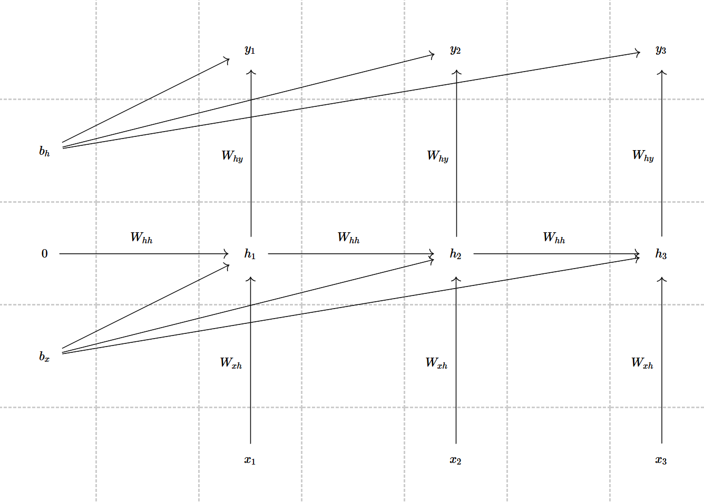

1. A CNN takes a \(128\times 128\) RGB image (3 channels) as input. It is passed through the following sequence of layers:
   (a) Conv layer with 16 filters, each of size \(5\times 5\), stride=1, padding='same'
   (b) Max Pooling layer with \(2\times 2\) window, stride=2
   (c) Conv layer with 32 filters, each of size \(3\times 3\), stride=1, padding='valid'
   (d) Max Pooling layer with \(2\times 2\) window, stride=2
   (e) A Flatten layer
   (f) A final Dense (Fully Connected) layer with 100 units
   * Calculate the dimensions (height, width, number of channels) of the output after each of the first four layers. Show your work.
   * What is the total number of elements after the Flatten layer?
   * Calculate the number of trainable parameters in the first convolutional layer. (Remember: parameters include weights and biases).

### Solution

(1)

输入为128×128 RGB 图像，尺寸为 (128, 128, 3)。

经过层(a)后, 由于padding='same'且步长为1，因此输出空间尺寸与输入相同：高度=128，宽度=128。同时输出通道数等于滤波器数量：16。因此输出维度为(128, 128, 16)

经过层(b)后, 输出高度 = ⌊(128 - 2) / 2⌋ + 1 = ⌊126 / 2⌋ + 1 = 63 + 1 = 64。输出宽度同理：64。通道数不变, 因此输出维度为(64, 64, 16)

经过层(c)后, 由于padding='valid',无填充，因此输出高度 = (64 - 3) / 1 + 1 = 62; 输出宽度同理为62; 输出通道数等于滤波器数量：32。因此输出维度为(62, 62, 32)

经过层(d)后, 输出高度 = ⌊(62 - 2) / 2⌋ + 1 = ⌊60 / 2⌋ + 1 = 30 + 1 = 31, 输出宽度同理：31; 通道数不变为32。输出维度为(31, 31, 32)

(2) 展平层后的总元素数量为 31 × 31 × 32 = 961 × 32 = 30752

(3) 每个滤波器的权重数为5 × 5 × 3 = 75, 因此权重总数为16 × 75 = 1200, 再加上每个滤波器中的偏置(一共16个)，总参数 = 1200 + 16 = 1216

---

2. Build your own residual net and train on the CIFAR10 dataset, try your best (within your computing capability) to get the test accuracy to 90 percent. Submit your code and training log.

### Solution

代码如下:

```\python
import torch
import torch.nn as nn
import torch.nn.functional as F
import torch.optim as optim
import torchvision
import torchvision.transforms as transforms
import numpy as np
import time
import matplotlib.pyplot as plt
from torch.utils.data import DataLoader
from torch.optim.lr_scheduler import MultiStepLR, CosineAnnealingLR

# 检查GPU是否可用
device = torch.device("cuda" if torch.cuda.is_available() else "cpu")
print(f"Using device: {device}")


# 设置随机种子以确保可重复性
torch.manual_seed(42)
if torch.cuda.is_available():
    torch.cuda.manual_seed(42)

# ==================== 数据增强和预处理 ====================
# 训练数据增强
train_transform = transforms.Compose([
    transforms.RandomCrop(32, padding=4),
    transforms.RandomHorizontalFlip(),
    transforms.RandomRotation(10),
    transforms.ColorJitter(brightness=0.2, contrast=0.2, saturation=0.2),
    transforms.ToTensor(),
    transforms.Normalize((0.4914, 0.4822, 0.4465), (0.2023, 0.1994, 0.2010)),
])

# 测试数据预处理
test_transform = transforms.Compose([
    transforms.ToTensor(),
    transforms.Normalize((0.4914, 0.4822, 0.4465), (0.2023, 0.1994, 0.2010)),
])

# 加载CIFAR-10数据集
batch_size = 128

train_dataset = torchvision.datasets.CIFAR10(
    root='./data', train=True, download=True, transform=train_transform
)
test_dataset = torchvision.datasets.CIFAR10(
    root='./data', train=False, download=True, transform=test_transform
)

train_loader = DataLoader(train_dataset, batch_size=batch_size, shuffle=True, num_workers=2, pin_memory=True)
test_loader = DataLoader(test_dataset, batch_size=batch_size, shuffle=False, num_workers=2, pin_memory=True)

classes = ('plane', 'car', 'bird', 'cat', 'deer', 'dog', 'frog', 'horse', 'ship', 'truck')
print(f"训练集大小: {len(train_dataset)}")
print(f"测试集大小: {len(test_dataset)}")

# ==================== ResNet模型定义 ====================
class BasicBlock(nn.Module):
    """ResNet基础残差块"""
    expansion = 1
    
    def __init__(self, in_channels, out_channels, stride=1):
        super(BasicBlock, self).__init__()
        
        # 第一个卷积层
        self.conv1 = nn.Conv2d(
            in_channels, out_channels, kernel_size=3, 
            stride=stride, padding=1, bias=False
        )
        self.bn1 = nn.BatchNorm2d(out_channels)
        
        # 第二个卷积层
        self.conv2 = nn.Conv2d(
            out_channels, out_channels, kernel_size=3,
            stride=1, padding=1, bias=False
        )
        self.bn2 = nn.BatchNorm2d(out_channels)
        
        # 快捷连接
        self.shortcut = nn.Sequential()
        if stride != 1 or in_channels != self.expansion * out_channels:
            self.shortcut = nn.Sequential(
                nn.Conv2d(
                    in_channels, self.expansion * out_channels,
                    kernel_size=1, stride=stride, bias=False
                ),
                nn.BatchNorm2d(self.expansion * out_channels)
            )
    
    def forward(self, x):
        identity = x
        
        out = F.relu(self.bn1(self.conv1(x)))
        out = self.bn2(self.conv2(out))
        
        out += self.shortcut(identity)
        out = F.relu(out)
        
        return out

class ResNet(nn.Module):
    """自定义ResNet模型"""
    def __init__(self, block, num_blocks, num_classes=10):
        super(ResNet, self).__init__()
        
        self.in_channels = 64
        
        # 初始卷积层
        self.conv1 = nn.Conv2d(3, 64, kernel_size=3, stride=1, padding=1, bias=False)
        self.bn1 = nn.BatchNorm2d(64)
        
        # 残差层
        self.layer1 = self._make_layer(block, 64, num_blocks[0], stride=1)
        self.layer2 = self._make_layer(block, 128, num_blocks[1], stride=2)
        self.layer3 = self._make_layer(block, 256, num_blocks[2], stride=2)
        self.layer4 = self._make_layer(block, 512, num_blocks[3], stride=2)
        
        # 全局平均池化和全连接层
        self.avgpool = nn.AdaptiveAvgPool2d((1, 1))
        self.fc = nn.Linear(512 * block.expansion, num_classes)
        
        # Dropout（可选，用于防止过拟合）
        self.dropout = nn.Dropout(0.3)
    
    def _make_layer(self, block, out_channels, num_blocks, stride):
        strides = [stride] + [1] * (num_blocks - 1)
        layers = []
        
        for stride in strides:
            layers.append(block(self.in_channels, out_channels, stride))
            self.in_channels = out_channels * block.expansion
        
        return nn.Sequential(*layers)
    
    def forward(self, x):
        out = F.relu(self.bn1(self.conv1(x)))
        
        out = self.layer1(out)
        out = self.layer2(out)
        out = self.layer3(out)
        out = self.layer4(out)
        
        out = self.avgpool(out)
        out = torch.flatten(out, 1)
        out = self.dropout(out)
        out = self.fc(out)
        
        return out

def resnet18():
    """创建ResNet-18模型"""
    return ResNet(BasicBlock, [2, 2, 2, 2])

def resnet34():
    """创建ResNet-34模型"""
    return ResNet(BasicBlock, [3, 4, 6, 3])

# ==================== 训练和测试函数 ====================
def train(model, device, train_loader, optimizer, criterion, epoch):
    model.train()
    train_loss = 0
    correct = 0
    total = 0
    
    for batch_idx, (data, target) in enumerate(train_loader):
        data, target = data.to(device), target.to(device)
        
        optimizer.zero_grad()
        output = model(data)
        loss = criterion(output, target)
        loss.backward()
        
        # 梯度裁剪防止梯度爆炸
        torch.nn.utils.clip_grad_norm_(model.parameters(), max_norm=1.0)
        optimizer.step()
        
        train_loss += loss.item()
        _, predicted = output.max(1)
        total += target.size(0)
        correct += predicted.eq(target).sum().item()
        
        if batch_idx % 100 == 0:
            print(f'Epoch: {epoch} [{batch_idx * len(data)}/{len(train_loader.dataset)} '
                  f'({100. * batch_idx / len(train_loader):.0f}%)]\tLoss: {loss.item():.6f}')
    
    train_accuracy = 100. * correct / total
    avg_loss = train_loss / len(train_loader)
    
    return avg_loss, train_accuracy

def test(model, device, test_loader, criterion):
    model.eval()
    test_loss = 0
    correct = 0
    total = 0
    
    with torch.no_grad():
        for data, target in test_loader:
            data, target = data.to(device), target.to(device)
            output = model(data)
            test_loss += criterion(output, target).item()
            _, predicted = output.max(1)
            total += target.size(0)
            correct += predicted.eq(target).sum().item()
    
    test_accuracy = 100. * correct / total
    avg_loss = test_loss / len(test_loader)
    
    return avg_loss, test_accuracy

# ==================== 主训练循环 ====================
def main():
    # 创建模型
    print("创建ResNet模型...")
    model = resnet18().to(device)
    
    # 打印模型参数数量
    total_params = sum(p.numel() for p in model.parameters())
    trainable_params = sum(p.numel() for p in model.parameters() if p.requires_grad)
    print(f"模型总参数量: {total_params:,}")
    print(f"可训练参数量: {trainable_params:,}")
    
    # 定义损失函数和优化器
    criterion = nn.CrossEntropyLoss(label_smoothing=0.1)  # 标签平滑防止过拟合
    optimizer = optim.SGD(
        model.parameters(), 
        lr=0.1,  # 初始学习率
        momentum=0.9, 
        weight_decay=5e-4  # L2正则化
    )
    
    # 学习率调度器
    scheduler = MultiStepLR(optimizer, milestones=[100, 150], gamma=0.1)
    # 或者使用余弦退火
    # scheduler = CosineAnnealingLR(optimizer, T_max=200)
    
    num_epochs = 200
    best_accuracy = 0
    best_model_state = None
    
    # 用于记录训练过程
    train_losses, train_accs = [], []
    test_losses, test_accs = [], []
    
    print(f"\n开始训练，共{num_epochs}个epoch...")
    print("="*60)
    
    for epoch in range(1, num_epochs + 1):
        start_time = time.time()
        
        # 训练
        train_loss, train_acc = train(model, device, train_loader, optimizer, criterion, epoch)
        train_losses.append(train_loss)
        train_accs.append(train_acc)
        
        # 测试
        test_loss, test_acc = test(model, device, test_loader, criterion)
        test_losses.append(test_loss)
        test_accs.append(test_acc)
        
        # 更新学习率
        scheduler.step()
        
        # 保存最佳模型
        if test_acc > best_accuracy:
            best_accuracy = test_acc
            best_model_state = model.state_dict().copy()
            torch.save({
                'epoch': epoch,
                'model_state_dict': best_model_state,
                'optimizer_state_dict': optimizer.state_dict(),
                'accuracy': best_accuracy,
            }, 'best_model.pth')
        
        epoch_time = time.time() - start_time
        
        print(f'Epoch {epoch:3d}/{num_epochs} | '
              f'Time: {epoch_time:.2f}s | '
              f'Train Loss: {train_loss:.4f} | Train Acc: {train_acc:.2f}% | '
              f'Test Loss: {test_loss:.4f} | Test Acc: {test_acc:.2f}% | '
              f'LR: {optimizer.param_groups[0]["lr"]:.6f}')
        
        # 每10个epoch保存一次中间结果
        if epoch % 10 == 0:
            torch.save({
                'epoch': epoch,
                'model_state_dict': model.state_dict(),
                'optimizer_state_dict': optimizer.state_dict(),
                'train_losses': train_losses,
                'test_accs': test_accs,
            }, f'checkpoint_epoch_{epoch}.pth')
    
    # 加载最佳模型
    model.load_state_dict(best_model_state)
    
    # 最终测试
    final_loss, final_accuracy = test(model, device, test_loader, criterion)
    print(f"\n{'='*60}")
    print(f"训练完成！")
    print(f"最佳测试准确率: {best_accuracy:.2f}%")
    print(f"最终测试准确率: {final_accuracy:.2f}%")
    
    # 绘制训练曲线
    plt.figure(figsize=(12, 4))
    
    plt.subplot(1, 2, 1)
    plt.plot(train_losses, label='Train Loss')
    plt.plot(test_losses, label='Test Loss')
    plt.xlabel('Epoch')
    plt.ylabel('Loss')
    plt.legend()
    plt.title('Training and Test Loss')
    
    plt.subplot(1, 2, 2)
    plt.plot(train_accs, label='Train Accuracy')
    plt.plot(test_accs, label='Test Accuracy')
    plt.xlabel('Epoch')
    plt.ylabel('Accuracy (%)')
    plt.legend()
    plt.title('Training and Test Accuracy')
    
    plt.tight_layout()
    plt.savefig('training_curves.png')
    plt.show()
    
    return model, best_accuracy

if __name__ == '__main__':
    model, best_acc = main()
```

部分训练日志如下(观察到50次左右准确率几乎收敛,因此只截取这么多; 且由于长度受限,最前面的部分行被顶掉了)：

```
测试集大小: 10000
Using device: cuda
训练集大小: 50000
测试集大小: 10000
Epoch   5/200 | Time: 39.84s | Train Loss: 1.0521 | Train Acc: 75.96% | Test Loss: 1.0461 | Test Acc: 76.75% | LR: 0.100000
Epoch   5/200 | Time: 39.84s | Train Loss: 1.0521 | Train Acc: 75.96% | Test Loss: 1.0461 | Test Acc: 76.75% | LR: 0.100000
Epoch   5/200 | Time: 39.84s | Train Loss: 1.0521 | Train Acc: 75.96% | Test Loss: 1.0461 | Test Acc: 76.75% | LR: 0.100000
Epoch   5/200 | Time: 39.84s | Train Loss: 1.0521 | Train Acc: 75.96% | Test Loss: 1.0461 | Test Acc: 76.75% | LR: 0.100000
Epoch   5/200 | Time: 39.84s | Train Loss: 1.0521 | Train Acc: 75.96% | Test Loss: 1.0461 | Test Acc: 76.75% | LR: 0.100000
Epoch   5/200 | Time: 39.84s | Train Loss: 1.0521 | Train Acc: 75.96% | Test Loss: 1.0461 | Test Acc: 76.75% | LR: 0.100000
Using device: cuda
训练集大小: 50000
Using device: cuda
训练集大小: 50000
训练集大小: 50000
测试集大小: 10000
Using device: cuda
训练集大小: 50000
测试集大小: 10000
Epoch: 6 [0/50000 (0%)] Loss: 1.087766
Epoch: 6 [12800/50000 (26%)]    Loss: 1.011722
Epoch: 6 [25600/50000 (51%)]    Loss: 0.995108
Epoch: 6 [38400/50000 (77%)]    Loss: 1.031414
Using device: cuda
训练集大小: 50000
测试集大小: 10000
Using device: cuda
训练集大小: 50000
测试集大小: 10000
Epoch   6/200 | Time: 38.85s | Train Loss: 1.0067 | Train Acc: 78.15% | Test Loss: 1.0467 | Test Acc: 76.19% | LR: 0.100000
Using device: cuda
训练集大小: 50000
测试集大小: 10000
Using device: cuda
训练集大小: 50000
测试集大小: 10000
Epoch: 7 [0/50000 (0%)] Loss: 0.879844
Epoch: 7 [12800/50000 (26%)]    Loss: 0.983126
Epoch: 7 [25600/50000 (51%)]    Loss: 0.866636
Epoch: 7 [38400/50000 (77%)]    Loss: 0.982824
Using device: cuda
训练集大小: 50000
测试集大小: 10000
Using device: cuda
训练集大小: 50000
测试集大小: 10000
Epoch   7/200 | Time: 38.84s | Train Loss: 0.9780 | Train Acc: 79.41% | Test Loss: 0.9641 | Test Acc: 79.84% | LR: 0.100000
Using device: cuda
训练集大小: 50000
测试集大小: 10000
Using device: cuda
训练集大小: 50000
测试集大小: 10000
Epoch: 8 [0/50000 (0%)] Loss: 0.937621
Epoch: 8 [12800/50000 (26%)]    Loss: 0.914785
Epoch: 8 [25600/50000 (51%)]    Loss: 0.838904
Epoch: 8 [38400/50000 (77%)]    Loss: 0.960768
Using device: cuda
训练集大小: 50000
测试集大小: 10000
Using device: cuda
训练集大小: 50000
测试集大小: 10000
Epoch   8/200 | Time: 39.42s | Train Loss: 0.9525 | Train Acc: 80.53% | Test Loss: 0.9284 | Test Acc: 81.52% | LR: 0.100000
Using device: cuda
训练集大小: 50000
测试集大小: 10000
Using device: cuda
训练集大小: 50000
测试集大小: 10000
Epoch: 9 [0/50000 (0%)] Loss: 0.882445
Epoch: 9 [12800/50000 (26%)]    Loss: 0.838363
Epoch: 9 [25600/50000 (51%)]    Loss: 0.993980
Epoch: 9 [38400/50000 (77%)]    Loss: 1.042528
Using device: cuda
训练集大小: 50000
测试集大小: 10000
Using device: cuda
训练集大小: 50000
测试集大小: 10000
Epoch   9/200 | Time: 39.36s | Train Loss: 0.9376 | Train Acc: 81.13% | Test Loss: 1.0127 | Test Acc: 77.65% | LR: 0.100000
Using device: cuda
训练集大小: 50000
测试集大小: 10000
Using device: cuda
训练集大小: 50000
测试集大小: 10000
Epoch: 10 [0/50000 (0%)]        Loss: 1.015038
Epoch: 10 [12800/50000 (26%)]   Loss: 0.823380
Epoch: 10 [25600/50000 (51%)]   Loss: 0.930203
Epoch: 10 [38400/50000 (77%)]   Loss: 1.029606
Using device: cuda
训练集大小: 50000
测试集大小: 10000
Using device: cuda
训练集大小: 50000
测试集大小: 10000
Epoch  10/200 | Time: 40.13s | Train Loss: 0.9218 | Train Acc: 81.98% | Test Loss: 0.9193 | Test Acc: 81.81% | LR: 0.100000
Using device: cuda
训练集大小: 50000
测试集大小: 10000
Using device: cuda
训练集大小: 50000
测试集大小: 10000
Epoch: 11 [0/50000 (0%)]        Loss: 1.021729
Epoch: 11 [12800/50000 (26%)]   Loss: 0.849520
Epoch: 11 [25600/50000 (51%)]   Loss: 0.902781
Epoch: 11 [38400/50000 (77%)]   Loss: 0.896577
Using device: cuda
训练集大小: 50000
测试集大小: 10000
Using device: cuda
训练集大小: 50000
测试集大小: 10000
Epoch  11/200 | Time: 39.02s | Train Loss: 0.9098 | Train Acc: 82.40% | Test Loss: 0.9469 | Test Acc: 80.71% | LR: 0.100000
Using device: cuda
训练集大小: 50000
测试集大小: 10000
Using device: cuda
训练集大小: 50000
测试集大小: 10000
Epoch: 12 [0/50000 (0%)]        Loss: 0.880218
Epoch: 12 [12800/50000 (26%)]   Loss: 0.924901
Epoch: 12 [25600/50000 (51%)]   Loss: 0.946423
Epoch: 12 [38400/50000 (77%)]   Loss: 0.910268
Using device: cuda
训练集大小: 50000
测试集大小: 10000
Using device: cuda
训练集大小: 50000
测试集大小: 10000
Epoch  12/200 | Time: 39.21s | Train Loss: 0.9059 | Train Acc: 82.63% | Test Loss: 1.2820 | Test Acc: 69.24% | LR: 0.100000
Using device: cuda
训练集大小: 50000
测试集大小: 10000
Using device: cuda
训练集大小: 50000
测试集大小: 10000
Epoch: 13 [0/50000 (0%)]        Loss: 0.945111
Epoch: 13 [12800/50000 (26%)]   Loss: 0.854790
Epoch: 13 [25600/50000 (51%)]   Loss: 0.923449
Epoch: 13 [38400/50000 (77%)]   Loss: 0.835611
Using device: cuda
训练集大小: 50000
测试集大小: 10000
Using device: cuda
训练集大小: 50000
测试集大小: 10000
Epoch  13/200 | Time: 38.77s | Train Loss: 0.8972 | Train Acc: 82.89% | Test Loss: 0.9364 | Test Acc: 80.98% | LR: 0.100000
Using device: cuda
训练集大小: 50000
测试集大小: 10000
Using device: cuda
训练集大小: 50000
测试集大小: 10000
Epoch: 14 [0/50000 (0%)]        Loss: 0.983675
Epoch: 14 [12800/50000 (26%)]   Loss: 0.851448
Epoch: 14 [25600/50000 (51%)]   Loss: 0.859002
Epoch: 14 [38400/50000 (77%)]   Loss: 0.876890
Using device: cuda
训练集大小: 50000
测试集大小: 10000
Using device: cuda
训练集大小: 50000
测试集大小: 10000
Epoch  14/200 | Time: 39.25s | Train Loss: 0.8882 | Train Acc: 83.36% | Test Loss: 1.0849 | Test Acc: 75.57% | LR: 0.100000
Using device: cuda
训练集大小: 50000
测试集大小: 10000
Using device: cuda
训练集大小: 50000
测试集大小: 10000
Epoch: 15 [0/50000 (0%)]        Loss: 0.786951
Epoch: 15 [12800/50000 (26%)]   Loss: 0.931398
Epoch: 15 [25600/50000 (51%)]   Loss: 0.831594
Epoch: 15 [38400/50000 (77%)]   Loss: 0.851406
Using device: cuda
训练集大小: 50000
测试集大小: 10000
Using device: cuda
训练集大小: 50000
测试集大小: 10000
Epoch  15/200 | Time: 39.12s | Train Loss: 0.8813 | Train Acc: 83.71% | Test Loss: 0.9430 | Test Acc: 81.15% | LR: 0.100000
Using device: cuda
训练集大小: 50000
测试集大小: 10000
Using device: cuda
训练集大小: 50000
测试集大小: 10000
Epoch: 16 [0/50000 (0%)]        Loss: 0.875680
Epoch: 16 [12800/50000 (26%)]   Loss: 0.864800
Epoch: 16 [25600/50000 (51%)]   Loss: 0.849827
Epoch: 16 [25600/50000 (51%)]   Loss: 0.849827
Epoch: 16 [38400/50000 (77%)]   Loss: 0.858223

Epoch: 16 [25600/50000 (51%)]   Loss: 0.849827
Epoch: 16 [38400/50000 (77%)]   Loss: 0.858223
Epoch: 16 [25600/50000 (51%)]   Loss: 0.849827
Epoch: 16 [25600/50000 (51%)]   Loss: 0.849827
Epoch: 16 [25600/50000 (51%)]   Loss: 0.849827
Epoch: 16 [25600/50000 (51%)]   Loss: 0.849827
Epoch: 16 [25600/50000 (51%)]   Loss: 0.849827
Epoch: 16 [38400/50000 (77%)]   Loss: 0.858223
Using device: cuda
训练集大小: 50000
测试集大小: 10000
Using device: cuda
训练集大小: 50000
测试集大小: 10000
Epoch  16/200 | Time: 39.13s | Train Loss: 0.8758 | Train Acc: 83.98% | Test Loss: 0.8880 | Test Acc: 83.03% | LR: 0.100000
Using device: cuda
训练集大小: 50000
测试集大小: 10000
Using device: cuda
训练集大小: 50000
测试集大小: 10000
Epoch: 17 [0/50000 (0%)]        Loss: 0.893735
Epoch: 17 [12800/50000 (26%)]   Loss: 0.908519
Epoch: 17 [25600/50000 (51%)]   Loss: 0.861074
Epoch: 17 [38400/50000 (77%)]   Loss: 0.872067
Using device: cuda
训练集大小: 50000
测试集大小: 10000
Using device: cuda
训练集大小: 50000
测试集大小: 10000
Epoch  17/200 | Time: 38.90s | Train Loss: 0.8706 | Train Acc: 84.26% | Test Loss: 0.9800 | Test Acc: 79.34% | LR: 0.100000
Using device: cuda
训练集大小: 50000
测试集大小: 10000
Using device: cuda
训练集大小: 50000
测试集大小: 10000
Epoch: 18 [0/50000 (0%)]        Loss: 0.866778
Epoch: 18 [12800/50000 (26%)]   Loss: 0.960702
Epoch: 18 [25600/50000 (51%)]   Loss: 0.887061
Epoch: 18 [38400/50000 (77%)]   Loss: 0.934257
Using device: cuda
训练集大小: 50000
测试集大小: 10000
Using device: cuda
训练集大小: 50000
测试集大小: 10000
Epoch  18/200 | Time: 38.87s | Train Loss: 0.8647 | Train Acc: 84.40% | Test Loss: 0.9434 | Test Acc: 80.67% | LR: 0.100000
Using device: cuda
训练集大小: 50000
测试集大小: 10000
Using device: cuda
训练集大小: 50000
测试集大小: 10000
Epoch: 19 [0/50000 (0%)]        Loss: 0.779473
Epoch: 19 [12800/50000 (26%)]   Loss: 0.893614
Epoch: 19 [25600/50000 (51%)]   Loss: 0.860402
Epoch: 19 [38400/50000 (77%)]   Loss: 0.893731
Using device: cuda
训练集大小: 50000
测试集大小: 10000
Using device: cuda
训练集大小: 50000
测试集大小: 10000
Epoch  19/200 | Time: 39.47s | Train Loss: 0.8650 | Train Acc: 84.39% | Test Loss: 1.0122 | Test Acc: 77.94% | LR: 0.100000
Using device: cuda
训练集大小: 50000
测试集大小: 10000
Using device: cuda
训练集大小: 50000
测试集大小: 10000
Epoch: 20 [0/50000 (0%)]        Loss: 0.885426
Epoch: 20 [12800/50000 (26%)]   Loss: 0.821589
Epoch: 20 [25600/50000 (51%)]   Loss: 0.807938
Epoch: 20 [38400/50000 (77%)]   Loss: 0.785754
Using device: cuda
训练集大小: 50000
测试集大小: 10000
Using device: cuda
训练集大小: 50000
测试集大小: 10000
Epoch  20/200 | Time: 39.59s | Train Loss: 0.8595 | Train Acc: 84.56% | Test Loss: 0.8890 | Test Acc: 83.29% | LR: 0.100000
Using device: cuda
训练集大小: 50000
测试集大小: 10000
Using device: cuda
训练集大小: 50000
测试集大小: 10000
Epoch: 21 [0/50000 (0%)]        Loss: 0.729994
Epoch: 21 [12800/50000 (26%)]   Loss: 0.948287
Epoch: 21 [25600/50000 (51%)]   Loss: 0.838261
Epoch: 21 [38400/50000 (77%)]   Loss: 0.833514
Using device: cuda
训练集大小: 50000
测试集大小: 10000
Using device: cuda
训练集大小: 50000
测试集大小: 10000
Epoch  21/200 | Time: 38.62s | Train Loss: 0.8563 | Train Acc: 84.89% | Test Loss: 0.9926 | Test Acc: 78.52% | LR: 0.100000
Using device: cuda
训练集大小: 50000
测试集大小: 10000
Using device: cuda
训练集大小: 50000
测试集大小: 10000
Epoch: 22 [0/50000 (0%)]        Loss: 0.912522
Epoch: 22 [12800/50000 (26%)]   Loss: 0.856283
Epoch: 22 [25600/50000 (51%)]   Loss: 0.773799
Epoch: 22 [38400/50000 (77%)]   Loss: 0.907908
Using device: cuda
训练集大小: 50000
测试集大小: 10000
Using device: cuda
训练集大小: 50000
测试集大小: 10000
Epoch  22/200 | Time: 38.60s | Train Loss: 0.8566 | Train Acc: 84.90% | Test Loss: 0.8805 | Test Acc: 83.50% | LR: 0.100000
Using device: cuda
训练集大小: 50000
测试集大小: 10000
Using device: cuda
训练集大小: 50000
测试集大小: 10000
Epoch: 23 [0/50000 (0%)]        Loss: 0.861313
Epoch: 23 [12800/50000 (26%)]   Loss: 0.912216
Epoch: 23 [25600/50000 (51%)]   Loss: 0.904580
Epoch: 23 [38400/50000 (77%)]   Loss: 0.777782
Using device: cuda
训练集大小: 50000
测试集大小: 10000
Using device: cuda
训练集大小: 50000
测试集大小: 10000
Epoch  23/200 | Time: 38.42s | Train Loss: 0.8537 | Train Acc: 84.89% | Test Loss: 0.8709 | Test Acc: 83.80% | LR: 0.100000
Epoch  23/200 | Time: 38.42s | Train Loss: 0.8537 | Train Acc: 84.89% | Test Loss: 0.8709 | Test Acc: 83.80% | LR: 0.100000
Using device: cuda
Epoch  23/200 | Time: 38.42s | Train Loss: 0.8537 | Train Acc: 84.89% | Test Loss: 0.8709 | Test Acc: 83.80% | LR: 0.100000
Epoch  23/200 | Time: 38.42s | Train Loss: 0.8537 | Train Acc: 84.89% | Test Loss: 0.8709 | Test Acc: 83.80% | LR: 0.100000
Using device: cuda
Epoch  23/200 | Time: 38.42s | Train Loss: 0.8537 | Train Acc: 84.89% | Test Loss: 0.8709 | Test Acc: 83.80% | LR: 0.100000
Using device: cuda
Epoch  23/200 | Time: 38.42s | Train Loss: 0.8537 | Train Acc: 84.89% | Test Loss: 0.8709 | Test Acc: 83.80% | LR: 0.100000
Epoch  23/200 | Time: 38.42s | Train Loss: 0.8537 | Train Acc: 84.89% | Test Loss: 0.8709 | Test Acc: 83.80% | LR: 0.100000
Using device: cuda
Epoch  23/200 | Time: 38.42s | Train Loss: 0.8537 | Train Acc: 84.89% | Test Loss: 0.8709 | Test Acc: 83.80% | LR: 0.100000
Using device: cuda
训练集大小: 50000
Epoch  23/200 | Time: 38.42s | Train Loss: 0.8537 | Train Acc: 84.89% | Test Loss: 0.8709 | Test Acc: 83.80% | LR: 0.100000
Using device: cuda
Epoch  23/200 | Time: 38.42s | Train Loss: 0.8537 | Train Acc: 84.89% | Test Loss: 0.8709 | Test Acc: 83.80% | LR: 0.100000
Using device: cuda
Epoch  23/200 | Time: 38.42s | Train Loss: 0.8537 | Train Acc: 84.89% | Test Loss: 0.8709 | Test Acc: 83.80% | LR: 0.100000
Using device: cuda
Epoch  23/200 | Time: 38.42s | Train Loss: 0.8537 | Train Acc: 84.89% | Test Loss: 0.8709 | Test Acc: 83.80% | LR: 0.100000
Epoch  23/200 | Time: 38.42s | Train Loss: 0.8537 | Train Acc: 84.89% | Test Loss: 0.8709 | Test Acc: 83.80% | LR: 0.100000
Using device: cuda
训练集大小: 50000
训练集大小: 50000
测试集大小: 10000
测试集大小: 10000
Using device: cuda
训练集大小: 50000
训练集大小: 50000
测试集大小: 10000
Epoch: 24 [0/50000 (0%)]        Loss: 0.768836
Epoch: 24 [12800/50000 (26%)]   Loss: 0.843089
Epoch: 24 [25600/50000 (51%)]   Loss: 0.794299
Epoch: 24 [38400/50000 (77%)]   Loss: 0.863314
Using device: cuda
训练集大小: 50000
测试集大小: 10000
Using device: cuda
训练集大小: 50000
测试集大小: 10000
Epoch  24/200 | Time: 38.79s | Train Loss: 0.8512 | Train Acc: 84.90% | Test Loss: 0.8796 | Test Acc: 83.94% | LR: 0.100000
Using device: cuda
训练集大小: 50000
测试集大小: 10000
Using device: cuda
训练集大小: 50000
测试集大小: 10000
Epoch: 25 [0/50000 (0%)]        Loss: 0.793720
Epoch: 25 [12800/50000 (26%)]   Loss: 0.889283
Epoch: 25 [25600/50000 (51%)]   Loss: 0.850743
Epoch: 25 [38400/50000 (77%)]   Loss: 0.863587
Using device: cuda
训练集大小: 50000
测试集大小: 10000
Using device: cuda
训练集大小: 50000
测试集大小: 10000
Epoch  25/200 | Time: 38.35s | Train Loss: 0.8465 | Train Acc: 85.18% | Test Loss: 0.9795 | Test Acc: 79.39% | LR: 0.100000
Using device: cuda
训练集大小: 50000
测试集大小: 10000
Using device: cuda
训练集大小: 50000
测试集大小: 10000
Epoch: 26 [0/50000 (0%)]        Loss: 0.874096
Epoch: 26 [12800/50000 (26%)]   Loss: 0.865125
Epoch: 26 [25600/50000 (51%)]   Loss: 1.025457
Epoch: 26 [38400/50000 (77%)]   Loss: 0.914064
Using device: cuda
训练集大小: 50000
测试集大小: 10000
Using device: cuda
训练集大小: 50000
测试集大小: 10000
Epoch  26/200 | Time: 38.23s | Train Loss: 0.8464 | Train Acc: 85.35% | Test Loss: 0.8721 | Test Acc: 83.79% | LR: 0.100000
Using device: cuda
训练集大小: 50000
测试集大小: 10000
Using device: cuda
训练集大小: 50000
测试集大小: 10000
Epoch: 27 [0/50000 (0%)]        Loss: 0.834723
Epoch: 27 [12800/50000 (26%)]   Loss: 0.812457
Epoch: 27 [25600/50000 (51%)]   Loss: 0.853618
Epoch: 27 [38400/50000 (77%)]   Loss: 0.872463
Using device: cuda
训练集大小: 50000
测试集大小: 10000
Using device: cuda
训练集大小: 50000
测试集大小: 10000
Epoch  27/200 | Time: 38.85s | Train Loss: 0.8413 | Train Acc: 85.50% | Test Loss: 0.9230 | Test Acc: 81.80% | LR: 0.100000
Using device: cuda
训练集大小: 50000
测试集大小: 10000
Using device: cuda
训练集大小: 50000
测试集大小: 10000
Epoch: 28 [0/50000 (0%)]        Loss: 0.875031
Epoch: 28 [12800/50000 (26%)]   Loss: 0.813771
Epoch: 28 [25600/50000 (51%)]   Loss: 0.804402
Epoch: 28 [38400/50000 (77%)]   Loss: 1.006783
Using device: cuda
训练集大小: 50000
测试集大小: 10000
Using device: cuda
训练集大小: 50000
测试集大小: 10000
Epoch  28/200 | Time: 38.99s | Train Loss: 0.8415 | Train Acc: 85.53% | Test Loss: 0.8741 | Test Acc: 83.54% | LR: 0.100000
Using device: cuda
训练集大小: 50000
测试集大小: 10000
Using device: cuda
训练集大小: 50000
测试集大小: 10000
Epoch: 29 [0/50000 (0%)]        Loss: 0.800548
Epoch: 29 [12800/50000 (26%)]   Loss: 0.819658
Epoch: 29 [25600/50000 (51%)]   Loss: 0.741928
Epoch: 29 [38400/50000 (77%)]   Loss: 0.722049
Using device: cuda
训练集大小: 50000
测试集大小: 10000
Using device: cuda
训练集大小: 50000
测试集大小: 10000
Epoch  29/200 | Time: 38.98s | Train Loss: 0.8398 | Train Acc: 85.65% | Test Loss: 0.8810 | Test Acc: 83.48% | LR: 0.100000
Using device: cuda
训练集大小: 50000
测试集大小: 10000
Using device: cuda
训练集大小: 50000
测试集大小: 10000
Epoch: 30 [0/50000 (0%)]        Loss: 0.753688
Epoch: 30 [12800/50000 (26%)]   Loss: 0.793758
Epoch: 30 [25600/50000 (51%)]   Loss: 0.893070
Epoch: 30 [38400/50000 (77%)]   Loss: 0.809058
Using device: cuda
训练集大小: 50000
测试集大小: 10000
Using device: cuda
训练集大小: 50000
测试集大小: 10000
Epoch  30/200 | Time: 38.81s | Train Loss: 0.8385 | Train Acc: 85.58% | Test Loss: 0.9485 | Test Acc: 80.32% | LR: 0.100000
Using device: cuda
训练集大小: 50000
测试集大小: 10000
Using device: cuda
训练集大小: 50000
测试集大小: 10000
Epoch: 31 [0/50000 (0%)]        Loss: 0.815435
Epoch: 31 [12800/50000 (26%)]   Loss: 0.812236
Epoch: 31 [25600/50000 (51%)]   Loss: 0.894801


Epoch: 31 [12800/50000 (26%)]   Loss: 0.812236
Epoch: 31 [25600/50000 (51%)]   Loss: 0.894801


Epoch: 31 [12800/50000 (26%)]   Loss: 0.812236
Epoch: 31 [25600/50000 (51%)]   Loss: 0.894801


Epoch: 31 [12800/50000 (26%)]   Loss: 0.812236
Epoch: 31 [25600/50000 (51%)]   Loss: 0.894801
Epoch: 31 [12800/50000 (26%)]   Loss: 0.812236
Epoch: 31 [12800/50000 (26%)]   Loss: 0.812236
Epoch: 31 [12800/50000 (26%)]   Loss: 0.812236
Epoch: 31 [12800/50000 (26%)]   Loss: 0.812236
Epoch: 31 [12800/50000 (26%)]   Loss: 0.812236
Epoch: 31 [12800/50000 (26%)]   Loss: 0.812236
Epoch: 31 [25600/50000 (51%)]   Loss: 0.894801
Epoch: 31 [38400/50000 (77%)]   Loss: 0.953879
Using device: cuda
训练集大小: 50000
测试集大小: 10000
训练集大小: 50000
测试集大小: 10000
测试集大小: 10000
Using device: cuda
训练集大小: 50000
测试集大小: 10000
Epoch  31/200 | Time: 38.66s | Train Loss: 0.8359 | Train Acc: 85.70% | Test Loss: 0.9761 | Test Acc: 80.19% | LR: 0.100000
测试集大小: 10000
Epoch  31/200 | Time: 38.66s | Train Loss: 0.8359 | Train Acc: 85.70% | Test Loss: 0.9761 | Test Acc: 80.19% | LR: 0.100000
Epoch  31/200 | Time: 38.66s | Train Loss: 0.8359 | Train Acc: 85.70% | Test Loss: 0.9761 | Test Acc: 80.19% | LR: 0.100000
Using device: cuda
训练集大小: 50000
测试集大小: 10000
Using device: cuda
训练集大小: 50000
测试集大小: 10000
Epoch: 32 [0/50000 (0%)]        Loss: 0.909081
Epoch: 32 [0/50000 (0%)]        Loss: 0.909081
Epoch: 32 [12800/50000 (26%)]   Loss: 0.853148
Epoch: 32 [25600/50000 (51%)]   Loss: 0.833069
Epoch: 32 [38400/50000 (77%)]   Loss: 0.822796
Using device: cuda
Epoch: 32 [25600/50000 (51%)]   Loss: 0.833069
Epoch: 32 [38400/50000 (77%)]   Loss: 0.822796
Using device: cuda
Epoch: 32 [38400/50000 (77%)]   Loss: 0.822796
Using device: cuda
Using device: cuda
训练集大小: 50000
测试集大小: 10000
Using device: cuda
训练集大小: 50000
测试集大小: 10000
Epoch  32/200 | Time: 38.28s | Train Loss: 0.8410 | Train Acc: 85.39% | Test Loss: 0.8265 | Test Acc: 85.90% | LR: 0.100000
Using device: cuda
训练集大小: 50000
测试集大小: 10000
Using device: cuda
训练集大小: 50000
测试集大小: 10000
Epoch: 33 [0/50000 (0%)]        Loss: 0.735700
Epoch: 33 [12800/50000 (26%)]   Loss: 0.888589
Epoch: 33 [25600/50000 (51%)]   Loss: 0.782686
Epoch: 33 [38400/50000 (77%)]   Loss: 0.854406
Using device: cuda
训练集大小: 50000
测试集大小: 10000
Using device: cuda
训练集大小: 50000
测试集大小: 10000
Epoch  33/200 | Time: 38.50s | Train Loss: 0.8349 | Train Acc: 85.78% | Test Loss: 0.8839 | Test Acc: 83.56% | LR: 0.100000
Using device: cuda
训练集大小: 50000
测试集大小: 10000
Using device: cuda
训练集大小: 50000
测试集大小: 10000
Epoch: 34 [0/50000 (0%)]        Loss: 0.864448
Epoch: 34 [12800/50000 (26%)]   Loss: 0.790643
Epoch: 34 [25600/50000 (51%)]   Loss: 0.786190
Epoch: 34 [38400/50000 (77%)]   Loss: 0.833043
Using device: cuda
训练集大小: 50000
测试集大小: 10000
Using device: cuda
训练集大小: 50000
测试集大小: 10000
Epoch  34/200 | Time: 38.20s | Train Loss: 0.8362 | Train Acc: 85.74% | Test Loss: 0.9166 | Test Acc: 82.40% | LR: 0.100000
Using device: cuda
训练集大小: 50000
测试集大小: 10000
Using device: cuda
训练集大小: 50000
测试集大小: 10000
Epoch: 35 [0/50000 (0%)]        Loss: 0.882009
Epoch: 35 [12800/50000 (26%)]   Loss: 0.813592
Epoch: 35 [25600/50000 (51%)]   Loss: 0.798536
Epoch: 35 [38400/50000 (77%)]   Loss: 0.957916
Using device: cuda
训练集大小: 50000
测试集大小: 10000
Using device: cuda
训练集大小: 50000
测试集大小: 10000
Epoch  35/200 | Time: 38.20s | Train Loss: 0.8327 | Train Acc: 85.75% | Test Loss: 0.8694 | Test Acc: 84.08% | LR: 0.100000
Using device: cuda
训练集大小: 50000
测试集大小: 10000
Using device: cuda
训练集大小: 50000
测试集大小: 10000
Epoch: 36 [0/50000 (0%)]        Loss: 0.863878
Epoch: 36 [12800/50000 (26%)]   Loss: 0.807364
Epoch: 36 [25600/50000 (51%)]   Loss: 0.770494
Epoch: 36 [38400/50000 (77%)]   Loss: 0.914391
Using device: cuda
训练集大小: 50000
测试集大小: 10000
Using device: cuda
训练集大小: 50000
测试集大小: 10000
Epoch  36/200 | Time: 38.93s | Train Loss: 0.8283 | Train Acc: 85.94% | Test Loss: 0.9322 | Test Acc: 81.62% | LR: 0.100000
Using device: cuda
训练集大小: 50000
测试集大小: 10000
Using device: cuda
训练集大小: 50000
测试集大小: 10000
Epoch: 37 [0/50000 (0%)]        Loss: 0.854352
Epoch: 37 [12800/50000 (26%)]   Loss: 0.725782
Epoch: 37 [25600/50000 (51%)]   Loss: 0.807109
Epoch: 37 [38400/50000 (77%)]   Loss: 0.826851
Using device: cuda
训练集大小: 50000
测试集大小: 10000
Using device: cuda
训练集大小: 50000
测试集大小: 10000
Epoch  37/200 | Time: 39.22s | Train Loss: 0.8302 | Train Acc: 85.97% | Test Loss: 0.9014 | Test Acc: 82.65% | LR: 0.100000
Using device: cuda
训练集大小: 50000
测试集大小: 10000
Using device: cuda
训练集大小: 50000
测试集大小: 10000
Epoch: 38 [0/50000 (0%)]        Loss: 0.753516
Epoch: 38 [12800/50000 (26%)]   Loss: 0.771223
Epoch: 38 [25600/50000 (51%)]   Loss: 0.846143
Epoch: 38 [38400/50000 (77%)]   Loss: 0.984590
Using device: cuda
训练集大小: 50000
测试集大小: 10000
Using device: cuda
训练集大小: 50000
测试集大小: 10000
Epoch  38/200 | Time: 39.17s | Train Loss: 0.8265 | Train Acc: 86.14% | Test Loss: 0.9130 | Test Acc: 82.33% | LR: 0.100000
Using device: cuda
训练集大小: 50000
测试集大小: 10000
Using device: cuda
训练集大小: 50000
测试集大小: 10000
Epoch: 39 [0/50000 (0%)]        Loss: 0.875876
Epoch: 39 [12800/50000 (26%)]   Loss: 0.702165
Epoch: 39 [25600/50000 (51%)]   Loss: 0.960663
Epoch: 39 [38400/50000 (77%)]   Loss: 0.779819
Using device: cuda
训练集大小: 50000
测试集大小: 10000
Using device: cuda
训练集大小: 50000
测试集大小: 10000
Epoch  39/200 | Time: 38.81s | Train Loss: 0.8275 | Train Acc: 85.99% | Test Loss: 0.9151 | Test Acc: 82.37% | LR: 0.100000
Using device: cuda
训练集大小: 50000
测试集大小: 10000
Using device: cuda
训练集大小: 50000
测试集大小: 10000
Epoch: 40 [0/50000 (0%)]        Loss: 0.703152
Epoch: 40 [12800/50000 (26%)]   Loss: 0.935494
Epoch: 40 [25600/50000 (51%)]   Loss: 0.841677
Epoch: 40 [38400/50000 (77%)]   Loss: 0.827102
Using device: cuda
训练集大小: 50000
测试集大小: 10000
Using device: cuda
训练集大小: 50000
测试集大小: 10000
Epoch  40/200 | Time: 38.60s | Train Loss: 0.8272 | Train Acc: 85.99% | Test Loss: 0.9338 | Test Acc: 81.81% | LR: 0.100000
Using device: cuda
训练集大小: 50000
测试集大小: 10000
Using device: cuda
训练集大小: 50000
测试集大小: 10000
Epoch: 41 [0/50000 (0%)]        Loss: 0.883611
Epoch: 41 [12800/50000 (26%)]   Loss: 0.807819
Epoch: 41 [25600/50000 (51%)]   Loss: 0.783696
Epoch: 41 [38400/50000 (77%)]   Loss: 0.896757
Using device: cuda
训练集大小: 50000
测试集大小: 10000
Using device: cuda
训练集大小: 50000
测试集大小: 10000
Epoch  41/200 | Time: 39.34s | Train Loss: 0.8230 | Train Acc: 86.23% | Test Loss: 0.9332 | Test Acc: 81.91% | LR: 0.100000
Using device: cuda
训练集大小: 50000
测试集大小: 10000
Using device: cuda
训练集大小: 50000
测试集大小: 10000
Epoch: 42 [0/50000 (0%)]        Loss: 0.727867
Epoch: 42 [12800/50000 (26%)]   Loss: 0.837117
Epoch: 42 [25600/50000 (51%)]   Loss: 0.839456
Epoch: 42 [38400/50000 (77%)]   Loss: 0.809152
Using device: cuda
训练集大小: 50000
测试集大小: 10000
Using device: cuda
训练集大小: 50000
测试集大小: 10000
Epoch  42/200 | Time: 38.79s | Train Loss: 0.8243 | Train Acc: 86.24% | Test Loss: 0.9085 | Test Acc: 82.87% | LR: 0.100000
Using device: cuda
训练集大小: 50000
测试集大小: 10000
Using device: cuda
训练集大小: 50000
测试集大小: 10000
Epoch: 43 [0/50000 (0%)]        Loss: 0.794433
Epoch: 43 [12800/50000 (26%)]   Loss: 0.881776
Epoch: 43 [25600/50000 (51%)]   Loss: 0.836084
Epoch: 43 [38400/50000 (77%)]   Loss: 0.768784
Using device: cuda
训练集大小: 50000
测试集大小: 10000
Using device: cuda
训练集大小: 50000
测试集大小: 10000
Epoch  43/200 | Time: 38.96s | Train Loss: 0.8253 | Train Acc: 86.26% | Test Loss: 0.8667 | Test Acc: 83.87% | LR: 0.100000
Using device: cuda
训练集大小: 50000
测试集大小: 10000
Using device: cuda
训练集大小: 50000
测试集大小: 10000
Epoch: 44 [0/50000 (0%)]        Loss: 0.771194
Epoch: 44 [12800/50000 (26%)]   Loss: 0.906438
Epoch: 44 [25600/50000 (51%)]   Loss: 0.947952
Epoch: 44 [38400/50000 (77%)]   Loss: 0.828006
Using device: cuda
训练集大小: 50000
测试集大小: 10000
Using device: cuda
训练集大小: 50000
测试集大小: 10000
Epoch  44/200 | Time: 37.93s | Train Loss: 0.8268 | Train Acc: 86.02% | Test Loss: 0.8745 | Test Acc: 84.21% | LR: 0.100000
Using device: cuda
训练集大小: 50000
测试集大小: 10000
Using device: cuda
训练集大小: 50000
测试集大小: 10000
Epoch: 45 [0/50000 (0%)]        Loss: 0.759914
Epoch: 45 [12800/50000 (26%)]   Loss: 0.956986
Epoch: 45 [25600/50000 (51%)]   Loss: 0.758154
Epoch: 45 [38400/50000 (77%)]   Loss: 0.757087
Using device: cuda
训练集大小: 50000
测试集大小: 10000
Using device: cuda
训练集大小: 50000
测试集大小: 10000
Epoch  45/200 | Time: 37.82s | Train Loss: 0.8206 | Train Acc: 86.35% | Test Loss: 0.8459 | Test Acc: 85.36% | LR: 0.100000
Using device: cuda
训练集大小: 50000
测试集大小: 10000
Using device: cuda
训练集大小: 50000
测试集大小: 10000
Epoch: 46 [0/50000 (0%)]        Loss: 0.793285
Epoch: 46 [12800/50000 (26%)]   Loss: 0.833025
Epoch: 46 [25600/50000 (51%)]   Loss: 0.868412
Epoch: 46 [38400/50000 (77%)]   Loss: 0.906702
Using device: cuda
训练集大小: 50000
测试集大小: 10000
Using device: cuda
训练集大小: 50000
测试集大小: 10000
Epoch  46/200 | Time: 37.96s | Train Loss: 0.8233 | Train Acc: 86.19% | Test Loss: 0.8571 | Test Acc: 85.15% | LR: 0.100000
Using device: cuda
训练集大小: 50000
测试集大小: 10000
Using device: cuda
训练集大小: 50000
测试集大小: 10000
Epoch: 47 [0/50000 (0%)]        Loss: 0.786184
Epoch: 47 [12800/50000 (26%)]   Loss: 0.912958
Epoch: 47 [25600/50000 (51%)]   Loss: 0.723513
Epoch: 47 [38400/50000 (77%)]   Loss: 0.762330
Using device: cuda
训练集大小: 50000
测试集大小: 10000
Using device: cuda
训练集大小: 50000
测试集大小: 10000
Epoch  47/200 | Time: 37.83s | Train Loss: 0.8200 | Train Acc: 86.41% | Test Loss: 0.9440 | Test Acc: 80.86% | LR: 0.100000
Using device: cuda
训练集大小: 50000
测试集大小: 10000
Using device: cuda
训练集大小: 50000
测试集大小: 10000
Epoch: 48 [0/50000 (0%)]        Loss: 0.840415
Epoch: 48 [12800/50000 (26%)]   Loss: 0.888184
Epoch: 48 [25600/50000 (51%)]   Loss: 0.916382
Epoch: 48 [38400/50000 (77%)]   Loss: 0.848842
Using device: cuda
训练集大小: 50000
测试集大小: 10000
Using device: cuda
训练集大小: 50000
测试集大小: 10000
Epoch  48/200 | Time: 37.98s | Train Loss: 0.8195 | Train Acc: 86.37% | Test Loss: 0.8276 | Test Acc: 85.64% | LR: 0.100000
Using device: cuda
训练集大小: 50000
测试集大小: 10000
Using device: cuda
训练集大小: 50000
测试集大小: 10000
Epoch: 49 [0/50000 (0%)]        Loss: 0.724486
Epoch: 49 [12800/50000 (26%)]   Loss: 0.880456
Epoch: 49 [25600/50000 (51%)]   Loss: 0.943924
Epoch: 49 [38400/50000 (77%)]   Loss: 0.730188
Using device: cuda
训练集大小: 50000
测试集大小: 10000
Using device: cuda
训练集大小: 50000
测试集大小: 10000
Epoch  49/200 | Time: 38.10s | Train Loss: 0.8191 | Train Acc: 86.57% | Test Loss: 0.8295 | Test Acc: 85.96% | LR: 0.100000
Using device: cuda
训练集大小: 50000
测试集大小: 10000
Using device: cuda
训练集大小: 50000
测试集大小: 10000
Epoch: 50 [0/50000 (0%)]        Loss: 0.809152
Epoch: 50 [12800/50000 (26%)]   Loss: 0.815406
Epoch: 50 [25600/50000 (51%)]   Loss: 0.801399
Epoch: 50 [38400/50000 (77%)]   Loss: 0.707607
Using device: cuda
训练集大小: 50000
测试集大小: 10000
Using device: cuda
训练集大小: 50000
测试集大小: 10000
Epoch  50/200 | Time: 38.40s | Train Loss: 0.8215 | Train Acc: 86.31% | Test Loss: 1.0801 | Test Acc: 76.04% | LR: 0.100000
Using device: cuda
训练集大小: 50000
测试集大小: 10000
Using device: cuda
训练集大小: 50000
测试集大小: 10000
Epoch: 51 [0/50000 (0%)]        Loss: 0.813922
Epoch: 51 [12800/50000 (26%)]   Loss: 0.860779
Epoch: 51 [25600/50000 (51%)]   Loss: 0.786736
Epoch: 51 [38400/50000 (77%)]   Loss: 0.840682
Using device: cuda
训练集大小: 50000
测试集大小: 10000
Using device: cuda
训练集大小: 50000
测试集大小: 10000
Epoch  51/200 | Time: 38.52s | Train Loss: 0.8238 | Train Acc: 86.24% | Test Loss: 1.0550 | Test Acc: 76.19% | LR: 0.100000
Using device: cuda
训练集大小: 50000
测试集大小: 10000
Using device: cuda
训练集大小: 50000
测试集大小: 10000
Epoch: 52 [0/50000 (0%)]        Loss: 0.775856
Epoch: 52 [12800/50000 (26%)]   Loss: 0.806393
Epoch: 52 [25600/50000 (51%)]   Loss: 0.823798
Epoch: 52 [38400/50000 (77%)]   Loss: 0.812104
Using device: cuda
训练集大小: 50000
测试集大小: 10000
Using device: cuda
训练集大小: 50000
测试集大小: 10000
Epoch  52/200 | Time: 38.38s | Train Loss: 0.8193 | Train Acc: 86.31% | Test Loss: 0.9098 | Test Acc: 82.41% | LR: 0.100000
Using device: cuda
训练集大小: 50000
测试集大小: 10000
Using device: cuda
训练集大小: 50000
测试集大小: 10000
Epoch: 53 [0/50000 (0%)]        Loss: 0.745606
Epoch: 53 [12800/50000 (26%)]   Loss: 0.826294
Epoch: 53 [25600/50000 (51%)]   Loss: 0.837316
Epoch: 53 [38400/50000 (77%)]   Loss: 0.808804
Using device: cuda
训练集大小: 50000
测试集大小: 10000
Using device: cuda
训练集大小: 50000
测试集大小: 10000
Epoch  53/200 | Time: 38.38s | Train Loss: 0.8170 | Train Acc: 86.44% | Test Loss: 0.8467 | Test Acc: 85.54% | LR: 0.100000
Using device: cuda
训练集大小: 50000
测试集大小: 10000
Using device: cuda
训练集大小: 50000
测试集大小: 10000
Epoch: 54 [0/50000 (0%)]        Loss: 0.911616
Epoch: 54 [12800/50000 (26%)]   Loss: 0.870953
Epoch: 54 [25600/50000 (51%)]   Loss: 0.811613
Epoch: 54 [38400/50000 (77%)]   Loss: 0.810302
Using device: cuda
训练集大小: 50000
测试集大小: 10000
Using device: cuda
训练集大小: 50000
测试集大小: 10000
Epoch  54/200 | Time: 38.40s | Train Loss: 0.8228 | Train Acc: 86.40% | Test Loss: 0.9419 | Test Acc: 80.78% | LR: 0.100000
Using device: cuda
训练集大小: 50000
测试集大小: 10000
Using device: cuda
训练集大小: 50000
测试集大小: 10000
Epoch: 55 [0/50000 (0%)]        Loss: 0.814699
Epoch: 55 [12800/50000 (26%)]   Loss: 0.782352
Epoch: 55 [25600/50000 (51%)]   Loss: 0.837808
Epoch: 55 [38400/50000 (77%)]   Loss: 0.978829
Using device: cuda
训练集大小: 50000
测试集大小: 10000
Using device: cuda
训练集大小: 50000
测试集大小: 10000
Epoch  55/200 | Time: 38.43s | Train Loss: 0.8198 | Train Acc: 86.30% | Test Loss: 0.8419 | Test Acc: 85.08% | LR: 0.100000
Using device: cuda
训练集大小: 50000
测试集大小: 10000
Using device: cuda
训练集大小: 50000
测试集大小: 10000
Epoch: 56 [0/50000 (0%)]        Loss: 0.763043
Epoch: 56 [12800/50000 (26%)]   Loss: 0.850563
Epoch: 56 [25600/50000 (51%)]   Loss: 0.985124
Epoch: 56 [38400/50000 (77%)]   Loss: 0.933215
Using device: cuda
训练集大小: 50000
测试集大小: 10000
Using device: cuda
训练集大小: 50000
测试集大小: 10000
Epoch  56/200 | Time: 38.39s | Train Loss: 0.8152 | Train Acc: 86.68% | Test Loss: 0.8638 | Test Acc: 84.48% | LR: 0.100000
Using device: cuda
训练集大小: 50000
测试集大小: 10000
Using device: cuda
训练集大小: 50000
测试集大小: 10000
Epoch: 57 [0/50000 (0%)]        Loss: 0.664767
Epoch: 57 [12800/50000 (26%)]   Loss: 0.792130
Epoch: 57 [25600/50000 (51%)]   Loss: 0.749718
Epoch: 57 [38400/50000 (77%)]   Loss: 0.839355
Using device: cuda
训练集大小: 50000
测试集大小: 10000
Using device: cuda
训练集大小: 50000
测试集大小: 10000
Epoch  57/200 | Time: 38.40s | Train Loss: 0.8173 | Train Acc: 86.37% | Test Loss: 0.8261 | Test Acc: 85.77% | LR: 0.100000
Using device: cuda
训练集大小: 50000
测试集大小: 10000
Using device: cuda
训练集大小: 50000
测试集大小: 10000
Epoch: 58 [0/50000 (0%)]        Loss: 0.859642
Epoch: 58 [12800/50000 (26%)]   Loss: 0.741268
Epoch: 58 [25600/50000 (51%)]   Loss: 0.940595
Epoch: 58 [38400/50000 (77%)]   Loss: 0.767082
Using device: cuda
训练集大小: 50000
测试集大小: 10000
Using device: cuda
训练集大小: 50000
测试集大小: 10000
Epoch  58/200 | Time: 38.59s | Train Loss: 0.8171 | Train Acc: 86.50% | Test Loss: 0.9022 | Test Acc: 81.99% | LR: 0.100000
Using device: cuda
训练集大小: 50000
测试集大小: 10000
Using device: cuda
训练集大小: 50000
测试集大小: 10000
Epoch: 59 [0/50000 (0%)]        Loss: 0.877677
Epoch: 59 [12800/50000 (26%)]   Loss: 0.776380
Epoch: 59 [25600/50000 (51%)]   Loss: 0.807352
Epoch: 59 [38400/50000 (77%)]   Loss: 0.751048
Using device: cuda
训练集大小: 50000
测试集大小: 10000
Using device: cuda
训练集大小: 50000
测试集大小: 10000
Epoch  59/200 | Time: 38.14s | Train Loss: 0.8173 | Train Acc: 86.42% | Test Loss: 0.9259 | Test Acc: 82.00% | LR: 0.100000
Using device: cuda
训练集大小: 50000
测试集大小: 10000
Using device: cuda
训练集大小: 50000
测试集大小: 10000
Epoch: 60 [0/50000 (0%)]        Loss: 0.779306
Epoch: 60 [12800/50000 (26%)]   Loss: 0.793999
Epoch: 60 [25600/50000 (51%)]   Loss: 0.847233
Epoch: 60 [38400/50000 (77%)]   Loss: 0.870969
Using device: cuda
训练集大小: 50000
测试集大小: 10000
Using device: cuda
训练集大小: 50000
测试集大小: 10000
Epoch  60/200 | Time: 37.98s | Train Loss: 0.8136 | Train Acc: 86.67% | Test Loss: 0.9906 | Test Acc: 79.54% | LR: 0.100000
```

---

3. Consider a simple RNN cell defined by the following equations:
   Hidden State Update: \[h_{t}=\tanh(W_{xh}x_{t}+W_{hh}h_{t-1}+b_{h})\]
   Output: \[y_{t}=W_{hy}h_{t}+b_{y}\]
   Where:
   * \(x_{t}\) is the input at time step \(t\)
   * \(h_{t}\) is the hidden state at time step \(t\) (\(h_{0}\) is initialized to zeros)
   * \(y_{t}\) is the output at time step \(t\)
   Given an input sequence \(\mathbf{x}=[x_{1},x_{2},x_{3}]\):
   (a) Draw the computational graph by **unrolling the RNN** for all three time steps. Clearly show the inputs \(x_{t}\), hidden states \(h_{t}\), outputs \(y_{t}\), and the sharing of weights \(W_{xh}\), \(W_{hh}\), and \(W_{hy}\) across time.
   (b) Using your graph, explain how the hidden state \(h_{3}\) depends on the entire input sequence \([x_{1},x_{2},x_{3}]\). Why is the hidden state considered the "memory" of the network?

### Solution

(1)



(2)

展开 $h_3$ 的计算过程：
$$\begin{array}{ll}h_3&=\tanh(W_{xh} x_{3} + W_{hh} h_{2} + b_h) \\
&=\tanh(W_{xh} x_{3} + W_{hh} \tanh(W_{xh} x_{2} + W_{hh} h_{1} + b_h) + b_h) \\
&=\tanh(W_{xh} x_{3} + W_{hh} \tanh(W_{xh} x_{2} + W_{hh} \tanh(W_{xh} x_{1} + W_{hh} h_{0} + b_h) + b_h) + b_h) \\
&=\tanh(W_{xh} x_{3} + W_{hh} \tanh(W_{xh} x_{2} + W_{hh} \tanh(W_{xh} x_{1} + b_h) + b_h) + b_h)\end{array}$$

或者从图模型的角度出发，可以看出 $h_3$ 和 $x_1, x_2, x_3$ 之间存在路径连接，因此 $h_3$ 依赖于整个输入序列 $[x_1, x_2, x_3]$。上述给出了 $h_3$ 的计算表达式，其实对 $h_t$ 都是类似的，它们都包含了前面所有时间步的输入信息，所以承担了记忆过去时间步信息的角色，因此被称为网络的“记忆”。具体地记忆调整取决于权重矩阵 $W_{xh}$ 和 $W_{hh}$ 的学习过程。激活函数 tanh 用来重新编码信息，而权重矩阵则决定了信息的存储和遗忘倾向。

---

4. The RNN network was described in last problem.
   (a) During Backpropagation Through Time (BPTT), the gradient of the loss \(L\) with respect to an early hidden state \(h_{1}\) involves a long chain of derivatives. Write the expression for \(\frac{\partial L}{\partial h_{1}}\) in terms of \(\frac{\partial L}{\partial h_{3}}\), showing the chain rule through \(h_{2}\).
   (b) The tanh derivative is \(\frac{d}{dz}\tanh(z)=1-\tanh^{2}(z)\), which is always \(\leq 1\). Explain how repeated multiplication of these derivatives (and the weight matrix \(W_{hh}\)) during BPTT can cause the **vanishing gradient problem**.
   (c) What is the negative consequence of vanishing gradients for an RNN's ability to learn long-range dependencies in a sequence?

### Solution

(1) 考虑随时间反向传播, 

$$
\dfrac {\partial L}{\partial h_1} = \dfrac {\partial L}{\partial h_3} \cdot \dfrac {\partial h_3}{\partial h_2} \cdot \dfrac {\partial h_2}{\partial h_1}
$$

因为激活函数 $\tanh$ 是逐元素应用的，所以:

$$
\begin{array}{ll}\displaystyle \dfrac {\partial h_t}{\partial h_{t-1}}&=\dfrac {\partial }{\partial h_{t-1}} \tanh(W_{xh} x_{t} + W_{hh} h_{t-1} + b_h) \\ \\&= \dfrac {\partial }{\partial A}\tanh(A) \cdot \dfrac {\partial A}{\partial h_{t-1}} \\ \\&= \mathrm{diag}(1 - \tanh^2(A)) \cdot W_{hh} \\ \\&= \mathrm{diag}(1 - h_t^2) \cdot W_{hh}\end{array}
$$

所以表达式可以代入，写为

$$
\dfrac {\partial L}{\partial h_1} = \dfrac {\partial L}{\partial h_3} \cdot \mathrm{diag}(1 - h_3^2) W_{hh} \cdot \mathrm{diag}(1 - h_2^2) W_{hh}
$$

(2) 在 BPTT 过程中，反向传播算法一般写成连乘的形式，如上所示，而每一步中 $1-h_t^2$ 的元素值都小于等于 $1$，如果对长序列采用这个架构，那么计算出来的梯度会以指数量级衰减，在计算机里可能会因为精度问题而变成 $0$，这就是梯度消失问题。

(3) 梯度消失会导致网络无法通过梯度下降法有效地更新早期时间步的参数，从而使得模型难以学习和记忆长距离依赖关系，直观上就是“记忆能力有限”。这意味着 RNN 在处理长序列时，可能无法捕捉到序列中远距离元素之间的重要联系，影响模型的性能和泛化能力。好在 LSTM 和 GRU 通过引入门控机制，将梯度的乘积算法改进成了线性组合，从而缓解了梯度消失问题。

---

5. Using the attached dataset (input.txt), and using the RNN with the GRU cell to train a language model. Submit your model and the sampling results.

### Solution

代码如下:

```python
import torch
import torch.nn as nn
import numpy as np
import random
from collections import Counter
import time


import os

# 打印当前工作目录
print(f"当前工作目录: {os.getcwd()}")

# 检查当前目录下的文件
print("当前目录下的文件:")
for file in os.listdir():
    print(f"  - {file}")

# 检查是否有 input.txt
if 'input.txt' in os.listdir():
    print("在当前目录找到 input.txt")
else:
    print("在当前目录没有找到 input.txt")

# 读取数据
with open('input.txt', 'r', encoding='utf-8') as f:
    text = f.read()

print(f"文本长度: {len(text)} 字符")
print(f"前100个字符: {text[:100]}")

# 创建字符到索引的映射
chars = sorted(list(set(text)))
vocab_size = len(chars)
print(f"词汇表大小: {vocab_size}")
print(f"字符集: {''.join(chars)}")

char_to_idx = {ch: i for i, ch in enumerate(chars)}
idx_to_char = {i: ch for i, ch in enumerate(chars)}

# 将文本转换为索引序列
data = [char_to_idx[ch] for ch in text]

# 数据准备
def create_dataset(data, seq_length=100):
    X = []
    y = []
    for i in range(len(data) - seq_length):
        X.append(data[i:i+seq_length])
        y.append(data[i+seq_length])
    return torch.tensor(X), torch.tensor(y)

seq_length = 100
X, y = create_dataset(data, seq_length)
print(f"训练样本数: {len(X)}")

# 划分训练集和验证集
split_idx = int(0.9 * len(X))
X_train, y_train = X[:split_idx], y[:split_idx]
X_val, y_val = X[split_idx:], y[split_idx:]

print(f"训练集大小: {len(X_train)}")
print(f"验证集大小: {len(y_val)}")

# 批量数据加载器
def batch_generator(X, y, batch_size=64, shuffle=True):
    indices = list(range(len(X)))
    if shuffle:
        random.shuffle(indices)
    
    for start_idx in range(0, len(indices), batch_size):
        batch_indices = indices[start_idx:start_idx+batch_size]
        batch_X = X[batch_indices]
        batch_y = y[batch_indices]
        yield batch_X, batch_y

# GRU语言模型
class CharGRU(nn.Module):
    def __init__(self, vocab_size, embedding_dim=128, hidden_dim=256, n_layers=2, dropout=0.2):
        super(CharGRU, self).__init__()
        self.hidden_dim = hidden_dim
        self.n_layers = n_layers
        
        self.embedding = nn.Embedding(vocab_size, embedding_dim)
        self.gru = nn.GRU(embedding_dim, hidden_dim, n_layers, 
                         batch_first=True, dropout=dropout if n_layers > 1 else 0)
        self.dropout = nn.Dropout(dropout)
        self.fc = nn.Linear(hidden_dim, vocab_size)
        
    def forward(self, x, hidden=None):
        batch_size = x.size(0)
        
        if hidden is None:
            hidden = self.init_hidden(batch_size)
        
        embedded = self.embedding(x)
        output, hidden = self.gru(embedded, hidden)
        output = self.dropout(output)
        
        # 只取最后一个时间步的输出
        output = output[:, -1, :]
        output = self.fc(output)
        
        return output, hidden
    
    def init_hidden(self, batch_size):
        weight = next(self.parameters()).data
        hidden = weight.new(self.n_layers, batch_size, self.hidden_dim).zero_()
        return hidden
    
    def generate(self, start_str, length=500, temperature=0.8, device='cpu'):
        self.eval()
        
        # 初始化隐藏状态
        hidden = None
        
        # 将起始字符串转换为索引
        input_seq = torch.tensor([[char_to_idx[ch] for ch in start_str]], device=device)
        
        # 前向传播获取初始隐藏状态
        with torch.no_grad():
            embedded = self.embedding(input_seq)
            _, hidden = self.gru(embedded, hidden)
        
        # 生成文本
        generated = list(start_str)
        input_char = input_seq[:, -1:]
        
        for _ in range(length):
            with torch.no_grad():
                embedded = self.embedding(input_char)
                output, hidden = self.gru(embedded, hidden)
                output = self.fc(output[:, -1, :])
                
                # 应用温度采样
                output = output / temperature
                probs = torch.softmax(output, dim=-1)
                
                # 采样下一个字符
                next_char_idx = torch.multinomial(probs, 1).item()
                
                # 添加到生成文本中
                generated.append(idx_to_char[next_char_idx])
                
                # 准备下一个输入
                input_char = torch.tensor([[next_char_idx]], device=device)
        
        return ''.join(generated)

# 训练函数
def train_model(model, X_train, y_train, X_val, y_val, epochs=20, batch_size=64, lr=0.001, device='cpu'):
    model.to(device)
    criterion = nn.CrossEntropyLoss()
    optimizer = torch.optim.Adam(model.parameters(), lr=lr)
    scheduler = torch.optim.lr_scheduler.ReduceLROnPlateau(optimizer, 'min', patience=2, factor=0.5)
    
    train_losses = []
    val_losses = []
    
    for epoch in range(epochs):
        model.train()
        epoch_loss = 0
        batch_count = 0
        
        # 训练阶段
        for batch_X, batch_y in batch_generator(X_train, y_train, batch_size):
            batch_X, batch_y = batch_X.to(device), batch_y.to(device)
            
            optimizer.zero_grad()
            hidden = None
            
            # 前向传播
            output, hidden = model(batch_X, hidden)
            loss = criterion(output, batch_y)
            
            # 反向传播
            loss.backward()
            torch.nn.utils.clip_grad_norm_(model.parameters(), 1.0)
            optimizer.step()
            
            epoch_loss += loss.item()
            batch_count += 1
        
        avg_train_loss = epoch_loss / batch_count
        train_losses.append(avg_train_loss)
        
        # 验证阶段
        model.eval()
        val_loss = 0
        val_batches = 0
        
        with torch.no_grad():
            for batch_X, batch_y in batch_generator(X_val, y_val, batch_size, shuffle=False):
                batch_X, batch_y = batch_X.to(device), batch_y.to(device)
                hidden = None
                
                output, hidden = model(batch_X, hidden)
                loss = criterion(output, batch_y)
                
                val_loss += loss.item()
                val_batches += 1
        
        avg_val_loss = val_loss / val_batches if val_batches > 0 else 0
        val_losses.append(avg_val_loss)
        
        scheduler.step(avg_val_loss)
        
        # 打印进度
        if (epoch + 1) % 1 == 0:
            print(f"Epoch {epoch+1}/{epochs}")
            print(f"  Train Loss: {avg_train_loss:.4f}")
            print(f"  Val Loss: {avg_val_loss:.4f}")
            
            # 生成示例文本
            with torch.no_grad():
                start_str = "First Citizen:"
                if len(start_str) > seq_length:
                    start_str = start_str[:seq_length]
                
                generated = model.generate(
                    start_str, 
                    length=200, 
                    temperature=0.8,
                    device=device
                )
                print(f"  生成文本示例:\n{generated[:500]}\n")
    
    return train_losses, val_losses

# 创建模型
device = torch.device('cuda' if torch.cuda.is_available() else 'cpu')
print(f"使用设备: {device}")

model = CharGRU(
    vocab_size=vocab_size,
    embedding_dim=128,
    hidden_dim=256,
    n_layers=2,
    dropout=0.2
)

print(f"模型参数量: {sum(p.numel() for p in model.parameters()):,}")

# 训练模型
print("开始训练...")
train_losses, val_losses = train_model(
    model, 
    X_train, y_train, 
    X_val, y_val,
    epochs=10,  # 可以增加更多epoch以获得更好效果
    batch_size=64,
    lr=0.001,
    device=device
)

# 保存模型
torch.save({
    'model_state_dict': model.state_dict(),
    'char_to_idx': char_to_idx,
    'idx_to_char': idx_to_char,
    'vocab_size': vocab_size,
    'seq_length': seq_length,
}, 'char_gru_model.pth')

print("模型已保存到 char_gru_model.pth")

# 生成更多文本示例
def generate_text_samples(model, start_strings, lengths=[200, 300, 500], temperatures=[0.5, 0.8, 1.0]):
    model.eval()
    
    for start_str in start_strings:
        print(f"\n{'='*60}")
        print(f"起始文本: '{start_str}'")
        print(f"{'='*60}")
        
        for length in lengths:
            for temp in temperatures:
                generated = model.generate(
                    start_str[:seq_length],
                    length=length,
                    temperature=temp,
                    device=device
                )
                
                print(f"\n长度: {length}, 温度: {temp}")
                print(f"{'-'*40}")
                print(generated)
                print(f"{'-'*40}\n")

# 测试不同的起始文本
start_strings = [
    "First Citizen:",
    "MENENIUS:",
    "CORIOLANUS:",
    "The gods",
    "I pray you",
    "To be or not to be",  # 莎士比亚其他作品的经典台词
]

generate_text_samples(model, start_strings)

# 评估困惑度（Perplexity）
def evaluate_perplexity(model, X, y, batch_size=64, device='cpu'):
    model.eval()
    criterion = nn.CrossEntropyLoss()
    
    total_loss = 0
    total_samples = 0
    
    with torch.no_grad():
        for batch_X, batch_y in batch_generator(X, y, batch_size, shuffle=False):
            batch_X, batch_y = batch_X.to(device), batch_y.to(device)
            hidden = None
            
            output, hidden = model(batch_X, hidden)
            loss = criterion(output, batch_y)
            
            total_loss += loss.item() * len(batch_y)
            total_samples += len(batch_y)
    
    avg_loss = total_loss / total_samples
    perplexity = torch.exp(torch.tensor(avg_loss)).item()
    
    return perplexity, avg_loss

# 计算困惑度
train_perplexity, train_loss = evaluate_perplexity(model, X_train, y_train, device=device)
val_perplexity, val_loss = evaluate_perplexity(model, X_val, y_val, device=device)

print(f"\n{'='*60}")
print("模型评估结果:")
print(f"{'='*60}")
print(f"训练集 - 损失: {train_loss:.4f}, 困惑度: {train_perplexity:.2f}")
print(f"验证集 - 损失: {val_loss:.4f}, 困惑度: {val_perplexity:.2f}")

# 加载模型并生成文本的函数
def load_and_generate(model_path, start_str, length=500, temperature=0.8):
    checkpoint = torch.load(model_path, map_location=device)
    
    loaded_model = CharGRU(
        vocab_size=checkpoint['vocab_size'],
        embedding_dim=128,
        hidden_dim=256,
        n_layers=2,
        dropout=0.2
    )
    
    loaded_model.load_state_dict(checkpoint['model_state_dict'])
    loaded_model.to(device)
    
    # 设置全局变量（为了generate函数能访问）
    global char_to_idx, idx_to_char
    char_to_idx = checkpoint['char_to_idx']
    idx_to_char = checkpoint['idx_to_char']
    
    # 生成文本
    loaded_model.eval()
    generated = loaded_model.generate(
        start_str,
        length=length,
        temperature=temperature,
        device=device
    )
    
    return generated

# 演示加载模型并生成
print("\n演示加载模型并生成文本...")
try:
    generated_text = load_and_generate(
        'char_gru_model.pth',
        "First Citizen: We are resolved",
        length=300,
        temperature=0.7
    )
    print(f"生成的文本:\n{generated_text}")
except Exception as e:
    print(f"加载模型时出错: {e}")
```

部分示例结果如下:

```
开始训练...
Epoch 1/10
  Train Loss: 1.7304
  Val Loss: 1.6820
  生成文本示例:
First Citizen:
That he chance thee, you shall see my brook him.

GLOUCESTER:
I'll great Vordant, that I say.

LADY CAPULET:
That? I shall have say'st; our me: not your danger on they dispeach
To lave their corn and

Epoch 2/10
  Train Loss: 1.6027
  Val Loss: 1.6444
  生成文本示例:
First Citizen:
I take the userance, no from thy dear of a fail to be
and o'clour king to thy lord, we were us us unto any that too queen,
And seem the blasting friend nature,
Will very by the some offent in well.


Epoch 3/10
  Train Loss: 1.5971
  Val Loss: 1.6609
  生成文本示例:
First Citizen:
Even they should sprawn.

LADY GREY:
Good like I am the come: here demming contented to be a suspain:
I must send againment deal in Capules?

First Senorn:
Go, and you now I hear my son:
And not I am

Epoch 4/10
  Train Loss: 1.6100
  Val Loss: 1.6717
  生成文本示例:
First Citizen:
Which there's 'twill. Why, parton they!

WARWICK:
Which I have a bear here.

Second Serving;
Where she be godd me we have here in suites
That would for efford of hose
The priness provices would have

Epoch 5/10
  Train Loss: 1.6328
  Val Loss: 1.6917
  生成文本示例:
First Citizen:
Prevait of the husband my lord,
And be weep the various father shot apposed:
And shall the become to mind find to you have love
Even good brother: laken, where so it mean in this country's saw hath h

Epoch 6/10
  Train Loss: 1.5746
  Val Loss: 1.6126
  生成文本示例:
First Citizen:
The truth to me a thank of the rayers
All and still ke in the loving and this arricious,
To that not change me ever on I am be
Till or me, and a shall not streak, be ground your it
Ev out conwant to

Epoch 7/10
  Train Loss: 1.5447
  Val Loss: 1.6067
  生成文本示例:
First Citizen:
My book, sir, with love us, our saint here more.
Who for my sound that shall kingths your way
To see the law and the grace of here!
He is a his rebute of such angers:
His fail is vice; to fool and de

Epoch 8/10
  Train Loss: 1.5342
  Val Loss: 1.6041
  生成文本示例:
First Citizen:
If thee that should I would be leigned great.

First Murderer:
I learn on the majesty but prowers, the even
In sight for us rememble touch be call-my father
To such for a previl of the sovereil,
Unto

Epoch 9/10
  Train Loss: 1.5271
  Val Loss: 1.5914
  生成文本示例:
First Citizen:
Make a brother in the tempter before.

GLOUCESTER:
I point, show not a doem'd appose as the sway on.

Second Servird:
There have best to my lifes, if I will still
bistings, shall past pleasure's deny
```

---

6. Given the fundamental attention equation: \[\text{Attention}(Q,K,V)=\text{softmax}\left(\frac{QK^{T}}{\sqrt{d_{k}}}\right)V\] Consider the following input matrices: \[Q=\begin{bmatrix}1&2\\ 3&4\\ 5&6\end{bmatrix},\quad K=\begin{bmatrix}2&1\\ 4&3\end{bmatrix},\quad V=\begin{bmatrix}0.5&1.0\\ 1.5&2.0\end{bmatrix}\] where \(Q\in\mathbb{R}^{3\times 2}\), \(K\in\mathbb{R}^{2\times 2}\), \(V\in\mathbb{R}^{2\times 2}\), and \(d_{k}=2\).
   (a) Compute the raw attention scores \(QK^{T}\) and show all steps.
   (b) Apply the scaling factor \(\frac{1}{\sqrt{d_{k}}}\) to the raw scores.
   (c) Calculate the attention weights by applying the softmax function to each row of the scaled scores. Show your work for at least one row.
   (d) Compute the final output by multiplying the attention weights with \(V\).
   (e) What is the shape of the final output matrix? Explain why this shape makes sense given the inputs.

### Solution

(a) 

$$
QK^T = \begin{bmatrix} 1 & 2 \\ 3 & 4 \\ 5 & 6 \end{bmatrix} \begin{bmatrix} 2 & 4 \\ 1 & 3 \end{bmatrix} = \begin{bmatrix} (1\cdot2 + 2\cdot1) & (1\cdot4 + 2\cdot3) \\ (3\cdot2 + 4\cdot1) & (3\cdot4 + 4\cdot3) \\ (5\cdot2 + 6\cdot1) & (5\cdot4 + 6\cdot3) \end{bmatrix} = \begin{bmatrix} 4 & 10 \\ 10 & 24 \\ 16 & 38 \end{bmatrix}
$$

(b) 

给定 \(d_k = 2\)，缩放因子为 \(1/\sqrt{2}\)。将 \(QK^T\) 的每个元素除以 \(\sqrt{2}\)：
\[
\frac{QK^T}{\sqrt{2}} = \begin{bmatrix} 4/\sqrt{2} & 10/\sqrt{2} \\ 10/\sqrt{2} & 24/\sqrt{2} \\ 16/\sqrt{2} & 38/\sqrt{2} \end{bmatrix} = \begin{bmatrix} 2\sqrt{2} & 5\sqrt{2} \\ 5\sqrt{2} & 12\sqrt{2} \\ 8\sqrt{2} & 19\sqrt{2} \end{bmatrix}
\]

(c)

计算得：

$$
\frac{QK^T}{\sqrt{2}} \approx \begin{bmatrix} 
2.828 & 7.071 \\
7.071 & 16.97 \\
11.31 & 26.87
\end{bmatrix}
$$

设 \(\mathbf{s} = [s_1, s_2] = [2.828, 7.071]\)  

$$
e^{2.828} \approx 1.696 \times 10^{1} \quad e^{7.071} \approx 1.178 \times 10^{3} 
$$

$$
e^{s_1} + e^{s_2} \approx 1.696 \times 10^{1} + 1.178 \times 10^{3} = 1.195 \times 10^{3}
$$

$$   
\text{softmax}(s_1) = \frac{e^{s_1}}{e^{s_1} + e^{s_2}} \approx \frac{1.696 \times 10^{1}}{1.195 \times 10^{3}} = 1.419 \times 10^{-2}$$

$$
\text{softmax}(s_2) = \frac{e^{s_2}}{e^{s_1} + e^{s_2}} \approx \frac{1.178 \times 10^{3}}{1.195 \times 10^{3}} = 9.858 \times 10^{-1}
$$

类似地，计算所有行，得到注意力权重矩阵 \(A\)：

$$
A \approx \begin{bmatrix}
1.419 \times 10^{-2} & 9.858 \times 10^{-1} \\
4.918 \times 10^{-5} & 1.000 \times 10^{0} \\
1.955 \times 10^{-7} & 1.000 \times 10^{0}
\end{bmatrix}
$$

(d) 

\(O = A \cdot V\)，即 $O_{ij} = \sum_{k=1}^{2} A_{ik} V_{kj}$

$$
\begin{aligned}
O_{10} &= (1.419 \times 10^{-2}) \times 0.5 + (9.858 \times 10^{-1}) \times 1.5 = 1.486 \\
O_{11} &= (1.419 \times 10^{-2}) \times 1.0 + (9.858 \times 10^{-1}) \times 2.0 = 1.986 \\
O_{20} &= (4.918 \times 10^{-5}) \times 0.5 + (1.000 \times 10^{0}) \times 1.5 = 1.500 \\
O_{21} &= (4.918 \times 10^{-5}) \times 1.0 + (1.000 \times 10^{0}) \times 2.0 = 2.000 \\
O_{30} &= (1.955 \times 10^{-7}) \times 0.5 + (1.000 \times 10^{0}) \times 1.5 = 1.500 \\
O_{31} &= (1.955 \times 10^{-7}) \times 1.0 + (1.000 \times 10^{0}) \times 2.0 = 2.000
\end{aligned}
$$

因此，最终输出矩阵为：

$$
O \approx \begin{bmatrix}
1.486 & 1.986 \\
1.500 & 2.000 \\
1.500 & 2.000
\end{bmatrix}
$$

(e) 
最终输出 \(O\) 的形状为 \(3 \times 2\)。  
原因：注意力权重矩阵 \(A = \text{softmax}\left(\frac{QK^T}{\sqrt{d_k}}\right)\)，其中 \(Q \in \mathbb{R}^{3 \times 2}\)，\(K \in \mathbb{R}^{2 \times 2}\)，故 \(QK^T \in \mathbb{R}^{3 \times 2}\)，因此 \(A \in \mathbb{R}^{3 \times 2}\)。值矩阵 \(V \in \mathbb{R}^{2 \times 2}\)，矩阵乘法 \(O = A \cdot V\) 即为 \(3 \times 2\) 维。输出表示 3 个查询对应的 2 维向量。

---

7. The multi-head attention mechanism is defined as: \[\text{MultiHead}(Q,K,V)=\text{Concat}(\text{head}_{1},\ldots,\text{head}_{h})W^{O}\] where each head is computed as: \[\text{head}_{i}=\text{Attention}(QW_{i}^{Q},KW_{i}^{K},VW_{i}^{V})\]
   Given:
   * \(Q,K,V\in\mathbb{R}^{4\times 8}\) (sequence length 4, embedding dimension 8)
   * Number of heads \(h=2\)
   * \(d_{k}=d_{v}=d_{\text{model}}/h=4\)
   (a) What must be the dimensions of the projection matrices \(W_{i}^{Q},W_{i}^{K},W_{i}^{V}\), and \(W^{O}\)?
   (b) If the output of the concatenated heads is \(C\in\mathbb{R}^{4\times 8}\), what operations are needed to ensure the final output has the same dimensions as the input?
   (c) Write the complete mathematical expression for one head of the multi-head attention, showing all matrix dimensions.

### Solution

(a) 

对于每个头 \(i\)：\(W_i^Q \in \mathbb{R}^{8 \times 4}\)（将 \(Q\) 投影到 \(d_k\) 维）；\(W_i^K \in \mathbb{R}^{8 \times 4}\)（将 \(K\) 投影到 \(d_k\) 维）；\(W_i^V \in \mathbb{R}^{8 \times 4}\)：将 \(V\) 投影到 \(d_v\) 维；\(W^O \in \mathbb{R}^{8 \times 8}\)：（将拼接后的输出\(h \cdot d_v = 8\)维映射回 \(d_{\text{model}} = 8\) 维）

(b)

如果拼接后的头输出 \(C \in \mathbb{R}^{4 \times 8}\)，需要乘以输出投影矩阵 \(W^O \in \mathbb{R}^{8 \times 8}\)：
\[
\text{MultiHead}(Q, K, V) = C W^O \in \mathbb{R}^{4 \times 8}
\]
该操作将 \(C\) 的嵌入维度从 \(8\) 映射回 \(8\)，从而保证最终输出与输入 \(Q, K, V\) 的维度相同。

(c) 

对于头 \(i\)（\(i = 1, 2\)）：

$$
\text{head}_i = \text{Attention}(Q W_i^Q, K W_i^K, V W_i^V) = \text{softmax}\left( \frac{ (Q W_i^Q) (K W_i^K)^T }{ \sqrt{d_k} } \right) (V W_i^V)
$$

其中：
\(Q \in \mathbb{R}^{4 \times 8}\)，\(W_i^Q \in \mathbb{R}^{8 \times 4}\) → \(Q W_i^Q \in \mathbb{R}^{4 \times 4}\)
\(K \in \mathbb{R}^{4 \times 8}\)，\(W_i^K \in \mathbb{R}^{8 \times 4}\) → \(K W_i^K \in \mathbb{R}^{4 \times 4}\)
\(V \in \mathbb{R}^{4 \times 8}\)，\(W_i^V \in \mathbb{R}^{8 \times 4}\) → \(V W_i^V \in \mathbb{R}^{4 \times 4}\)
\((Q W_i^Q)(K W_i^K)^T \in \mathbb{R}^{4 \times 4}\)
缩放以及 \(\text{softmax}\) 不改变维数，输出维度 \(4 \times 4\)。乘以 \(V W_i^V \in \mathbb{R}^{4 \times 4}\) → \(\text{head}_i \in \mathbb{R}^{4 \times 4}\)

---

8. Consider the gradient flow through the attention mechanism. Let \(L\) be the loss function.
   (a) Using the chain rule, express \(\frac{\partial L}{\partial Q}\) in terms of:
       * \(\frac{\partial L}{\partial\text{Output}}\)
       * The attention weights matrix \(A=\text{softmax}\left(\frac{QK^{T}}{\sqrt{d_{k}}}\right)\)
       * The value matrix \(V\)
       * The key matrix \(K\)
   (b) The softmax derivative for a vector \(\mathbf{z}\) is: \[\frac{\partial\text{softmax}(z_{i})}{\partial z_{j}}=\text{softmax}(z_{i})( \delta_{ij}-\text{softmax}(z_{j}))\] where \(\delta_{ij}\) is the Kronecker delta. How does this affect gradient computation in attention?
   (c) Explain why the scaling factor \(\frac{1}{\sqrt{d_{k}}}\) helps with gradient stability during training.

### Solution

(a) 

设输出为 \(\text{Output} = A V\)，其中 \(A = \text{softmax}\left( \frac{QK^T}{\sqrt{d_k}} \right)\)。令 \(G = \frac{\partial L}{\partial \text{Output}}\)，则通过链式法则有：

计算 \(\frac{\partial L}{\partial A}\)：  
   \[
   \frac{\partial L}{\partial A} = G V^T.
   \]
   记 \(M = G V^T\)，其形状与 \(A\) 相同。

计算 \(\frac{\partial L}{\partial S}\)，其中 \(S = \frac{QK^T}{\sqrt{d_k}}\)。  
   利用 softmax 的导数公式（按行应用），对于每一行 \(i\)，有：
   \[
   \frac{\partial L}{\partial S_{ij}} = A_{ij} \left( M_{ij} - \sum_{k} M_{ik} A_{ik} \right).
   \]
   令 \(r_i = \sum_{j} M_{ij} A_{ij}\)（列向量），则矩阵形式为：
   \[
   \frac{\partial L}{\partial S} = A \odot (M - r \mathbf{1}^T),
   \]
   其中 \(\odot\) 表示逐元素乘法，\(\mathbf{1}\) 是全 1 行向量。

计算 \(\frac{\partial L}{\partial Q}\)：  
   由于 \(S = \frac{QK^T}{\sqrt{d_k}}\)，有 \(\frac{\partial S}{\partial Q} = \frac{K}{\sqrt{d_k}}\)，因此：
   \[
   \frac{\partial L}{\partial Q} = \frac{1}{\sqrt{d_k}} \frac{\partial L}{\partial S} K.
   \]

综合得：
\[
\frac{\partial L}{\partial Q} = \frac{1}{\sqrt{d_k}} \left[ A \odot \left( \left( \frac{\partial L}{\partial \text{Output}} V^T \right) - \left( \left( \frac{\partial L}{\partial \text{Output}} V^T \odot A \right) \mathbf{1} \mathbf{1}^T \right) \right) \right] K.
\]

(b)

softmax 的导数 \(\frac{\partial \text{softmax}(z_i)}{\partial z_j} = \text{softmax}(z_i)(\delta_{ij} - \text{softmax}(z_j))\) 表明，改变输入向量 \(\mathbf{z}\) 的一个分量 \(z_j\) 会影响到所有输出分量 \(\text{softmax}(z_i)\)。在注意力机制中，\(A = \text{softmax}(S)\) 按行计算，其中 \(S = \frac{QK^T}{\sqrt{d_k}}\)。对于固定行 \(i\)（对应一个查询），导数表明：
- 当 \(j = k\) 时，\(\frac{\partial A_{ij}}{\partial S_{ik}} = A_{ij}(1 - A_{ij})\)；
- 当 \(j \neq k\) 时，\(\frac{\partial A_{ij}}{\partial S_{ik}} = -A_{ij} A_{ik}\)。

这意味着注意力权重之间相互竞争：增加某个分数 \(S_{ik}\) 会提高对应的注意力权重 \(A_{ik}\)，同时降低同行的其他注意力权重。在反向传播中，梯度通过该雅可比矩阵传播，可能导致梯度消失或爆炸。例如，如果某个 \(A_{ij}\) 接近 0 或 1，其导数接近 0，从而阻碍训练。此外，由于 softmax 的归一化性质，梯度计算需要考虑整行的相互作用，增加了计算的复杂性。

(c) 

缩放因子 \(1/\sqrt{d_k}\) 主要用于控制点积 \(QK^T\) 的方差。假设 \(Q\) 和 \(K\) 的元素是独立同分布的随机变量，均值为 0，方差为 1，则点积 \(Q_i \cdot K_j\) 的方差为 \(d_k\)（因为它是 \(d_k\) 个独立乘积之和，每个方差为 1），标准差为 \(\sqrt{d_k}\)。若不缩放，当 \(d_k\) 较大时，点积的绝对值可能很大，使得 softmax 函数的输入落入饱和区（即绝对值很大的负数或正数），导致 softmax 输出接近 0 或 1，此时梯度接近于 0，造成梯度消失问题。通过除以 \(\sqrt{d_k}\)，将点积的标准差缩放至 1，保持 softmax 输入的方差稳定，使其落在梯度较大的区域，从而有利于梯度流动和训练稳定性。

---