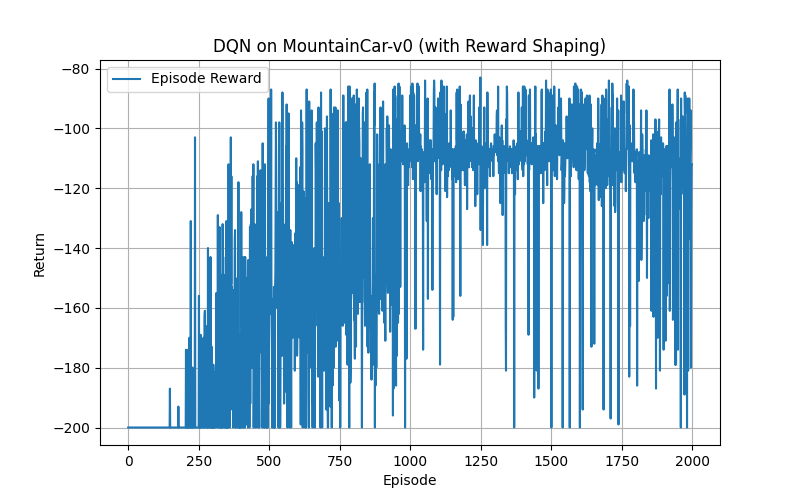
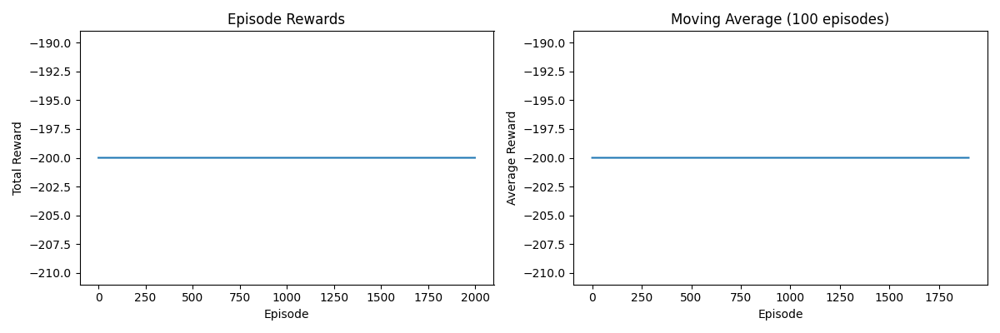
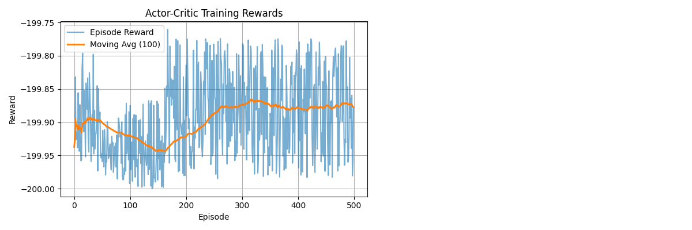
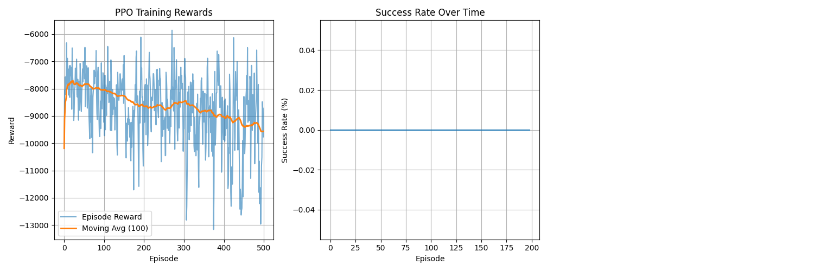

# 机器学习的数学原理 HW7

**蔡天卓 数31 2023011246**

## 1 Problem: Gridworld Navigation

Consider a simple \(3\times 3\) Gridworld where an agent navigates to reach a goal state. The states are labeled \(s_{1}\) through \(s_{9}\) as shown below:

| | | |
| ---- | ---- | ---- |
| \(s_{1}\) | \(s_{2}\) | \(s_{3}\) |
| \(s_{4}\) | \(s_{5}\) | \(s_{6}\) |
| \(s_{7}\) | \(s_{8}\) | \(s_{9}\) |


The agent can take four possible actions: \(\mathcal{A}=\{\text{Up},\text{Down},\text{Left},\text{Right}\}\). State \(s_{9}\) is a terminal goal state with reward +10. All other transitions yield a reward of \(-1\). If the agent attempts to move outside the grid, it remains in the current state and receives the transition reward.

### Parameters

* Discount factor: \(\gamma=0.9\)

* The environment is deterministic

* The terminal state \(s_{9}\) has value \(V(s_{9})=0\) (no further rewards after termination)

#### Part 1: Q-value Calculation

Assume the agent follows a uniform random policy: \(\pi(a|s)=0.25\) for all \(a\in\mathcal{A}\) in all non-terminal states.

1. Compute \(Q(s_{5},\text{Right})\) using the Bellman expectation equation: \[Q^{\pi}(s,a)=\sum_{s^{\prime}}P(s^{\prime}|s,a)\left[R(s,a,s^{\prime})+\gamma V^{\pi}(s^{\prime})\right]\] where \(V^{\pi}(s^{\prime})\) is given by the following current value function estimates (after some iterations of policy evaluation): 

| | | |
| ---- | ---- | ---- |
| $V(s_{1})=2.1$ | $V(s_{2})=3.5$ | $V(s_{3})=5.0$ |
| $V(s_{4})=1.8$ | $V(s_{5})=4.2$ | $V(s_{6})=6.8$ |
| $V(s_{7})=0.5$ | $V(s_{8})=2.9$ | $V(s_{9})=0$ |

2. Compute \(Q(s_{2},\text{Down})\) using the same value function.

#### Part 2: State Value Calculation

Now consider a different policy where:

* In \(s_{5}\): \(\pi(\text{Right}|s_{5})=0.7\), \(\pi(\text{Down}|s_{5})=0.3\), \(\pi(\text{Up}|s_{5})=0\), \(\pi(\text{Left}|s_{5})=0\)

* In \(s_{8}\): \(\pi(\text{Right}|s_{8})=0.6\), \(\pi(\text{Up}|s_{8})=0.4\), \(\pi(\text{Down}|s_{8})=0\), \(\pi(\text{Left}|s_{8})=0\)

* Assume deterministic transitions with rewards as specified earlier

The Q-values for these states under some policy are given as:

\begin{tabular}{l|c} State-Action pair & Q-value \\ \hline \(Q(s_{5},\text{Right})\) & 8.2 \\ \(Q(s_{5},\text{Down})\) & 6.5 \\ \(Q(s_{8},\text{Right})\) & 9.8 \\ \(Q(s_{8},\text{Up})\) & 7.3 \\

1. Compute \(V^{\pi}(s_{5})\) using the policy-weighted average: \[V^{\pi}(s)=\sum_{a\in\mathcal{A}}\pi(a|s)Q^{\pi}(s,a)\]

2. Compute \(V^{\pi}(s_{8})\) using the same method.

#### Part 3: Optimal Values

Assuming the agent finds the optimal policy \(\pi^{*}\):

1. Write the Bellman optimality equation for \(Q^{*}(s,a)\).

2. If \(Q^{*}(s_{6},\text{Right})=9.0\) and all other actions from \(s_{6}\) have lower Q-values, what is \(V^{*}(s_{6})\)?

3. If \(V^{*}(s_{2})=8.4\) and taking "Right" from \(s_{2}\) leads deterministically to \(s_{3}\) with \(V^{*}(s_{3})=9.0\), what is \(Q^{*}(s_{2},\text{Right})\)? (Use the reward of \(-1\) for this transition)

#### Solution of Part 1

**1.**  
根据贝尔曼期望方程：  
$$
Q^{\pi}(s, a) = \sum_{s'} P(s' \mid s, a) \left[ R(s, a, s') + \gamma V^{\pi}(s') \right]
$$  

环境是确定性的，从 \(s_5\) 执行动作"Right"必然转移到 \(s_6\)，且奖励 \(R = -1\)。已知 \(\gamma = 0.9\)，\(V(s_6) = 6.8\)，代入得：  
$$
Q(s_5, Right) = 1 \times \left[ (-1) + 0.9 \times 6.8 \right] = -1 + 6.12 = 5.12
$$

**2.**  
从 \(s_2\) 执行动作"Down"必然转移到 \(s_5\)，奖励 \(R = -1\)，已知 \(V(s_5) = 4.2\)：  
$$
Q(s_2, Down) = 1 \times \left[ (-1) + 0.9 \times 4.2 \right] = -1 + 3.78 = 2.78
$$

#### Solution of Part 2

**1.**  
$$
V^{\pi}(s) = \sum_{a \in \mathcal{A}} \pi(a \mid s) Q^{\pi}(s, a)
$$

在 \(s_5\) 的策略为：\(\pi(Right \mid s_5) = 0.7\)，\(\pi(Down \mid s_5) = 0.3\)，其他动作概率为 0。已知 \(Q(s_5, Right) = 8.2\)，\(Q(s_5, Down) = 6.5\)：  
$$
V^{\pi}(s_5) = 0.7 \times 8.2 + 0.3 \times 6.5 = 5.74 + 1.95 = 7.69
$$

**2.**  
在 \(s_8\) 的策略为：\(\pi(Right \mid s_8) = 0.6\)，\(\pi(Up \mid s_8) = 0.4\)，其他动作概率为 0。已知 \(Q(s_8, Right) = 9.8\)，\(Q(s_8, Up) = 7.3\)：  
\[
V^{\pi}(s_8) = 0.6 \times 9.8 + 0.4 \times 7.3 = 5.88 + 2.92 = 8.80
\]

#### Solution of Part 3

**1.**  
\[
Q^{*}(s, a) = \sum_{s'} P(s' \mid s, a) \left[ R(s, a, s') + \gamma \max_{a'} Q^{*}(s', a') \right]
\]

**2.**  
最优状态价值函数：  
\[
V^{*}(s) = \max_{a} Q^{*}(s, a)
\] 

已知 \(Q^{*}(s_6, Right) = 9.0\)，且其他动作的 Q 值均小于 9.0，因此：  
\[
V^{*}(s_6) = 9.0
\]

**3.**  
从 \(s_2\) 执行动作Right必然转移到 \(s_3\)，奖励 \(R = -1\)，已知 \(V^{*}(s_3) = 9.0\)：  
\[
Q^{*}(s_2, Right) = 1 \times \left[ (-1) + 0.9 \times 9.0 \right] = -1 + 8.1 = 7.1
\]


## 2 Montain car

The environment is described in https://gymnasium.farama.org/environments/classic_control/mountain_car/. Find the optimal policy by using neural network and following algorithm

1. Deep Q learning

2. Vanilla policy gradient.

3. Actor-Critic.

4. PPO.

### 1. Deep Q-Learning
```python
import gymnasium as gym
import numpy as np
import random
import torch
import torch.nn as nn
import torch.optim as optim
import matplotlib.pyplot as plt
from collections import deque

# =========================
# Q-Network
# =========================
class QNetwork(nn.Module):
    def __init__(self, obs_dim, act_dim):
        super().__init__()
        self.net = nn.Sequential(
            nn.Linear(obs_dim, 128),
            nn.ReLU(),
            nn.Linear(128, 128),
            nn.ReLU(),
            nn.Linear(128, act_dim)
        )

    def forward(self, x):
        return self.net(x)


# =========================
# DQN Agent
# =========================
class DQNAgent:
    def __init__(
        self,
        obs_dim,
        act_dim,
        lr=1e-3,
        gamma=0.99,
        epsilon_start=1.0,
        epsilon_end=0.05,
        epsilon_decay=5000,
        buffer_size=100000,
        batch_size=64,
        target_update_freq=1000
    ):
        self.q_net = QNetwork(obs_dim, act_dim)
        self.target_net = QNetwork(obs_dim, act_dim)
        self.target_net.load_state_dict(self.q_net.state_dict())
        self.target_net.eval()

        self.optimizer = optim.Adam(self.q_net.parameters(), lr=lr)
        self.gamma = gamma

        self.epsilon = epsilon_start
        self.epsilon_start = epsilon_start
        self.epsilon_end = epsilon_end
        self.epsilon_decay = epsilon_decay

        self.batch_size = batch_size
        self.target_update_freq = target_update_freq

        self.replay_buffer = deque(maxlen=buffer_size)
        self.step_count = 0
        self.act_dim = act_dim

    def select_action(self, obs):
        self.step_count += 1
        self.epsilon = self.epsilon_end + (
            self.epsilon_start - self.epsilon_end
        ) * np.exp(-1.0 * self.step_count / self.epsilon_decay)

        if random.random() < self.epsilon:
            return random.randint(0, self.act_dim - 1)
        else:
            obs_t = torch.tensor(obs, dtype=torch.float32)
            with torch.no_grad():
                q_values = self.q_net(obs_t)
            return q_values.argmax().item()

    def store(self, transition):
        self.replay_buffer.append(transition)

    def update(self):
        if len(self.replay_buffer) < self.batch_size:
            return

        batch = random.sample(self.replay_buffer, self.batch_size)
        obs, actions, rewards, next_obs, dones = zip(*batch)

        obs = torch.tensor(obs, dtype=torch.float32)
        actions = torch.tensor(actions).unsqueeze(1)
        rewards = torch.tensor(rewards, dtype=torch.float32)
        next_obs = torch.tensor(next_obs, dtype=torch.float32)
        dones = torch.tensor(dones, dtype=torch.float32)

        q_values = self.q_net(obs).gather(1, actions).squeeze()
        with torch.no_grad():
            max_next_q = self.target_net(next_obs).max(1)[0]
            target = rewards + self.gamma * max_next_q * (1 - dones)

        loss = nn.MSELoss()(q_values, target)

        self.optimizer.zero_grad()
        loss.backward()
        self.optimizer.step()

        if self.step_count % self.target_update_freq == 0:
            self.target_net.load_state_dict(self.q_net.state_dict())


# =========================
# Training Loop
# =========================
def train_dqn(episodes=2000):
    env = gym.make("MountainCar-v0")
    agent = DQNAgent(
        obs_dim=env.observation_space.shape[0],
        act_dim=env.action_space.n
    )

    reward_history = []

    for ep in range(episodes):
        obs, _ = env.reset()
        done = False
        ep_reward = 0

        while not done:
            action = agent.select_action(obs)
            next_obs, reward, terminated, truncated, _ = env.step(action)
            done = terminated or truncated

            # =========================
            # Reward Shaping
            # =========================
            shaped_reward = reward + 0.1 * next_obs[0]  # position shaping

            agent.store((obs, action, shaped_reward, next_obs, done))
            agent.update()

            obs = next_obs
            ep_reward += reward  # 原始 reward 用于评估

        reward_history.append(ep_reward)

        if (ep + 1) % 50 == 0:
            print(
                f"Episode {ep+1:4d} | "
                f"Avg Reward (50): {np.mean(reward_history[-50:]):.2f}"
            )

    env.close()

    # =========================
    # Visualization
    # =========================
    plt.figure(figsize=(8, 5))
    plt.plot(reward_history, label="Episode Reward")
    plt.xlabel("Episode")
    plt.ylabel("Return")
    plt.title("DQN on MountainCar-v0 (with Reward Shaping)")
    plt.legend()
    plt.grid()

    plt.savefig("dqn_mountaincar_reward.png")
    plt.show()


if __name__ == "__main__":
    train_dqn()
```
结果如下：

```
Episode   50 | Avg Reward (50): -200.00
Episode  100 | Avg Reward (50): -200.00
Episode  150 | Avg Reward (50): -199.74
Episode  200 | Avg Reward (50): -199.86
Episode  250 | Avg Reward (50): -193.78
Episode  300 | Avg Reward (50): -191.74
Episode  350 | Avg Reward (50): -180.18
Episode  400 | Avg Reward (50): -170.18
Episode  450 | Avg Reward (50): -160.80
Episode  500 | Avg Reward (50): -165.66
Episode  550 | Avg Reward (50): -154.56
Episode  600 | Avg Reward (50): -154.44
Episode  650 | Avg Reward (50): -150.76
Episode  700 | Avg Reward (50): -149.78
Episode  750 | Avg Reward (50): -150.82
Episode  800 | Avg Reward (50): -147.16
Episode  850 | Avg Reward (50): -133.52
Episode  900 | Avg Reward (50): -148.62
Episode  950 | Avg Reward (50): -126.24
Episode 1000 | Avg Reward (50): -116.90
Episode 1050 | Avg Reward (50): -108.20
Episode 1100 | Avg Reward (50): -108.94
Episode 1150 | Avg Reward (50): -108.32
Episode 1200 | Avg Reward (50): -110.24
Episode 1250 | Avg Reward (50): -107.12
Episode 1300 | Avg Reward (50): -109.94
Episode 1350 | Avg Reward (50): -108.92
Episode 1400 | Avg Reward (50): -110.54
Episode 1450 | Avg Reward (50): -110.44
Episode 1500 | Avg Reward (50): -107.16
Episode 1550 | Avg Reward (50): -109.16
Episode 1600 | Avg Reward (50): -105.68
Episode 1650 | Avg Reward (50): -109.38
Episode 1700 | Avg Reward (50): -111.52
Episode 1750 | Avg Reward (50): -112.10
Episode 1800 | Avg Reward (50): -107.34
Episode 1850 | Avg Reward (50): -116.78
Episode 1900 | Avg Reward (50): -119.02
Episode 1950 | Avg Reward (50): -118.44
Episode 2000 | Avg Reward (50): -119.30
```



### 2. Vanilla Policy Gradient
```python
import gymnasium as gym
import torch
import torch.nn as nn
import torch.optim as optim
import numpy as np
import matplotlib.pyplot as plt
from collections import deque
import torch.nn.functional as F

class PolicyNetwork(nn.Module):
    def __init__(self, state_dim, action_dim, hidden_dim=128):
        super().__init__()
        self.fc1 = nn.Linear(state_dim, hidden_dim)
        self.fc2 = nn.Linear(hidden_dim, hidden_dim)
        self.fc3 = nn.Linear(hidden_dim, action_dim)
        
    def forward(self, state):
        x = torch.relu(self.fc1(state))
        x = torch.relu(self.fc2(x))
        return F.softmax(self.fc3(x), dim=-1)

class VPGAgent:
    def __init__(self, state_dim=2, action_dim=3, hidden_dim=128, 
                 lr=0.001, gamma=0.99, device='cuda'):
        self.device = torch.device(device if torch.cuda.is_available() else 'cpu')
        self.policy = PolicyNetwork(state_dim, action_dim, hidden_dim).to(self.device)
        self.optimizer = optim.Adam(self.policy.parameters(), lr=lr)
        self.gamma = gamma
        self.log_probs = []
        self.rewards = []
        
    def select_action(self, state):
        state = torch.FloatTensor(state).unsqueeze(0).to(self.device)
        probs = self.policy(state)
        action_dist = torch.distributions.Categorical(probs)
        action = action_dist.sample()
        log_prob = action_dist.log_prob(action)
        
        self.log_probs.append(log_prob)
        return action.item()
    
    def update(self):
        # Calculate discounted returns
        returns = []
        R = 0
        for r in reversed(self.rewards):
            R = r + self.gamma * R
            returns.insert(0, R)
        
        returns = torch.FloatTensor(returns).to(self.device)
        returns = (returns - returns.mean()) / (returns.std() + 1e-8)
        
        # Calculate policy loss
        policy_loss = []
        for log_prob, R in zip(self.log_probs, returns):
            policy_loss.append(-log_prob * R)
        
        policy_loss = torch.stack(policy_loss).sum()
        
        # Update policy
        self.optimizer.zero_grad()
        policy_loss.backward()
        self.optimizer.step()
        
        # Clear buffers
        self.log_probs = []
        self.rewards = []
        
        return policy_loss.item()

def train_vpg(episodes=2000, max_steps=200):
    env = gym.make('MountainCar-v0')
    agent = VPGAgent()
    
    episode_rewards = []
    episode_lengths = []
    moving_avg_rewards = deque(maxlen=100)
    
    for episode in range(episodes):
        state, _ = env.reset()
        total_reward = 0
        log_probs = []
        
        for step in range(max_steps):
            action = agent.select_action(state)
            next_state, reward, terminated, truncated, _ = env.step(action)
            
            # Modify reward to encourage reaching the goal
            position = next_state[0]
            velocity = next_state[1]
            
            # Reward shaping: extra reward for being close to goal
            if position >= 0.5:  # Goal reached
                reward += 100
            elif position > 0.3:  # Close to goal
                reward += 10
            elif position > 0:  # Right side of valley
                reward += 1
            
            agent.rewards.append(reward)
            total_reward += reward
            state = next_state
            
            if terminated or truncated:
                break
        
        # Update policy
        loss = agent.update()
        
        episode_rewards.append(total_reward)
        episode_lengths.append(step + 1)
        moving_avg_rewards.append(total_reward)
        
        if episode % 100 == 0:
            avg_reward = np.mean(list(moving_avg_rewards))
            print(f"Episode {episode}, Reward: {total_reward:.2f}, "
                  f"Avg Reward (last 100): {avg_reward:.2f}, "
                  f"Length: {step + 1}")
    
    env.close()
    
    # Plot results
    plt.figure(figsize=(12, 4))
    
    plt.subplot(1, 2, 1)
    plt.plot(episode_rewards)
    plt.title('Episode Rewards')
    plt.xlabel('Episode')
    plt.ylabel('Total Reward')
    
    plt.subplot(1, 2, 2)
    moving_avg = np.convolve(episode_rewards, np.ones(100)/100, mode='valid')
    plt.plot(moving_avg)
    plt.title('Moving Average (100 episodes)')
    plt.xlabel('Episode')
    plt.ylabel('Average Reward')
    
    plt.tight_layout()
    plt.savefig('vpg_training.png')
    plt.show()
    
    return agent

if __name__ == "__main__":
    train_vpg()
```

结果如下：


### 3. Actor-Critic
```python
import gymnasium as gym
import torch
import torch.nn as nn
import torch.optim as optim
import numpy as np
from collections import deque
import matplotlib.pyplot as plt
import random

class ActorNetwork(nn.Module):
    def __init__(self, state_dim, action_dim, hidden_dim=128):
        super(ActorNetwork, self).__init__()
        self.fc1 = nn.Linear(state_dim, hidden_dim)
        self.fc2 = nn.Linear(hidden_dim, hidden_dim)
        self.fc3 = nn.Linear(hidden_dim, action_dim)
        
    def forward(self, x):
        x = torch.relu(self.fc1(x))
        x = torch.relu(self.fc2(x))
        x = self.fc3(x)
        return torch.softmax(x, dim=-1)
    
    def get_action(self, state, device='cpu'):
        state = torch.FloatTensor(state).unsqueeze(0).to(device)
        probs = self.forward(state)
        action_dist = torch.distributions.Categorical(probs)
        action = action_dist.sample()
        return action.item(), action_dist.log_prob(action)

class CriticNetwork(nn.Module):
    def __init__(self, state_dim, hidden_dim=128):
        super(CriticNetwork, self).__init__()
        self.fc1 = nn.Linear(state_dim, hidden_dim)
        self.fc2 = nn.Linear(hidden_dim, hidden_dim)
        self.fc3 = nn.Linear(hidden_dim, 1)
        
    def forward(self, x):
        x = torch.relu(self.fc1(x))
        x = torch.relu(self.fc2(x))
        return self.fc3(x)

class ACAgent:
    def __init__(self, state_dim, action_dim, actor_lr=0.001, critic_lr=0.001, gamma=0.99):
        self.device = torch.device('cuda' if torch.cuda.is_available() else 'cpu')
        self.actor = ActorNetwork(state_dim, action_dim).to(self.device)
        self.critic = CriticNetwork(state_dim).to(self.device)
        self.actor_optimizer = optim.Adam(self.actor.parameters(), lr=actor_lr)
        self.critic_optimizer = optim.Adam(self.critic.parameters(), lr=critic_lr)
        self.gamma = gamma
        
    def select_action(self, state):
        action, log_prob = self.actor.get_action(state, self.device)
        value = self.critic(torch.FloatTensor(state).unsqueeze(0).to(self.device))
        return action, log_prob, value
    
    def update(self, log_probs, values, rewards, next_state, done):
        # Calculate returns and advantages
        returns = []
        advantages = []
        R = 0 if done else self.critic(torch.FloatTensor(next_state).unsqueeze(0).to(self.device)).item()
        
        # Calculate returns from the end
        for r in reversed(rewards):
            R = r + self.gamma * R
            returns.insert(0, R)
        
        returns = torch.tensor(returns, device=self.device).unsqueeze(1)
        values = torch.cat(values)
        
        # Calculate advantages
        advantages = returns - values
        
        # Calculate actor loss
        actor_loss = -(torch.stack(log_probs) * advantages.detach()).mean()
        
        # Calculate critic loss
        critic_loss = advantages.pow(2).mean()
        
        # Update networks
        self.actor_optimizer.zero_grad()
        actor_loss.backward()
        self.actor_optimizer.step()
        
        self.critic_optimizer.zero_grad()
        critic_loss.backward()
        self.critic_optimizer.step()
        
        return actor_loss.item(), critic_loss.item()

def train_ac(env_name="MountainCar-v0", num_episodes=1000, render_freq=100):
    env = gym.make(env_name)
    state_dim = env.observation_space.shape[0]
    action_dim = env.action_space.n
    
    agent = ACAgent(state_dim, action_dim)
    
    episode_rewards = []
    moving_avg_rewards = []
    moving_window = deque(maxlen=100)
    
    for episode in range(num_episodes):
        state, _ = env.reset()
        total_reward = 0
        done = False
        truncated = False
        
        log_probs = []
        values = []
        rewards = []
        
        while not (done or truncated):
            action, log_prob, value = agent.select_action(state)
            next_state, reward, done, truncated, _ = env.step(action)
            
            # Optional: Modify reward
            if not done:
                reward = reward + 0.1 * abs(next_state[1])  # Reward for velocity
            
            log_probs.append(log_prob)
            values.append(value)
            rewards.append(reward)
            total_reward += reward
            
            # Update every step
            if len(rewards) > 0:
                actor_loss, critic_loss = agent.update(log_probs, values, rewards, next_state, done or truncated)
                log_probs = []
                values = []
                rewards = []
            
            state = next_state
        
        # Record rewards
        episode_rewards.append(total_reward)
        moving_window.append(total_reward)
        moving_avg = np.mean(moving_window)
        moving_avg_rewards.append(moving_avg)
        
        # Print progress
        if (episode + 1) % 10 == 0:
            print(f"Episode {episode+1}/{num_episodes}, "
                  f"Reward: {total_reward:.2f}, "
                  f"Moving Avg: {moving_avg:.2f}")
        
        # Render occasionally
        if (episode + 1) % render_freq == 0:
            test_ac_agent(agent, env_name, render=True)
    
    # Save the models
    torch.save(agent.actor.state_dict(), 'ac_actor_mountaincar.pth')
    torch.save(agent.critic.state_dict(), 'ac_critic_mountaincar.pth')
    
    # Plot results
    plt.figure(figsize=(12, 4))
    
    plt.subplot(1, 2, 1)
    plt.plot(episode_rewards, alpha=0.6)
    plt.plot(moving_avg_rewards, linewidth=2)
    plt.xlabel('Episode')
    plt.ylabel('Reward')
    plt.title('Actor-Critic Training Rewards')
    plt.legend(['Episode Reward', 'Moving Avg (100)'])
    plt.grid(True)
    
    plt.tight_layout()
    plt.savefig('ac_training.png')
    plt.show()
    
    env.close()
    return agent

def test_ac_agent(agent, env_name="MountainCar-v0", num_episodes=5, render=True):
    env = gym.make(env_name, render_mode="human" if render else None)
    total_rewards = []
    
    for episode in range(num_episodes):
        state, _ = env.reset()
        total_reward = 0
        done = False
        truncated = False
        
        while not (done or truncated):
            action, _, _ = agent.select_action(state)
            state, reward, done, truncated, _ = env.step(action)
            total_reward += reward
        
        total_rewards.append(total_reward)
        print(f"Test Episode {episode+1}: Reward = {total_reward}")
    
    env.close()
    print(f"Average test reward: {np.mean(total_rewards):.2f}")
    return total_rewards

if __name__ == "__main__":
    agent = train_ac(num_episodes=500, render_freq=50)
```

结果如下：

其经过episode = 2000的训练后reward还是始终保持在-200

### 4. PPO 
```python
import gymnasium as gym
import torch
import torch.nn as nn
import torch.optim as optim
import numpy as np
from collections import deque
import matplotlib.pyplot as plt
import random

class ActorCriticNetwork(nn.Module):
    def __init__(self, state_dim, action_dim, hidden_dim=128):
        super(ActorCriticNetwork, self).__init__()
        
        # 共享特征提取层
        self.shared = nn.Sequential(
            nn.Linear(state_dim, hidden_dim),
            nn.Tanh(),
            nn.Linear(hidden_dim, hidden_dim),
            nn.Tanh()
        )
        
        # Actor头 - 策略网络
        self.actor = nn.Sequential(
            nn.Linear(hidden_dim, hidden_dim // 2),
            nn.Tanh(),
            nn.Linear(hidden_dim // 2, action_dim)
        )
        
        # Critic头 - 价值网络
        self.critic = nn.Sequential(
            nn.Linear(hidden_dim, hidden_dim // 2),
            nn.Tanh(),
            nn.Linear(hidden_dim // 2, 1)
        )
        
        # 初始化参数
        for layer in self.shared:
            if isinstance(layer, nn.Linear):
                nn.init.xavier_uniform_(layer.weight)
                
        for layer in self.actor:
            if isinstance(layer, nn.Linear):
                nn.init.xavier_uniform_(layer.weight)
                
        for layer in self.critic:
            if isinstance(layer, nn.Linear):
                nn.init.xavier_uniform_(layer.weight)
        
    def forward(self, x):
        shared_features = self.shared(x)
        action_logits = self.actor(shared_features)
        state_value = self.critic(shared_features)
        return action_logits, state_value
    
    def get_action(self, state):
        action_logits, state_value = self.forward(state)
        action_probs = torch.softmax(action_logits, dim=-1)
        action_dist = torch.distributions.Categorical(action_probs)
        action = action_dist.sample()
        
        return action, action_dist.log_prob(action), state_value.squeeze(), action_dist.entropy()

class PPOMemory:
    """PPO经验回放缓冲区"""
    def __init__(self, batch_size):
        self.states = []
        self.actions = []
        self.log_probs = []
        self.values = []
        self.rewards = []
        self.dones = []
        
        self.batch_size = batch_size
        
    def store(self, state, action, log_prob, value, reward, done):
        self.states.append(state)
        self.actions.append(action)
        self.log_probs.append(log_prob)
        self.values.append(value)
        self.rewards.append(reward)
        self.dones.append(done)
        
    def clear(self):
        self.states = []
        self.actions = []
        self.log_probs = []
        self.values = []
        self.rewards = []
        self.dones = []
        
    def get_batches(self):
        n_states = len(self.states)
        batch_start = np.arange(0, n_states, self.batch_size)
        indices = np.arange(n_states, dtype=np.int64)
        np.random.shuffle(indices)
        batches = [indices[i:i+self.batch_size] for i in batch_start]
        
        return np.array(self.states), np.array(self.actions), np.array(self.log_probs), \
               np.array(self.values), np.array(self.rewards), np.array(self.dones), batches

class PPOAgent:
    def __init__(self, state_dim, action_dim, lr=3e-4, gamma=0.99, gae_lambda=0.95,
                 clip_epsilon=0.2, ppo_epochs=10, batch_size=64, entropy_coef=0.01):
        self.device = torch.device('cuda' if torch.cuda.is_available() else 'cpu')
        print(f"Using device: {self.device}")
        
        self.model = ActorCriticNetwork(state_dim, action_dim).to(self.device)
        self.optimizer = optim.Adam(self.model.parameters(), lr=lr, eps=1e-5)
        
        self.gamma = gamma
        self.gae_lambda = gae_lambda
        self.clip_epsilon = clip_epsilon
        self.ppo_epochs = ppo_epochs
        self.batch_size = batch_size
        self.entropy_coef = entropy_coef
        
        self.memory = PPOMemory(batch_size)
        
    def select_action(self, state):
        state_tensor = torch.FloatTensor(state).unsqueeze(0).to(self.device)
        with torch.no_grad():
            action, log_prob, value, entropy = self.model.get_action(state_tensor)
        
        return action.item(), log_prob.item(), value.item()
    
    def compute_gae(self, next_value, rewards, values, dones):
        """计算广义优势估计(GAE)"""
        gae = 0
        returns = []
        advantages = []
        
        # 反向计算
        for step in reversed(range(len(rewards))):
            if step == len(rewards) - 1:
                next_non_terminal = 1.0 - dones[step]
                next_values = next_value
            else:
                next_non_terminal = 1.0 - dones[step + 1]
                next_values = values[step + 1]
            
            delta = rewards[step] + self.gamma * next_values * next_non_terminal - values[step]
            gae = delta + self.gamma * self.gae_lambda * next_non_terminal * gae
            advantages.insert(0, gae)
            returns.insert(0, gae + values[step])
            
        return np.array(advantages), np.array(returns)
    
    def update(self):
        """PPO更新步骤"""
        # 获取经验数据
        states, actions, old_log_probs, values, rewards, dones, batches = self.memory.get_batches()
        
        # 计算GAE和回报
        with torch.no_grad():
            next_state_tensor = torch.FloatTensor(states[-1]).unsqueeze(0).to(self.device)
            _, next_value = self.model(next_state_tensor)
            next_value = next_value.squeeze().item()
        
        advantages, returns = self.compute_gae(next_value, rewards, values, dones)
        
        # 转换为tensor
        states = torch.FloatTensor(states).to(self.device)
        actions = torch.LongTensor(actions).to(self.device)
        old_log_probs = torch.FloatTensor(old_log_probs).to(self.device)
        returns = torch.FloatTensor(returns).to(self.device)
        advantages = torch.FloatTensor(advantages).to(self.device)
        
        # 归一化优势
        if advantages.std() > 0:
            advantages = (advantages - advantages.mean()) / (advantages.std() + 1e-8)
        
        # PPO多次更新
        for _ in range(self.ppo_epochs):
            for batch in batches:
                # 获取批量数据
                batch_states = states[batch]
                batch_actions = actions[batch]
                batch_old_log_probs = old_log_probs[batch]
                batch_returns = returns[batch]
                batch_advantages = advantages[batch]
                
                # 前向传播
                action_logits, state_values = self.model(batch_states)
                action_probs = torch.softmax(action_logits, dim=-1)
                dist = torch.distributions.Categorical(action_probs)
                
                # 计算新log probs和熵
                new_log_probs = dist.log_prob(batch_actions)
                entropy = dist.entropy().mean()
                
                # 计算比率
                ratio = torch.exp(new_log_probs - batch_old_log_probs)
                
                # 计算代理损失
                surr1 = ratio * batch_advantages
                surr2 = torch.clamp(ratio, 1 - self.clip_epsilon, 1 + self.clip_epsilon) * batch_advantages
                actor_loss = -torch.min(surr1, surr2).mean()
                
                # 计算critic损失
                critic_loss = 0.5 * (state_values.squeeze() - batch_returns).pow(2).mean()
                
                # 总损失
                loss = actor_loss + 0.5 * critic_loss - self.entropy_coef * entropy
                
                # 反向传播
                self.optimizer.zero_grad()
                loss.backward()
                
                # 梯度裁剪
                torch.nn.utils.clip_grad_norm_(self.model.parameters(), max_norm=0.5)
                
                self.optimizer.step()
        
        # 清空内存
        self.memory.clear()
        
        return actor_loss.item(), critic_loss.item()

def train_ppo(env_name="MountainCar-v0", num_episodes=1000, max_timesteps=500, update_freq=10, render_freq=50):
    # 创建环境
    env = gym.make(env_name, max_episode_steps=max_timesteps)
    
    state_dim = env.observation_space.shape[0]
    action_dim = env.action_space.n
    
    agent = PPOAgent(state_dim, action_dim, lr=3e-4, gamma=0.99, 
                     gae_lambda=0.95, clip_epsilon=0.2, ppo_epochs=4,
                     batch_size=32, entropy_coef=0.01)
    
    episode_rewards = []
    moving_avg_rewards = []
    moving_window = deque(maxlen=100)
    success_rate = deque(maxlen=100)
    
    timestep = 0
    
    for episode in range(num_episodes):
        state, _ = env.reset()
        episode_reward = 0
        done = False
        truncated = False
        success = False
        
        # 自定义奖励参数
        last_position = state[0]
        swing_count = 0
        last_action = None
        
        while not (done or truncated):
            # 选择动作
            action, log_prob, value = agent.select_action(state)
            
            # 执行动作
            next_state, reward, done, truncated, _ = env.step(action)
            
            # 自定义奖励函数
            position = next_state[0]
            velocity = next_state[1]
            
            # 1. 基础奖励
            base_reward = -1 if position < 0.5 else 0
            
            # 2. 位置奖励
            position_reward = 100 * position if position > last_position else 0
            
            # 3. 摆动奖励（鼓励反直觉策略）
            if last_action is not None:
                if action != last_action:  # 动作变化
                    swing_count += 1
                    swing_reward = min(swing_count * 0.5, 10)
                else:
                    swing_reward = -0.1  # 惩罚连续相同动作
            else:
                swing_reward = 0
            
            # 4. 速度奖励
            velocity_reward = 50 * abs(velocity)
            
            # 5. 进展奖励
            progress = position - last_position
            progress_reward = 200 * progress if progress > 0 else 0
            
            # 组合奖励
            total_reward = (base_reward + position_reward + swing_reward + 
                          velocity_reward + progress_reward)
            
            # 存储经验
            agent.memory.store(state, action, log_prob, value, total_reward, done)
            
            episode_reward += total_reward
            timestep += 1
            
            # 定期更新
            if timestep % update_freq == 0:
                actor_loss, critic_loss = agent.update()
            
            # 更新状态
            state = next_state
            last_position = position
            last_action = action
            
            # 检查是否成功
            if position >= 0.5:
                success = True
                done = True
        
        # 如果回合结束，进行一次更新
        if len(agent.memory.states) > 0:
            actor_loss, critic_loss = agent.update()
        
        # 记录结果
        episode_rewards.append(episode_reward)
        moving_window.append(episode_reward)
        moving_avg = np.mean(moving_window)
        moving_avg_rewards.append(moving_avg)
        
        success_rate.append(1 if success else 0)
        
        # 打印进度
        if (episode + 1) % 10 == 0:
            avg_success = np.mean(success_rate) * 100
            print(f"Episode {episode+1}/{num_episodes}, "
                  f"Reward: {episode_reward:.2f}, "
                  f"Avg Reward: {moving_avg:.2f}, "
                  f"Success Rate: {avg_success:.1f}%")
        
        # 定期测试
        if (episode + 1) % render_freq == 0:
            test_ppo_agent(agent, env_name, num_episodes=3)
    
    # 保存模型
    torch.save({
        'model_state_dict': agent.model.state_dict(),
        'optimizer_state_dict': agent.optimizer.state_dict(),
    }, 'ppo_mountaincar_optimized.pth')
    
    # 绘制训练曲线
    plt.figure(figsize=(15, 5))
    
    plt.subplot(1, 3, 1)
    plt.plot(episode_rewards, alpha=0.6, label='Episode Reward')
    plt.plot(moving_avg_rewards, linewidth=2, label='Moving Avg (100)')
    plt.xlabel('Episode')
    plt.ylabel('Reward')
    plt.title('PPO Training Rewards')
    plt.legend()
    plt.grid(True)
    
    plt.subplot(1, 3, 2)
    success_rates = []
    for i in range(len(episode_rewards)):
        start = max(0, i-99)
        success_rates.append(np.mean(list(success_rate)[start:i+1]) * 100)
    plt.plot(success_rates)
    plt.xlabel('Episode')
    plt.ylabel('Success Rate (%)')
    plt.title('Success Rate Over Time')
    plt.grid(True)
    
    plt.tight_layout()
    plt.savefig('ppo_training_optimized.png')
    plt.show()
    
    env.close()
    return agent

def test_ppo_agent(agent, env_name="MountainCar-v0", num_episodes=5, render=True):
    env = gym.make(env_name, render_mode="human" if render else None)
    total_rewards = []
    success_count = 0
    
    for episode in range(num_episodes):
        state, _ = env.reset()
        total_reward = 0
        steps = 0
        done = False
        truncated = False
        
        positions = []
        actions = []
        velocities = []
        
        while not (done or truncated):
            action, _, _ = agent.select_action(state)
            state, reward, done, truncated, _ = env.step(action)
            total_reward += reward
            steps += 1
            
            positions.append(state[0])
            actions.append(action)
            velocities.append(state[1])
        
        total_rewards.append(total_reward)
        
        # 检查是否成功
        if state[0] >= 0.5:
            success_count += 1
            print(f"Test Episode {episode+1}: SUCCESS in {steps} steps!")
            
            # 分析成功策略
            print("  Strategy analysis:")
            for i in range(min(20, len(actions))):
                action_names = ["Left", "No-op", "Right"]
                print(f"    Step {i+1}: {action_names[actions[i]]}, Position: {positions[i]:.3f}, Velocity: {velocities[i]:.3f}")
        else:
            print(f"Test Episode {episode+1}: Failed in {steps} steps, final position: {state[0]:.3f}")
        
        # 统计动作分布
        left_actions = sum(1 for a in actions if a == 0)
        right_actions = sum(1 for a in actions if a == 2)
        noop_actions = sum(1 for a in actions if a == 1)
        
        print(f"  Actions: Left={left_actions}, Right={right_actions}, No-op={noop_actions}")
        
        # 绘制轨迹
        fig, (ax1, ax2) = plt.subplots(1, 2, figsize=(12, 4))
        
        ax1.plot(positions)
        ax1.set_xlabel('Step')
        ax1.set_ylabel('Position')
        ax1.set_title(f'Position Trajectory (Final: {positions[-1]:.3f})')
        ax1.axhline(y=0.5, color='r', linestyle='--', label='Goal')
        ax1.grid(True)
        ax1.legend()
        
        ax2.plot(velocities)
        ax2.set_xlabel('Step')
        ax2.set_ylabel('Velocity')
        ax2.set_title('Velocity Profile')
        ax2.grid(True)
        
        plt.tight_layout()
        plt.show()
    
    env.close()
    
    success_rate = success_count / num_episodes * 100
    print(f"\nTest Results: Success Rate = {success_rate:.1f}%, Average Reward = {np.mean(total_rewards):.2f}")
    
    return total_rewards

if __name__ == "__main__":
    # 设置随机种子
    torch.manual_seed(42)
    np.random.seed(42)
    random.seed(42)
    
    # 启用CUDA优化
    if torch.cuda.is_available():
        torch.backends.cudnn.benchmark = True
    
    # 训练
    agent = train_ppo(num_episodes=500, max_timesteps=400, update_freq=5, render_freq=50)
```

其结果如下：