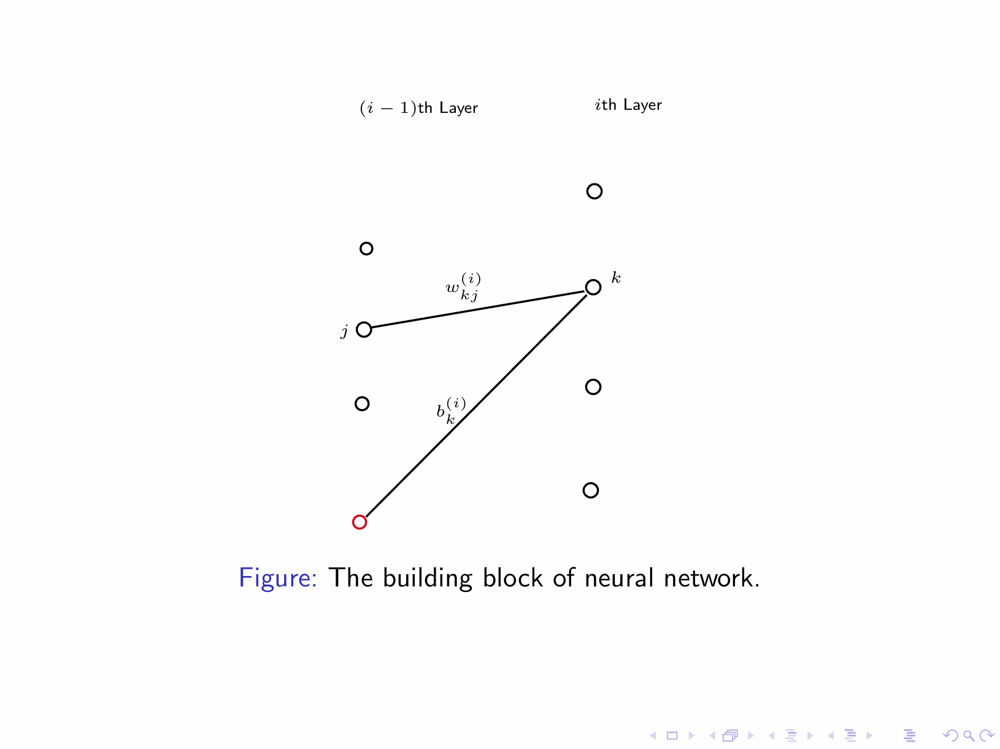
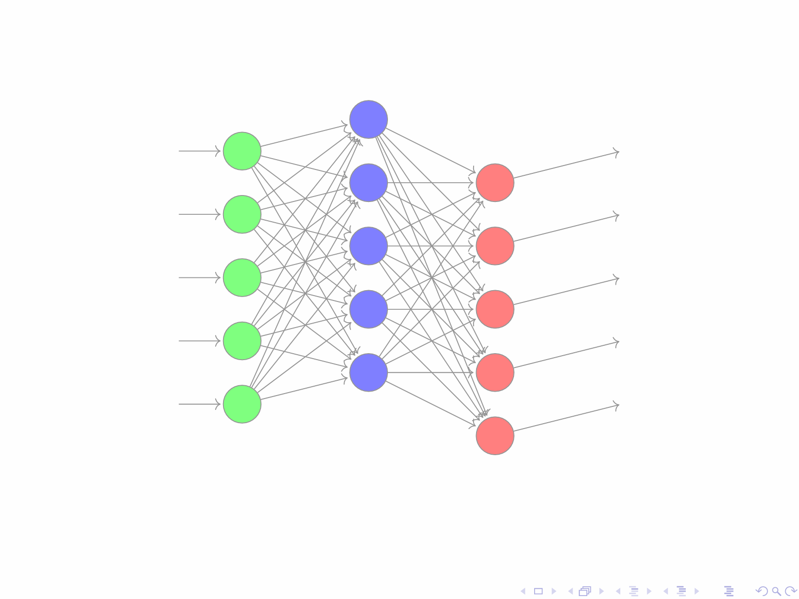
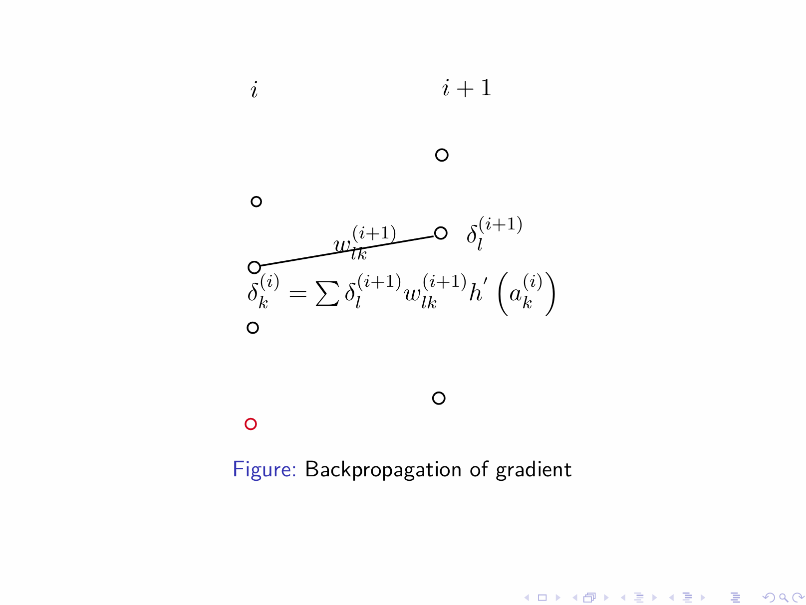

**第三讲 2025年9月22日**

# 第三章：非线性效应
## **1.线性模型：假设与局限性**

标准线性模型基于两个基本概率假设：

1.  **高斯噪声：** 假设目标变量 \( y \) 在其均值附近服从高斯（正态）分布。
2.  **线性均值：** 该分布的均值是输入特征 \( x \) 的线性组合：

\[\mathbb{E}[y | x] = w^T x = w_0 + w_1 x_1 + \ldots + w_D x_D\]

这引出了熟悉的模型：
\[y = w^T x + \epsilon,\]
其中
\[\epsilon \sim \mathcal{N}(0, \sigma^2).\]

**解决局限性**

这些假设对于现实世界的数据通常限制性过强。
一个强大的解决方案是使用非线性基函数 \(\phi_j(\mathbf{x})\) 将输入投影到特征空间：

\[\mathbb{E}[y \mid \mathbf{x}] = \sum_{j=0}^{M} w_j \phi_j(\mathbf{x})\]

该模型在参数 \(w_j\) 上保持线性，便于优化，但能够捕捉数据中复杂的非线性关系。

形式为 \(\mathbb{E}[y | x] = \sum_j w_j \phi_j(x)\) 的模型是广义线性模型和线性基函数模型的基础。

**常见基函数目录**

| 类型       | 基函数                                  | 描述                         |
| :--------- | :-------------------------------------- | :--------------------------- |
| 多项式     | \(x^j\)                                 | 简单曲线，全局影响。         |
| 高斯       | \(\exp\left(-\frac{(x-\mu_j)^2}{2s^2}\right)\) | 局部"凸起"，通用逼近器。     |
| S型        | \(\sigma\left(\frac{x-\mu_j}{s}\right)\)        | 平滑的阶跃函数。             |
| 傅里叶     | \(\sin(\omega_j x), \cos(\omega_j x)\)  | 适用于周期性数据。           |

特征工程的艺术通常在于为这些函数选择正确的类型和参数（例如，\(\mu_j\), \(s\)）。

**现代范式：学习得到的特征**

深度学习模型不是手动进行特征工程，而是直接从数据中学习最优的层次化特征 \(\phi(x)\)，从而自动化这一关键步骤。

**什么是广义线性模型？**

► **广义线性模型** 扩展了线性回归
► 允许非正态的响应分布
► 三个组成部分：
    1. **随机成分：** 响应的概率分布
    2. **系统成分：** 线性预测器 \(\eta = \mathbf{w}^T \phi(\mathbf{x})\)
    3. **连接函数：** \(g(\mu) = \eta\)

**GLM 方程**

\[\mathbb{E}[y|\mathbf{x}] = \mu = g^{-1}(\mathbf{w}^T \phi(\mathbf{x}))\]

**# 训练**:损失函数可以通过遵循与线性模型类似方法的极大似然估计找到。没有精确解，因此需要随机梯度下降估计方法。

===== Page 8 =====

**连接函数**:在逻辑回归中，我们使用 S 型函数 \(\sigma(z)\) 来建模概率。

我们可以通过使用任何将实值映射到有效概率的函数 \(f : \mathbb{R} \to [0, 1]\) 来推广此模型：

\[p(t = 1 \, | \, \mathbf{w}, \mathbf{x}) = f(\mathbf{w}^T\mathbf{x})\]

这样的函数 \(f\) 在广义线性模型的背景下被称为连接函数或激活函数。

**概率解释**:任何连续随机变量的有效累积分布函数 \(F\) 都定义了一个适当的连接函数：

\[f(x) = \int_{-\infty}^{x} p(\theta) \, d\theta = F(x)\]

S 型函数 \(\sigma(x)\) 对应于逻辑斯蒂分布的 CDF。

**二元分类的常见连接函数目录**

| 名称                    | 函数 \( f(z) \)              | 分布                 | 特性             |
| :---------------------- | :--------------------------- | :------------------- | :--------------- |
| Logistics(Sigmoid) | \( \frac{1}{1+e^{-z}} \)     | 逻辑斯蒂   | 平滑，对称       |
| Probit                  | \( \Phi(z) \)                | 标准正态             | 对称，S形        |
| Log-Log                 | \( 1-\exp(-\exp(z)) \)       | 冈贝尔（极值）       | 不对称           |
| 互补 Log-Log      | \( \exp(-\exp(-z)) \)        | 冈贝尔（最大稳定）   | 不对称           |

连接函数的选择会影响模型性能，尤其是在分布的尾部。

**处理非线性：基函数展开**
为了建模复杂的非线性关系，我们可以使用基函数 \( \phi_j(\mathbf{x}) \) 将输入投影到特征空间：

\[p(t = 1 \mid \mathbf{w}, \mathbf{x}) = f \left( \sum_{j=0}^{M} w_j \phi_j(\mathbf{x}) \right)\]

该模型在参数 \( w_j \) 上保持线性，但可以在原始输入空间中捕捉非线性决策边界。

**神经网络方法**

另一种编码随机变量 y 均值的方法是使用神经网络，它已被证明是异常强大的函数逼近器。

## **2.神经网络基础**

**定义:** 神经网络定义了一个参数化函数 \( y(x; w) \)，其中：

- \( x \)：输入变量
- \( y \)：输出变量
- \( w \)：网络参数

**基本组件:**
1.  **节点：** 计算单元
2.  **边：** 节点之间的连接，带有权重 \( w \)

**分层结构:**
对于具有分层结构的网络，每个节点处的函数为：

\[z_{k}^{(i)} = h\left(\sum_j w_{kj}^{(i)} z_j^{(i-1)} + b_k^{(i)}\right)\]

通过在每个层添加一个偏置节点（固定为1），我们得到紧凑形式：

\[z_{k}^{(i)} = h \left( \sum_j w_{kj}^{(i)} z_j^{(i-1)} \right)\]

**前馈过程**
► 用输入层（\( i = 0 \)）值初始化
► 通过隐藏层递归计算
► 在最后一层得到最终输出
► 多个输出节点产生向量输出

### **1.网络架构选择**

**1. 结构设计：**
- **层数和每层节点数**
- **输入层大小由数据维度决定**
- **深度神经网络：多个隐藏层**

**2. 激活函数：**

**表：常见激活函数**

| 函数           | 公式                                    |
| :------------- | :-------------------------------------- |
| 逻辑斯蒂 S 型 | \(\sigma(a) = \frac{1}{1 + \exp(-a)}\) |
| Tanh           | \(\tanh(a) = \frac{e^a - e^{-a}}{e^a + e^{-a}}\) |
| Hard Tanh      | \(h(a) = \max(-1, \min(1, a))\)         |
| Softplus       | \(h(a) = \ln(1 + \exp(a))\)             |
| ReLU           | \(h(a) = \max(0, a)\)                   |
| Leaky ReLU     | \(h(a) = \max(0, a) + \alpha \min(0, a)\) |

这是神经网络的概率模型：

\[P(y|x, w, \sigma^2) = \mathcal{N}(y|y(x, w), \sigma^2)\]

其中 \( y(x, w) \) 是使用神经网络定义的。类似地，可以得到分类的概率模型。

### **2.神经网络损失函数** 

对于回归和分类问题，损失函数自然地推广为：

\[E(w) = \sum_{n=1}^{N} (t_n - y(x_n, w))^2 + \lambda \sum_{i} w_i^2\]

其中：
- \( y(x_n, w) \)：神经网络输出
- \(\lambda\)：正则化参数

损失分解为 \( E = \sum E_n \)，其中：

\[E_n = \frac{1}{2} [t_n - y(\mathbf{x}_n, \mathbf{w})]^2 = \frac{1}{2} \left( t_n - h \left( \sum_j w_{kj}^{(f)} z_j^{(f-1)} \right) \right)^2\]

可以应用梯度下降法来最小化 \( E(\mathbf{w}) \)，并通过以下方式高效计算梯度：

**反向传播算法**（基于链式法则微分）

对某一个参数 \( w_{ji}^{(l)} \) 求导，利用微积分中的链式法则，有

\[\frac{\partial E_n}{\partial w_{kj}^{(i)}} = \frac{\partial E_n}{\partial a_k^{(i)}} \frac{\partial a_k^{(i)}}{\partial w_{kj}^{(i)}} = \frac{\partial E_n}{\partial a_k^{(i)}} z_j^{(i-1)} = \delta_k^{(i)} z_j^{(i-1)}\]

这里我们利用了 \( a_k^{(i)} = \sum_j w_{kj}^{(i)} z_j^{(i-1)} \)。这样偏导数就有一个局域的表达形式，只需要在每一个节点上定义一个新的误差项

\[\delta_k^{(i)} = \frac{\partial E_n}{\partial a_k^{(i)}} = \sum_l \frac{\partial E_n}{\partial a_l^{(i+1)}} \frac{\partial a_l^{(i+1)}}{\partial a_k^{(i)}} =\]

\[\sum_l \frac{\partial E_n}{\partial a_l^{(i+1)}} \frac{\partial a_l^{(i+1)}}{\partial a_k^{(i)}} = \sum_l \delta_l^{(i+1)} w_{lk}^{(i+1)} h'(a_k^{(i)})\]

这里我们用到了 \( a_l^{(i+1)} = \sum_t w_{lt}^{(i+1)} h(a_t^{(i)}) \)。上面的公式给了一个递归的方式来计算误差，但是和原来量不一样的是这个时候初始的量为输出端。初始条件为

\[\delta_j^{(f)} = \frac{\partial E_n}{\partial a_j^{(f)}} = (t_n - y_n)\]

**# 使用神经网络进行分类**

**概率输出**
对于具有 \( K \) 个输出节点 \((y_i, i = 1, \ldots, K)\) 的网络，我们可以通过 softmax 获得分类概率：

\[p_i = \frac{\exp(y_i)}{\sum_{j=1}^{K} \exp(y_j)}\]

**温度参数**
我们可以引入温度 \( T \) 来控制输出分布：

\[p_i(T) = \frac{\exp(y_i/T)}{\sum_{j=1}^{K} \exp(y_j/T)}\]

► 较高的 \( T \)：更平滑的概率
► 较低的 \( T \)：更集中的分布

**生成式应用**
网络可以参数化许多概率分布，从而实现强大的生成式 AI 模型：文本生成、用于图像生成的扩散模型。

### **深度神经网络**

**函数表示**
神经网络为表示复杂的非线性函数提供了一个几何框架：通用函数逼近器。

**深度优势**
经验表明，对于许多任务，更深的网络（更多的隐藏层）能产生更好的性能。

**训练挑战**

1.  **梯度问题：**
    - 梯度消失（太小）
    - 梯度爆炸（太大）
2.  **计算复杂性：**
    - 数百万到数十亿、数万亿的参数
    - 巨大的计算需求

**解决方案**

► 架构创新解决梯度问题
► GPU 加速实现大规模训练

**# 计算考量**

**矩阵运算**

- 神经网络主要执行矩阵乘法
- 这些操作是高度可并行的
- GPU 擅长这些操作的并行计算

**效率**

- 现代 GPU 可以同时执行数千次操作
- 专用的张量核心进一步加速训练

**以下课上展示了神经网络实现的动手演示**