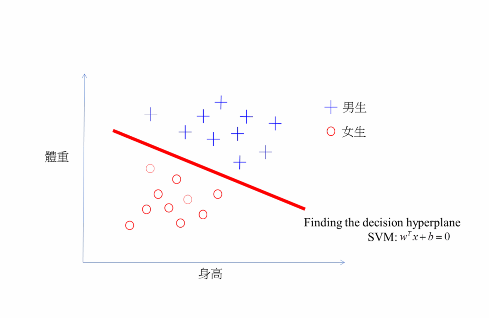

**第四讲：分类方法深入 / Lecture 4: More on classification**

---

**# 分类问题 / Classification Problem**

- **目标 / Goal**: 将输入数据 \( x \) 分配到 \( K \) 个类别之一 / Assign input data \( x \) to one of \( K \) classes
- **输入 / Input**: 特征向量 \( x \in \mathbb{R}^D \) / Feature vector \( x \in \mathbb{R}^D \)
- **输出 / Output**: 类别标签 \( y \in \{1, 2, \ldots, K\} \) / Class label \( y \in \{1, 2, \ldots, K\} \)
- **方法 / Approaches**:
  - 判别函数 / Discriminant functions
  - 生成模型 / Generative models
  - 判别模型 / Discriminative models (例如：逻辑回归 / e.g., Logistic Regression)

**# 判别函数 / Discriminant Functions**

* 定义 / Definition
为每个类别 \( k \) 定义一个函数 \( f_k(x) \)，直接将输入 \( x \) 映射到类别分配 / A function \( f_k(x) \) for each class \( k \) that directly maps input \( x \) to class assignments:

\[y = \arg\max_{k} f_k(x)\]

**线性判别式 / Linear Discriminant:**
\[f_k(x) = w_k^T x + b_k\]

**非线性判别式 / Non-linear Discriminant:**

\[f_k(x) = \phi(w_k^T x + b_k)\]

* 关键特性 / Key Property
直接对决策边界建模，无需估计概率分布 / Directly models decision boundaries without estimating probability distributions

---

**===== Page 4 =====**

**线性判别函数表述 I / Linear Discriminant Function Formulation I**

基本形式 / Basic Form
对于线性判别函数： / For a linear discriminant function:

\[ f(x) = w^T x + b \]

其中： / where:

- \( w \): 权重向量 / weight vector
- \( b \): 偏置项 / bias term
- \( x \): 输入特征向量 / input feature vector

分类规则 / Classification Rule

\[ y =
\begin{cases}
+1 & \text{如果 } f(x) \geq 0 \text{ / if } f(x) \geq 0 \\
-1 & \text{如果 } f(x) < 0 \text{ / if } f(x) < 0
\end{cases} \]

---

**===== Page 5 =====**

**线性判别函数表述 II / Linear Discriminant Function Formulation II**

多类别扩展 / Multi-class Extension

\[ f_k(x) = w_k^T x + b_k, \quad y = \arg\max_k f_k(x) \]

即，类别分配由函数值最大的那个决定 / Namely, the assignment for the class is given by the function with maximal value.

**# 方法1：最小二乘法 I / Method 1: Least Squares Approach I**

## 目标函数 / Objective Function
最小化平方误差和 / Minimize sum of squared errors:

\[J(w) = \sum_{i=1}^{N} (y_i - (w^T x_i + b))^2\]

## 矩阵形式 / Matrix Formulation

\[J(w) = (y - Xw)^T (y - Xw)\]

## 闭式解 / Closed-form Solution

---

**===== Page 8 =====**

**方法1：最小二乘法 II / Method 1: Least Squares Approach II**

\[ w = (X^T X)^{-1} X^T y \]

- 要求 \( X^T X \) 可逆 / Requires \( X^T X \) to be invertible
- 对异常值敏感 / Sensitive to outliers
- 对于小数据集计算高效 / Computationally efficient for small datasets

---

**===== Page 9 =====**

**方法2：感知机损失函数 I / Method 2: Perceptron Loss Function I**
感知机学习背后的驱动力 / The driving force behind perceptron learning

定义 / Definition
感知机使用定义为以下的**合页损失**函数 / The perceptron uses a **hinge loss** function defined as:

\[L(w) = \sum_{i \in M} -y_i(w \cdot x_i + b)\]

其中： / where:
- \( M \): 被错误分类的样本集合 / set of misclassified samples (预测与真实观测不同 / prediction is not the same as the true observed)
- \( y_i \in \{-1, +1\} \): 真实标签 / true label
- \( w \): 权重向量 / weight vector
- \( b \): 偏置项 / bias term
- \( x_i \): 输入特征 / input features

---

**===== Page 10 =====**

**方法2：感知机损失函数 II / Method 2: Perceptron Loss Function II**
感知机学习背后的驱动力 / The driving force behind perceptron learning

关键特性 / Key Properties    梯度 / Gradient

- **凸函数 / Convex**: 保证收敛 / Guarantees convergence
  \[  \nabla L(\mathbf{w}) = \sum_{i \in M} -y_i \mathbf{x}_i\]
- **分段线性 / Piecewise linear**: 梯度简单 / Simple gradients
  \[  \frac{\partial L}{\partial b} = \sum_{i \in M} -y_i\]
- **正确分类时为零 / Zero for correct classifications**
  导致更新规则： / Leads to the update rule:

- **错误分类时为正值 / Positive for misclassifications**
  \[  \mathbf{w} \leftarrow \mathbf{w} + \eta y_i \mathbf{x}_i\]

---

**===== Page 11 =====**

**方法3：支持向量机 / Method 3: Support Vector Machines (SVM)**

y_i = +1

+ 男生 / Male
○ 女生 / Female

支持向量 / support vectors

w^T x + b = 1

最优超平面 / Optimal hyperplane
w^T x + b = 0

身高 / Height

---

**===== Page 12 =====**

**将SVM转化为规划问题 I / Transforming SVM into a Programming Problem I**
从几何直观到优化表述 / From geometric intuition to optimization formulation

原始几何问题 / Original Geometric Problem
最大化间隔：\(\max \frac{2}{\|w\|}\) / Maximize the margin: \(\max \frac{2}{\|w\|}\)
满足约束：对所有 \(i\) 有 \(y_i(w \cdot x_i + b) \geq 1\) / Subject to: \(y_i(w \cdot x_i + b) \geq 1\) for all \(i\) (线性可分 / linear separable)

步骤1：等价重述 / Step 1: Equivalent Reformulation
不最大化 \(\frac{2}{\|w\|}\)，而是最小化 \(\|w\|\)： / Instead of maximizing \(\frac{2}{\|w\|}\), minimize \(\|w\|\):

\[\min \|w\| \quad \text{满足约束 / subject to} \quad y_i(w \cdot w_i + b) \geq 1\]

步骤2：凸优化形式 / Step 2: Convex Optimization Form

---

**===== Page 13 =====**

**将SVM转化为规划问题 II / Transforming SVM into a Programming Problem II**
从几何直观到优化表述 / From geometric intuition to optimization formulation

为计算方便，使用平方范数： / For computational convenience, use squared norm:

\[\min \frac{1}{2} \|w\|^2 \quad \text{满足约束 / subject to} \quad y_i(w \cdot x_i + b) \geq 1\]

- [x] 凸目标函数 / Convex objective function
- [x] 线性约束 / Linear constraints
- [x] 二次规划问题 / Quadratic Programming (QP) problem

步骤3：原始QP表述 / Step 3: Primal QP Formulation
特性 / Properties

\[\min_{w,b} \frac{1}{2} w^T w\]
\[满足约束: / subject to:\]
\[y_i(w^T x_i + b) \geq 1, \quad i = 1, \ldots, n\]
- [x] 凸目标 / Convex objective
- [x] 线性约束 / Linear constraints
- [x] 保证全局最优 / Global optimum guaranteed

---

**===== Page 14 =====**

**将SVM转化为规划问题 III / Transforming SVM into a Programming Problem III**
从几何直观到优化表述 / From geometric intuition to optimization formulation

步骤4：实际实现 / Step 4: Practical Implementation

- 使用QP求解器 / Use QP solvers (CVXOPT, MOSEK)
- 或专门的SVM库 / Or specialized SVM libraries (LIBSVM, scikit-learn)
- 使用优化技术处理大型数据集 / Handle large datasets with optimization techniques

---

**===== Page 15 =====**

**软间隔SVM 1 / Soft-Margin SVM 1**

软间隔SVM：处理噪声和重叠 / Soft-Margin SVM: Handling Noise and Overlap
真实数据很少完全线性可分。我们引入松弛变量 \(\xi_i\) 以允许误分类。/ Real data is rarely perfectly separable. We introduce slack variables \(\xi_i\) to allow misclassifications.

\[\min_{w, b, \xi} \frac{1}{2} \| w \|^2 + C \sum_{i=1}^n \xi_i\]

满足约束 / subject to
\[y_i (w^T x_i + b) \geq 1 - \xi_i, \quad \xi_i \geq 0 \quad \forall i\]

参数 \(C\) 控制大间隔和正确分类点之间的权衡。/ Parameter \(C\) controls the trade-off between a large margin and classifying points correctly.

---

**===== Page 16 =====**

**多类别训练策略 / Multi-class Training Strategies**
| 一对多  One-vs-Rest (OvR)| 一对一 One-vs-One (OvO)|
| -------- | ------- |
|训练K个二分类器 / binary classifiers | 训练K(K-1)个分类器 / classifiers |
| 每个将一个类别与所有其他类别分开 | 每个将一对类别分开 |
| 最终：\(\arg \max\limits_k f_k(x)\) | 最终：majority voting |

**# 生成模型 / Generative Models**

贝叶斯方法 / Bayesian Approach
使用以下模型对联合分布 \( p(x, y) \) 建模： / Model the joint distribution \( p(x, y) \) using:

\[p(y|x) = \frac{p(x|y)p(y)}{p(x)}\]

- **类别先验 / Class prior**: \( p(y) \) - 每个类别的概率 / probability of each class
- **类别条件密度 / Class-conditional density**: \( p(x|y) \) - 给定类别下特征的分布 / distribution of features given class
- **后验概率 / Posterior**: \( p(y|x) \) - 给定特征下类别的概率 / probability of class given features

* 例子 / Examples

- 线性判别分析 / Linear Discriminant Analysis (LDA)
- 二次判别分析 / Quadratic Discriminant Analysis (QDA)
- 朴素贝叶斯分类器 / Naive Bayes classifiers

**线性判别分析 / Linear Discriminant Analysis (LDA)**

假设 / Assumptions

► 高斯类别条件密度： / Gaussian class-conditional densities:
\[p(x|y = k) = \mathcal{N}(x|\mu_k, \Sigma)\]

► 跨类别共享协方差矩阵： / Shared covariance matrix across classes

► 所有类别具有相同协方差： / Equal covariance for all classes

\[\log p(y = k|x) \propto -\frac{1}{2}(x - \mu_k)^T\Sigma^{-1}(x - \mu_k) + \log\pi_k\]

决策边界 / Decision Boundary
由于共享协方差矩阵，在 \( x \) 上是线性的： / Linear in \( x \) due to shared covariance matrix:

\[(x - \mu_1)^T\Sigma^{-1}(x - \mu_1) = (x - \mu_2)^T\Sigma^{-1}(x - \mu_2)\]

---

**===== Page 19 =====**

**# 二次判别分析 / Quadratic Discriminant Analysis (QDA)**

## 假设 / Assumptions

- **高斯类别条件密度 / Gaussian class-conditional densities**
- **类别特定协方差矩阵 / Class-specific covariance matrices**
- \( p(x|y = k) = \mathcal{N}(x|\mu_k, \Sigma_k) \)

\[\log p(y = k|x) \propto -\frac{1}{2}(x - \mu_k)^T\Sigma_k^{-1}(x - \mu_k) - \frac{1}{2}\log|\Sigma_k| + \log\pi_k\]

## 决策边界 / Decision Boundary

**由于不同的协方差矩阵，在 x 上是二次的： / Quadratic in x due to different covariance matrices:**

\[(x - \mu_1)^T\Sigma_1^{-1}(x - \mu_1) + \log|\Sigma_1| = (x - \mu_2)^T\Sigma_2^{-1}(x - \mu_2) + \log|\Sigma_2|\]

---

**===== Page 20 =====**

**# 什么是朴素贝叶斯？ / What is Naive Bayes?**

## 定义 / Definition
朴素贝叶斯是一种基于贝叶斯定理的概率分类算法，其假设特征之间具有强（朴素）独立性。/ Naive Bayes is a probabilistic classification algorithm based on Bayes' theorem with a strong (naive) independence assumption between features.

- **简单** 但强大 / **Simple** yet powerful
- **快速** 训练和预测 / **Fast** training and prediction
- **概率** 输出 / **Probabilistic** outputs
- 在高维数据上表现良好 / Works well with high-dimensional data

---

**===== Page 21 =====**

**为什么是"朴素"的？ / Why "Naive"?**

朴素假设 / The Naive Assumption
给定类别标签，特征条件独立： / Features are conditionally independent given the class label:

\[P(X_1, X_2, \ldots, X_d | Y) = P(X_1 | Y) \cdot P(X_2 | Y) \cdots P(X_d | Y)\]

现实世界例子 / Real-world Example

- 将电子邮件分类为垃圾邮件/正常邮件
- 像"免费"和"金钱"这样的词可能是相关的
- 朴素贝叶斯假设在给定"垃圾邮件"条件下它们是独立的
- 令人惊讶的是，这在实践中通常效果很好！

---

**===== Page 22 =====**

**# 朴素贝叶斯概率模型 / Naive Bayes Probability Model**

完整公式 / Complete Formula
对于特征 \( X_1, X_2, \ldots, X_d \) 和类别 \( Y \)： / For features \( X_1, X_2, \ldots, X_d \) and class \( Y \):

\[P(Y|X_1, \ldots, X_d) = \frac{P(Y) \prod_{j=1}^d P(X_j|Y)}{P(X_1, \ldots, X_d)}\]

---

## 分类规则 / Classification Rule
我们预测概率最高的类别： / We predict the class with highest probability:

\[\hat{y} = \arg \max_y P(y) \prod_{j=1}^d P(x_j|y)\]

- \( P(X_1, \ldots, X_d) \) 对所有类别是常数 / is constant for all classes
- 比较时可以忽略它 / We can ignore it for comparison

---

**===== Page 23 =====**

**# 高斯朴素贝叶斯 / Gaussian Naive Bayes**

## 对于连续特征 / For Continuous Features
假设特征服从正态分布： / Assumes features follow normal distribution:

\[P(X_j | Y = y_k) = \frac{1}{\sqrt{2\pi\sigma_{jk}^2}} \exp\left(-\frac{(x_j - \mu_{jk})^2}{2\sigma_{jk}^2}\right)\]

## 参数估计 / Parameter Estimation

- \(\mu_{jk} = \frac{1}{n_k} \sum_{i:y_i = y_k} x_j^{(i)}\)
- \(\sigma_{jk}^2 = \frac{1}{n_k} \sum_{i:y_i = y_k} (x_j^{(i)} - \mu_{jk})^2\)
- \(n_k\): 类别 \(y_k\) 中的样本数 / number of samples in class \(y_k\)

---

**===== Page 24 =====**

**# 多项朴素贝叶斯 / Multinomial Naive Bayes**

对于离散计数 / For Discrete Counts
常用于文本分类： / Commonly used for text classification:

\[P(X_j|Y = y_k) = \frac{\text{count}(X_j, Y = y_k) + \alpha}{\sum_{l=1}^d \text{count}(X_l, Y = y_k) + \alpha d}\]

---

- \(\alpha\): 平滑参数 / Smoothing parameter
- \(\alpha\): 防止零概率 / Prevents zero probabilities
- 当 \(\alpha = 1\) 时为拉普拉斯平滑 / Laplace smoothing when \(\alpha = 1\)

---

## 例子 / Example
文档中的词频：______ / Word counts in documents: ______
单词 / Word 垃圾邮件计数 / Span Count 免费 / free 150 金钱 / money 120 ...

---
  $\sum\limits_{i=1}^{n}A_i$
**===== Page 25 =====**

**# 伯努利朴素贝叶斯 / Bernoulli Naive Bayes**

对于二值特征 / For Binary Features
模拟特征的存在/缺失： / Models presence/absence of features:

\[P(X_j|Y = y_k) = P(j|y_k)^{x_j}(1 - P(j|y_k))^{1-x_j}\]

## 应用 / Application

- \( x_j = 1 \) 如果特征 \( j \) 存在 / if feature \( j \) is present
- \( x_j = 0 \) 如果特征 \( j \) 缺失 / if feature \( j \) is absent
- 对于具有二值词存在性的文档分类很有用 / Useful for document classification with binary word presence

---

**===== Page 26 =====**

**# 训练算法 / Training Algorithm**

## 步骤1：估计先验概率 / Step 1: Estimate Priors

\[P(Y = y_k) = \frac{\text{类别 } y_k \text{ 中的样本数}}{\text{总样本数}} \]

---

## 步骤2：估计似然 / Step 2: Estimate Likelihoods

- **高斯型 / Gaussian**: 计算每个类别每个特征的均值和方差 / Compute mean and variance for each feature per class
- **多项型 / Multinomial**: 计算每个类别每个特征的频率计数 / Compute frequency counts for each feature per class
- **伯努利型 / Bernoulli**: 计算每个类别特征存在的概率 / Compute probability of feature presence per class

---

**===== Page 27 =====**

**# 预测算法 / Prediction Algorithm**

**步骤1:** 计算类别概率 / Compute Class Probabilities
对于每个类别 \( y_k \)： / For each class \( y_k \):

\[P(y_k|x) \propto P(y_k) \prod_{j=1}^d P(x_j|y_k)\]

---

**步骤2:** 处理数值问题 / Handle Numerical Issues
使用对数概率避免下溢： / Use log probabilities to avoid underflow:

\[\log P(y_k|x) = \log P(y_k) + \sum_{j=1}^d \log P(x_j|y_k)\]

---

**步骤3:** 进行预测 / Make Prediction

\[\hat{y} = \arg \max_{y_k} \log P(y_k|x)\]

---

**===== Page 28 =====**

**优点和局限性 / Advantages and Limitations**

优点 / Advantages

局限性 / Limitations

快速训练和预测 / Fast training and prediction

强独立性假设 / Strong independence assumption

在高维情况下表现良好 / Works well with high dimensions

可能被更复杂的模型超越 / Can be outperformed by more complex models

处理连续和离散数据 / Handles continuous and discrete data

零频率问题 / Zero-frequency problem (需要平滑 / needs smoothing)

提供概率估计 / Provides probability estimates

不适合复杂的特征交互 / Not ideal for complex feature interactions

对不相关特征鲁棒 / Robust to irrelevant features

**何时使用朴素贝叶斯 / When to Use Naive Bayes**

文本分类（垃圾邮件检测，情感分析）/ Text classification (spam detection, sentiment analysis)

推荐系统 / Recommendation systems

多类别预测 / Multi-class prediction

当训练数据有限时 / When training data is limited

---

**===== Page 29 =====**

**判别模型：逻辑回归 / Discriminate model: Logistic Regression**

判别式方法 / Discriminative Approach
直接对后验概率 \( p(y|x) \) 建模，而不对 \( p(x|y) \) 建模 / Directly model posterior probability \( p(y|x) \) without modeling \( p(x|y) \)

二分类情况 / Binary case:

\[p(y = 1|x) = \sigma(w^T x + b)\]

\[\sigma(z) = \frac{1}{1 + e^{-z}}\]

多分类情况 / Multiclass case (Softmax):

\[p(y = k|x) = \frac{\exp(w_k^T x + b_k)}{\sum_{j=1}^K \exp(w_j^T x + b_j)}\]

优点 / Advantage
与生成模型相比，对数据分布的假设更少 / Makes fewer assumptions about data distribution compared to generative models

---

**===== Page 30 =====**

**最大似然估计 / Maximum Likelihood Estimation**
最大化训练数据的对数似然： / Maximize log-likelihood of training data:

\[\mathcal{L}(w) = \sum_{i=1}^{N} [y_i \log p(y_i|x_i, w) + (1 - y_i) \log(1 - p(y_i|x_i, w))]\]

二分类情况的梯度 / Gradient for Binary Case

\[\nabla_w \mathcal{L} = \sum_{i=1}^{N} (y_i - p(y_i = 1|x_i, w)) x_i\]

优化方法 / Optimization Methods

- 梯度下降 / Gradient Descent
- 牛顿-拉弗森方法 / Newton-Raphson method
- 随机梯度下降 / Stochastic Gradient Descent

---

**===== Page 31 =====**

**# 方法比较 / Comparison of Approaches**

## 方法 / Method
|    | 类型 / Type    | 边界 / Boundary  | 假设 / Assumptions |
|---|---|---|---|
| 判别函数 / Discriminant Functions | 非概率的 / Non-probabilistic    | 灵活的 / Flexible    | 无 / None    |
| LDA    | 生成的 / Generative    | 线性的 / Linear    | 高斯，共享协方差 / Gaussian, shared covariance |
| QDA    | 生成的 / Generative    | 二次的 / Quadratic   | 高斯，不同协方差 / Gaussian, different covariance |
| 逻辑回归 / Logistic Regression | 判别的 / Discriminative    | 线性的 / Linear    | 线性决策边界 / Linear decision boundary |

**表：** 分类方法比较 / **Table:** Comparison of classification methods

- **生成式 / Generative**: 小数据集表现更好，可以生成样本，处理缺失数据 / Better with small datasets, can generate samples, handles missing data
- **判别式 / Discriminative**: 通常在大数据集上性能更好，专注于决策边界 / Often better performance with large datasets, focuses on decision boundary

---

**===== Page 32 =====**

**# 何时使用每种方法 I / When to Use Each Method I**

## 判别函数 / Discriminant Functions
- **当不需要概率解释时 / When probabilistic interpretation is not needed**
- **当计算效率至关重要时 / When computational efficiency is critical**
- **用于简单、可解释的模型 / For simple, interpretable models**

## 生成模型 / Generative Models (LDA/QDA)
- **当数据集较小时 / When dataset is small**
- **当你想生成新样本时 / When you want to generate new samples**
- **当特征大致遵循高斯分布时 / When features follow approximately Gaussian distribution**
- **当你需要处理缺失数据时 / When you need to handle missing data**

## 逻辑回归 / Logistic Regression

---

**===== Page 33 =====**

**何时使用每种方法 II / When to Use Each Method II**

► 对于大型数据集 / For large datasets
► 当你想要良好校准的概率时 / When you want well-calibrated probabilities
► 当高斯假设被违反时 / When Gaussian assumptions are violated
► 作为更复杂模型的基线 / As a baseline for more complex models

---

**===== Page 34 =====**

**# 处理非线性 / Addressing Non-Linearity**

我们可以通过两种主要方法来处理非线性效应：/ We can address non-linear effects through two primary approaches:

1.  **显式特征变换 / Explicit Feature Transformation**
    - 使用一组**基函数** \((\phi(x))\) 变换输入特征。/ Transform the input features using a set of **basis functions** \((\phi(x))\).
    - 目标变量可以通过**连接函数** \((\mathbf{g}(\mu))\) 进行变换。/ The target variable may be transformed via a **link function** \((\mathbf{g}(\mu))\).
    - 模型在参数上保持线性：\(\mathbb{E}[y] = \mathbf{w}^T\phi(x)\). / The model remains linear in the parameters: \(\mathbb{E}[y] = \mathbf{w}^T\phi(x)\).

2.  **隐式表示学习 / Implicit Representation Learning**
    - 均值是输入和参数的**复杂、非线性函数**。/ The mean is a **complex, non-linear function** of the inputs and parameters.
    - 这个函数由像神经网络这样的模型**直接学习**。/ This function is **learned directly** by a model like a neural network.

接下来，我们将探索一个强大的替代方案：基于**核函数**的方法，以及更广泛的**高斯过程**。/ Next, we will explore a powerful alternative: methods based on **kernels** and, more generally, **Gaussian Processes**.

---

**===== Page 35 =====**

**# 特征映射 \(\phi\) 与核技巧 / The Feature Map \(\phi\) and The Kernel Trick**

## 显式特征映射 / Explicit Feature Mapping

- **输入空间 \(\mathcal{X}\)** / **Input Space \(\mathcal{X}\)**
  - **特征空间 \(\mathcal{F}\)** / **Feature Space \(\mathcal{F}\)**
  - 计算 \(\phi(x)\)，然后计算 \(\langle \phi(x), \phi(x') \rangle\) / Compute \(\phi(x)\), then \(\langle \phi(x), \phi(x') \rangle\)
  - 计算上可能很昂贵。/ Can be computationally expensive.

---

## 核技巧 / The Kernel Trick

- **输入空间 \(\mathcal{X}\)** / **Input Space \(\mathcal{X}\)**
  - 跳过变换！通过核函数直接在输入空间中计算内积。/ Skip the transformation! Compute the inner product directly in the input space via the kernel function.
  \[ k(x, x') = \langle \phi(x), \phi(x') \rangle \]

---

## 核技巧定义 / The Kernel Trick Defined

如果一个算法可以仅用内积的形式来表述，那么我们可以通过将每个 \(\langle x_i, x_j \rangle\) 替换为 \(k(x_i, x_j)\) 来使其非线性化。/ If an algorithm can be formulated solely in terms of inner products, we can make it non-linear by replacing every \(\langle x_i, x_j \rangle\) with \(k(x_i, x_j)\).

---

**===== Page 36 =====**

**# 常见核函数 I / Common Kernel Functions I**

## 线性核 / Linear Kernel
最简单的核，无映射。等价于标准点积。/ The simplest kernel, no mapping. Equivalent to standard dot product.

\[k(x, x') = x^T x'\]

## 多项式核 / Polynomial Kernel
创建度数为 \( d \) 的多项式特征映射。学习多项式决策边界。/ Creates polynomial feature maps of degree \( d \). Learns polynomial decision boundaries.

\[k(x, x') = (x^T x' + c)^d\]

## 径向基函数核 / 高斯核 / Radial Basis Function (RBF) / Gaussian Kernel

---

**===== Page 37 =====**

**常见核函数 II / Common Kernel Functions II**

最流行的核。隐式地将数据映射到无限维特征空间。高度灵活。/ The most popular kernel. Implicitly maps data to an infinite-dimensional feature space. Highly flexible.

\[k(x, x') = \exp\left(-\gamma\|x - x'\|^2\right)\]

\(\gamma\) 控制单个训练样本的影响（边界的平滑度）。/ \(\gamma\) controls the influence of a single training example (smoothness of the boundary).

---

**===== Page 38 =====**

**# 为什么它有效？默瑟定理 / Why Does It Work? Mercer's Theorem**

**默瑟条件 / Mercer's Condition**

对于一个函数 \( k \) 成为有效的核，它必须满足：/ For a function \( k \) to be a valid kernel, it must be:

1.  **对称的 / Symmetric:**
   \[   k(x,x') = k(x',x)\]

2.  **半正定的 / Positive Semi-Definite:** 核矩阵 \( K \)（又称Gram矩阵），其中 / The kernel matrix \( K \) (aka Gram matrix), where
   \[   K_{ij} = k(x_i,x_j)\]
   对于任何输入集合 \(\{x_1,\ldots,x_N\}\) 必须是半正定的。/ must be PSD for any set of inputs \(\{x_1,\ldots,x_N\}\).

---

**定理 / Theorem (Mercer's Theorem)**

*任何满足默瑟条件的函数 \( k \) 都对应于某个特征空间中的内积。/* Any function \( k \) satisfying Mercer's condition corresponds to an inner product in some feature space.*

\[k(x,x') = \langle \phi(x), \phi(x')\rangle\]

---

**实际意义 / Practical Implication:** 我们不需要知道 \(\phi\)！我们只需要选择任何有效的核函数 \( k \)，就可以保证它对应于某个复杂的特征空间。/ We don't need to know \(\phi\)! We can just choose any valid kernel function \( k \) and be guaranteed that it corresponds to some complex feature space.

---

**===== Page 39 =====**

**应用与总结 / Applications and Summary**

核化算法 / Kernelized Algorithms

许多经典算法都有核化版本：/ Many classic algorithms have kernelized versions:

支持向量机 / Support Vector Machines (SVM): 经典应用。/ The classic application.
核SVM非常强大。/ Kernel SVM is incredibly powerful.

核岭回归 / Kernel Ridge Regression: 用于非线性回归。/ For non-linear regression.

高斯过程 / Gaussian Processes: 使用核函数的完整贝叶斯方法 / A full Bayesian approach using kernels

总结：核的力量 / Summary: The Power of Kernels

效率：在高维空间中工作而无需计算成本。/ Efficiency: Work in high-dimensional spaces without the computational cost.

灵活性：建模复杂的非线性关系。/ Flexibility: Model complex, non-linear relationships

通用性：通过设计衡量相似性的核，将ML应用于非向量数据（如图、序列）。/ Generality: Apply ML to non-vectorial data (e.g., graphs, sequences) by designing a kernel that measures similarity

核将设计特征空间的任务与学习的任务分离开。/ Kernels separate the task of designing the feature space from the task of learning

---

**===== Page 40 =====**

**# 核岭回归 I / Kernel Ridge Regression I**

## 问题表述 / Problem Formulation
岭回归最小化惩罚最小二乘目标：/ Ridge regression minimizes the penalized least squares objective:

\[J(w) = \|y - Xw\|^2 + \lambda \|w\|^2\]

其中：/ where:
- \( X \in \mathbb{R}^{n \times d} \) 是设计矩阵 / is the design matrix
- \( y \in \mathbb{R}^n \) 是目标向量 / is the target vector
- \( w \in \mathbb{R}^d \) 是权重向量 / is the weight vector
- \( \lambda \geq 0 \) 是正则化参数 / is the regularization parameter

## 推导 / Derivation

---

**===== Page 41 =====**

**核岭回归 II / Kernel Ridge Regression II**

\[ \nabla_w J(w) = -2X^T(y - Xw) + 2\lambda w \]
\[ 0 = -X^Ty + X^TXw + \lambda w \]
\[ X^Ty = (X^TX + \lambda I)w \]

闭式解 / Closed-Form Solution

\[ \hat{W}_{ridge} = (X^TX + \lambda I)^{-1}X^Ty \]

► 矩阵 \( X^TX + \lambda I \) 在 \( \lambda > 0 \) 时总是可逆的 / The matrix \( X^TX + \lambda I \) is always invertible for \( \lambda > 0 \)

► 与OLS相比，正则化提高了数值稳定性 / Regularization improves numerical stability compared to OLS

► 当 \( \lambda = 0 \) 时，解退化为OLS / Solution reduces to OLS when \( \lambda = 0 \)

---

**===== Page 42 =====**

**# 岭回归：对偶表述 I / Ridge Regression: Dual Formulation I**

## 原始问题 / Primal Problem

\[\min_{\mathbf{w}} \frac{1}{2} \| \mathbf{y} - \mathbf{X} \mathbf{w} \|^2 + \frac{\lambda}{2} \| \mathbf{w} \|^2\]

其中 \(\mathbf{X} \in \mathbb{R}^{n \times d}\), \(\mathbf{y} \in \mathbb{R}^n\), \(\mathbf{w} \in \mathbb{R}^d\), \(\lambda > 0\). / where \(\mathbf{X} \in \mathbb{R}^{n \times d}\), \(\mathbf{y} \in \mathbb{R}^n\), \(\mathbf{w} \in \mathbb{R}^d\), \(\lambda > 0\).

## 表示定理洞察 / Representer Theorem Insight
解可以表示为：/ The solution can be expressed as:

\[\mathbf{w} = \mathbf{X}^\top \alpha = \sum_{i=1}^n \alpha_i \mathbf{x}_i\]

其中 \(\alpha \in \mathbb{R}^n\) 是对偶变量。/ where \(\alpha \in \mathbb{R}^n\) are dual variables.

## 对偶表述推导 / Dual Formulation Derivation

---

**===== Page 43 =====**

**# 岭回归：对偶表述 II / Ridge Regression: Dual Formulation II**

将 \( w = X^\top \alpha \) 代入原始问题：/ Substitute \( w = X^\top \alpha \) into the primal:

\[\|y - Xw\|^2 = \|y - XX^\top \alpha\|^2 = \|y - K\alpha\|^2\]

\[\|w\|^2 = \alpha^\top XX^\top \alpha = \alpha^\top K\alpha\]

其中 \( K = XX^\top \) 是Gram矩阵。/ where \( K = XX^\top \) is the Gram matrix.

## 对偶问题 / Dual Problem

---

**===== Page 44 =====**

**# 岭回归：对偶表述 III / Ridge Regression: Dual Formulation III**

\[\min_{\alpha} \frac{1}{2} \|y - K\alpha\|^2 + \frac{\lambda}{2} \alpha^{\top} K\alpha\]

解：/ Solution:

\[\hat{\alpha} = (K + \lambda I)^{-1} y\]

对新点 \( x \) 的预测：/ Prediction for new point \( x \):

\[\hat{y} = w^{\top} x = \alpha^{\top} Xx = \sum_{i=1}^{n} \alpha_i x_i^{\top} x\]

核技巧：用不同的核函数 \( K(x, y) \) 替换平凡的核。/ Kernel trick: replace the trivial Kernel by a different Kernel function \( K(x, y) \).

---

**===== Page 45 =====**

**核支持向量机 / Kernel support vector machine**

目标：找到将类别 \((y_i \in \{-1, +1\})\) 分开且具有最大间隔的超平面 \( w^T x + b = 0 \)。/ Goal: Find hyperplane \( w^T x + b = 0 \) that separates the classes \((y_i \in \{-1, +1\})\) with max margin.

一个点到超平面的距离是：/ The distance from a point to the hyperplane is:

\[\frac{|w^T x_i + b|}{\|w\|} = \frac{y_i(w^T x_i + b)}{\|w\|}\]

我们想要最大化间隔 \( M = \frac{2}{\|w\|} \)。这导致了优化问题：/ We want to maximize the margin \( M = \frac{2}{\|w\|} \). This leads to the optimization problem:

\[\min_{w, b} \frac{1}{2} \|w\|^2\]

满足约束 \( y_i(w^T x_i + b) \geq 1 \) \(\forall i\) / subject to \( y_i(w^T x_i + b) \geq 1 \) \(\forall i\)

这是一个二次规划问题。/ This is a Quadratic Programming (QP) problem.

---

**===== Page 46 =====**

**软间隔SVM与核技巧 I / Soft-Margin SVM and The Kernel Trick I**

软间隔SVM：处理噪声和重叠 / Soft-Margin SVM: Handling Noise and Overlap
真实数据很少完全线性可分。我们引入松弛变量 \(\xi_i\) 以允许误分类。/ Real data is rarely perfectly separable. We introduce slack variables \(\xi_i\) to allow misclassifications.

\[\min_{w, b, \xi} \frac{1}{2} \| w \|^2 + C \sum_{i=1}^n \xi_i\]

满足约束 / subject to
\[y_i (w^T x_i + b) \geq 1 - \xi_i, \quad \xi_i \geq 0 \quad \forall i\]

参数 \(C\) 控制大间隔和正确分类点之间的权衡。/ Parameter \(C\) controls the trade-off between a large margin and classifying points correctly.

---

**===== Page 47 =====**

**软间隔SVM：对偶表述 I / Soft Margin SVM: Dual Formulation I**

原始问题 / Primal Problem (软间隔SVM / Soft Margin SVM)

\[\min_{w,b,\xi} \frac{1}{2} \| w \|^2 + C \sum_{i=1}^n \xi_i\]

满足约束 / subject to
\[y_i (w^\top x_i + b) \geq 1 - \xi_i, \quad i = 1, \ldots, n\]
\[\xi_i \geq 0, \quad i = 1, \ldots, n\]

其中 \(\xi_i\) 是松弛变量，\(C > 0\) 是正则化参数。/ where \(\xi_i\) are slack variables and \(C > 0\) is the regularization parameter.

拉格朗日函数 / Lagrangian Function

---

**===== Page 48 =====**

**软间隔SVM：对偶表述 II / Soft Margin SVM: Dual Formulation II**

\[L(w, b, \xi, \alpha, \beta) = \frac{1}{2} \|w\|^2 + C \sum_{i=1}^n \xi_i - \sum_{i=1}^n \alpha_i [y_i (w^\top x_i + b) - 1 + \xi_i] - \sum_{i=1}^n \beta_i \xi_i\]

其中 \(\alpha_i \geq 0\), \(\beta_i \geq 0\) 是拉格朗日乘子。/ with \(\alpha_i \geq 0\), \(\beta_i \geq 0\) as Lagrange multipliers.

对偶问题 / Dual Problem

\[\max_{\alpha} \sum_{i=1}^n \alpha_i - \frac{1}{2} \sum_{i=1}^n \sum_{j=1}^n \alpha_i \alpha_j y_i y_j \boxed{x_i^\top x_j}\]

满足约束 / subject to
\[\sum_{i=1}^n \alpha_i y_i = 0\]
\[0 \leq \alpha_i \leq C, \quad i = 1, \ldots, n\]

---

**===== Page 49 =====**

**软间隔SVM：对偶表述 III / Soft Margin SVM: Dual Formulation III**

核技巧：用不同的核函数 \( K(x, y) \) 替换平凡的核。/ Kernel trick: replace the trivial Kernel by a different Kernel function \( K(x, y) \).

---

**===== Page 50 =====**

**超越参数模型 / Beyond Parametric Models**

参数模型 / Parametric models (例如：线性回归 / e.g., Linear Regression):

\[y = w^\top \phi(x) + \epsilon\]

学习参数 \(w\)。灵活性有限。/ Learn parameters \(w\). Limited flexibility.

非参数模型 / Non-parametric models (例如：高斯过程 / e.g., Gaussian Processes):

► 不学习固定的参数集 \(w\)。/ Don't learn a fixed set of parameters \(w\).
► 而是定义在可能函数 \(f(x)\) 上的概率分布。/ Instead, define a probability distribution over possible functions \(f(x)\).
► 复杂性随着数据量增长。/ The complexity grows with the amount of data.

---

**===== Page 51 =====**

**# 高斯过程的核心思想 / The Core Idea of a Gaussian Process**

## 定义 / Definition
高斯过程是一个随机变量的集合，其中任何有限数量的随机变量都具有一致的联合高斯分布。/ A Gaussian Process is a collection of random variables, any finite number of which have a consistent joint Gaussian distribution.

### 类比 / Analogy:
- 高斯分布：向量上的分布。/ A Gaussian distribution: distribution over vectors.
- 高斯过程：函数上的分布。/ A Gaussian process: distribution over functions.

一个GP完全由其指定：/ A GP is completely specified by its:
- 均值函数：\( m(x) = \mathbb{E}[f(x)] \) / Mean function: \( m(x) = \mathbb{E}[f(x)] \)
- 协方差函数（核）：/ Covariance function (kernel):
  \[  k(x,x') = \mathbb{E}[(f(x) - m(x))(f(x') - m(x'))]\]

我们写作：/ We write:
  \[  f(x) \sim \mathcal{GP}(m(x), k(x,x')).\]

---

**===== Page 52 =====**

**GP的核心：核 / The Heart of the GP: The Kernel**

核 \( k(x, x') \) 定义了函数值 \( f(x) \) 和 \( f(x') \) 之间的协方差。它编码了我们关于函数属性的先验假设。/ The kernel \( k(x, x') \) defines the covariance between the function values \( f(x) \) and \( f(x') \). It encodes our prior assumptions about the function’s properties.

---

**===== Page 53 =====**

**# 先验 / The Prior**

我们假设一个函数上的先验。通常我们将均值函数设为零：\( m(x) = 0 \)。/ We assume a prior over functions. Often we set the mean function to zero: \( m(x) = 0 \).

\[f(x) \sim GP(0, k(x, x'))\] / \[f(x) \sim \mathcal{GP}(0, k(x, x'))\]

对于任何有限点集 \( X = \{x_1, \ldots, x_N\} \)，函数值 \( f = [f(x_1), \ldots, f(x_N)]^\top \) 具有多元高斯先验：/ For any finite set of points \( X = \{x_1, \ldots, x_N\} \), the function values \( f = [f(x_1), \ldots, f(x_N)]^\top \) have a multivariate Gaussian prior:

\[f \sim N(0, K)\] / \[f \sim \mathcal{N}(0, K)\]

其中 \( K \) 是 \( N \times N \) 的核矩阵，其元素 \( K_{ij} = k(x_i, x_j) \)。/ where \( K \) is the \( N \times N \) kernel matrix with entries \( K_{ij} = k(x_i, x_j) \).

---

**===== Page 54 =====**

**# 含噪声的观测 / Noisy Observations**

我们观测到含噪声的数据：/ We observe noisy data:

\[y_i = f(x_i) + \epsilon_i, \quad \epsilon_i \sim \mathcal{N}(0, \sigma_n^2)\]

观测目标 \( y \) 和潜在函数值 \( f \) 的联合分布是：/ The joint distribution of the observed targets \( y \) and the latent function values \( f \) is:

\[\begin{bmatrix}
y \\
f
\end{bmatrix} \sim \mathcal{N}\left(0,
\begin{bmatrix}
K + \sigma_n^2 I & K \\
K & K
\end{bmatrix}\right)\] / *(注：PPT中矩阵可能有误，标准形式通常为 [[K + σ²I, K], [K, K]] )*

---

**===== Page 55 =====**

**# 后验预测分布 / The Posterior Predictive Distribution**

对于一个新的测试点 \( x_* \)，我们想要预测分布 \( p(f(x_*)|X, y, x_*) \)。/ For a new test point \( x_* \), we want the predictive distribution \( p(f(x_*)|X, y, x_*) \).

## 关键公式 / Key Formulas
后验预测分布是高斯分布：/ The posterior predictive distribution is Gaussian:
\[ p(f(x_*)|X, y, x_*) \sim \mathcal{N}(\bar{f}_*, \mathbb{V}[f_*]) \] / *(注：PPT中方差符号为 \(\nabla f^*_*\)，应为 \(\mathbb{V}[f_*]\))*

### 预测均值 / Predictive Mean:
\[\bar{f}_* = k^T_*(K + \sigma^2_n I)^{-1}y\] / \[\bar{f}_* = k_*^T (K + \sigma^2_n I)^{-1} y\]

### 预测方差 / Predictive Variance:
\[\mathbb{V}[f_*] = k(x_*, x_*) - k^T_*(K + \sigma^2_n I)^{-1}k_*\] / \[\mathbb{V}[f_*] = k(x_*, x_*) - k_*^T (K + \sigma^2_n I)^{-1} k_*\]
其中 \( k_* = [k(x_*, x_1), \ldots, k(x_*, x_N)]^T \). / where \( k_* = [k(x_*, x_1), \ldots, k(x_*, x_N)]^T \).

---

**===== Page 56 =====**

**高斯过程的应用 / Applications of Gaussian Processes**

回归 / Regression

小数据集 (n<10,000) / Small datasets (n<10,000 points)

地质统计学 / Geostatistics (克里金法 / Kriging)

空间数据插值 / Interpolating spatial data

不确定性很重要的情况 / Where uncertainty matters
高斯过程的最初应用 / The original application of GPs
例如，校准，传感器数据 / E.g., calibration, sensor data

贝叶斯优化 / Bayesian Optimization

状态空间模型 / State Space Models

优化昂贵的黑盒函数 / Optimizing expensive black-box functions
高斯过程可以用于更复杂模型的组件中 / GPs can be used as components in more complex models
高斯过程指导寻找最优值 / GPs guide the search for the optimum

---

**===== Page 57 =====**

**# 总结 / Summary**

- 高斯过程提供了一种非参数的、贝叶斯的回归方法。/ Gaussian Processes provide a non-parametric, Bayesian approach to regression.
- 它们定义了函数上的分布。/ They define a distribution over functions.
- 核编码了关于函数属性的先验知识。/ The kernel encodes prior knowledge about the function’s properties.
- 它们提供完整的预测分布（均值 + 不确定性）。/ They provide full predictive distributions (mean + uncertainty).
- 主要限制是计算复杂度 \( O(N^3) \)。/ The main limitation is computational complexity \( O(N^3) \).
- 对于许多数据稀缺且不确定性量化至关重要的问题，它们是首选方法。/ They are the method of choice for many problems where data is scarce and uncertainty quantification is crucial.

---

**===== Page 58 =====**

**# 机器学习中的优化挑战 / The Optimization Challenge in ML**

- 机器学习通常涉及**约束优化** / Machine learning often involves **constrained optimization**
- 我们希望在**满足约束**的同时最小化损失 / We want to minimize loss **while satisfying constraints**
- 例子 / Examples:
  - SVM：在正确分类的同时最大化间隔 / SVMs: Maximize margin while classifying correctly
  - 正则化：在保持权重较小的同时最小化误差 / Regularization: Minimize error while keeping weights small

# 基本问题 / The Fundamental Problem
如何高效地解决约束优化问题？/ How do we efficiently solve constrained optimization problems?

---

**===== Page 59 =====**

**# 原始问题表述 / The Primal Problem Formulation**

约束优化的一般形式 / General Form of Constrained Optimization
**最小化：** \( f(w) \) / **Minimize:** \( f(w) \)
**满足约束：** / **Subject to:**

\[g_i(w) \leq 0, \quad i = 1, \ldots, k \quad (\text{不等式约束 / Inequality constraints})\]
\[h_j(w) = 0, \quad j = 1, \ldots, m \quad (\text{等式约束 / Equality constraints})\]

- **w**: 模型参数（权重）/ Model parameters (weights)
- \( f(w) \): 目标/损失函数 / Objective/loss function
- \( g_i(w) \): 不等式约束 / Inequality constraints
- \( h_j(w) \): 等式约束 / Equality constraints
---

**===== Page 60 =====**

**# 拉格朗日方法 / The Lagrangian Approach**

## 关键思想 / Key Idea
通过引入**拉格朗日乘子**将约束问题转化为无约束问题 / Transform constrained problem into unconstrained problem by introducing **Lagrange multipliers**
**拉格朗日乘子：** / **Lagrange Multipliers:**

- \(\alpha_i \geq 0\) 对应 \(g_i(\mathbf{w}) \leq 0\) / for \(g_i(\mathbf{w}) \leq 0\)
- \(\beta_j\) 对应 \(h_j(\mathbf{w}) = 0\) / for \(h_j(\mathbf{w}) = 0\)

## 拉格朗日函数 / Lagrangian Function

\[\mathcal{L}(\mathbf{w}, \alpha, \beta) = f(\mathbf{w}) + \sum_{i=1}^k \alpha_i g_i(\mathbf{w}) + \sum_{j=1}^m \beta_j h_j(\mathbf{w})\]

---

**===== Page 61 =====**

**# 拉格朗日乘子背后的直觉 / Intuition Behind Lagrange Multipliers**

## 约束 / Constraint
- \( f(w) \)
- \( f(w) \)
- 最优点 / Optimum
- \( w \)

- 约束定义了可行区域 / Constraints define feasible region
- 拉格朗日乘子充当约束违反的"**价格**" / Lagrange multipliers act as "**prices**" for constraint violation
- 在目标和约束满足之间取得平衡 / Balance between objective and constraint satisfaction

---

**===== Page 62 =====**

**# 从原始问题到对偶问题 / From Primal to Dual**

## 拉格朗日对偶函数 / Lagrangian Dual Function

\[G(\alpha, \beta) = \min_{\mathbf{w}} L(\mathbf{w}, \alpha, \beta)\]

---

### 对偶问题 / Dual Problem
**最大化：** / **Maximize:**
\( G(\alpha, \beta) \)
**满足约束：** / **Subject to:**
\(\alpha_i \geq 0, \quad i = 1, \ldots, k\)

- 我们从**最小化**切换到**最大化** / We switched from **minimization** to **maximization**
- 约束变得**简单得多** / Constraints become much **simpler**
- 通常更容易解决！/ Often easier to solve!

---

**===== Page 63 =====**

**# 对偶性定理 / Duality Theorems**

## 弱对偶性 / Weak Duality
对于任何可行的 \( w \) 和 \( \alpha \geq 0 \)：/ For any feasible \( w \) and \( \alpha \geq 0 \):

\[G(\alpha, \beta) \leq f(w)\]

对偶问题总是为原始问题提供**下界**。/ The dual always provides a **lower bound** on the primal.

## 强对偶性 / Strong Duality
在特定条件下（凸性 + Slater条件）：/ Under certain conditions (convexity + Slater's condition):

\[d^* = p^*\]

其中 \( p^* \) 是最优原始值，\( d^* \) 是最优对偶值。/ where \( p^* \) is optimal primal value and \( d^* \) is optimal dual value.

---

**===== Page 64 =====**

**可视化对偶性 / Visualizing Duality**

目标值 / Objective Value

原始问题 p / Primal p
对偶问题 d / Dual d

最优性 / Optimality
迭代次数 / Iteration

► 原始问题向最优值减小 / Primal decreases toward optimum
► 对偶问题向最优值增大 / Dual increases toward optimum
► 在最优点：\( p^* = d^* \) (强对偶性) / At optimum: \( p^* = d^* \) (strong duality)

---

**===== Page 65 =====**

**支持向量机 / Support Vector Machines (SVMs)**

SVM原始问题 / SVM Primal Problem
**最小化：** / **Minimize:**
\[\frac{1}{2} \|w\|^2 + C \sum_{i=1}^n \xi_i\]
**满足约束：** / **Subject to:**
\[y_i(w \cdot x_i + b) \geq 1 - \xi_i, \xi_i \geq 0\]

SVM对偶问题 / SVM Dual Problem
**最大化：** / **Maximize:**
\[\sum_{i=1}^n \alpha_i - \frac{1}{2} \sum_{i=1}^n \sum_{j=1}^n \alpha_i \alpha_j y_i y_j x_i \cdot x_j\]
**满足约束：** / **Subject to:**
\[0 \leq \alpha_i \leq C, \sum_{i=1}^n \alpha_i y_i = 0\]

---

**===== Page 66 =====**

**# 核技巧 / The Kernel Trick**

## 原始问题：显式的 w / Primal: Explicit w

### 拉格朗日对偶 / Lagrangian Dual

---

**关键点：** / **Keypoint:**
**核技巧** / **Kernel Trick**
**核：** \( K(x_i, x_j) \) / **Kernel:** \( K(x_i, x_j) \)

---

- **对偶表述揭示了点积** / **Dual formulation reveals dot products**
- **实现核技巧**：用 \( K(x_i, x_j) \) 替换 \( x_i \cdot x_j \) / **Enables kernel trick**: Replace \( x_i \cdot x_j \) with \( K(x_i, x_j) \)
- **允许非线性决策边界** / **Allows non-linear decision boundaries**

---

**===== Page 67 =====**

**# 其他机器学习应用 / Other ML Applications**

## 正则化 / Regularization
- L1/L2 正则化 / L1/L2 regularization
- 弹性网络 / Elastic net
- 约束优化视角 / Constrained optimization perspective

## 神经网络 / Neural Networks
- 用于约束的拉格朗日乘子 / Lagrange multipliers for constraints
- 对抗训练 / Adversarial training

## 图模型 / Graphical Models
- 作为优化的推断 / Inference as optimization
- 变分方法 / Variational methods

## 公平性约束 / Fairness Constraints
- 人口统计平等 / Demographic parity
- 均等化几率 / Equalized odds
- 通过约束强制执行 / Enforced via constraints

---

**===== Page 68 =====**

**对偶表述的优点 / Advantages of Dual Formulation**

更简单的约束：通常只是对 \(\alpha\) 的边界约束；/ Simpler constraints: Often just bound constraints on \(\alpha\);

核技巧：实现非线性模型 / Kernel trick: Enables non-linear models

理论洞察：揭示问题结构（例如，支持向量）/ Theoretical insights: Reveals problem structure (e.g., support vectors)

数值稳定性：通常条件更好 / Numerical stability: Often better conditioned

特征空间解释：隐式地在高维空间中工作 / Feature space interpretation: Works in high-dimensional spaces implicitly

---

**===== Page 69 =====**

**# 局限性与考量 / Limitations and Considerations**

## 计算问题 / Computational Issues
- **变量数量** = 约束数量 / **Number of variables** = number of constraints
- 对于大型数据集可能很大 / Can be large for big datasets
- 可能需要专门的求解器 / May need specialized solvers

## 理论局限性 / Theoretical Limitations
- 强对偶性并不总是保证 / Strong duality not always guaranteed
- 可能存在对偶间隙 / Duality gap may exist

## 实际挑战 / Practical Challenges
- 从对偶解恢复原始解 / Recovering primal solution from dual
- 解释对偶变量 / Interpreting dual variables
- 实现复杂性 / Implementation complexity

## 何时使用对偶？/ When to Use Dual?
- 约束复杂时 / Constraints are complex
- 需要核方法时 / Kernel methods needed
- 问题具有特殊结构时 / Problem has special structure

---

**===== Page 70 =====**

**# 总结 / Summary**

- 拉格朗日对偶将**约束**问题 → **无约束**问题 / Lagrangian dual transforms **constrained** → **unconstrained** problems
- 通过弱对偶性提供**下界** / Provides **lower bounds** via weak duality
- 在良好条件下：**强对偶性** (\( p^* = d^* \)) / Under nice conditions: **strong duality** (\( p^* = d^* \))
- 对于**核方法**至关重要 / Crucial for **kernel methods** (SVMs)
- 揭示**问题结构**和洞察 / Reveals **problem structure** and insights
- 实现强大的ML算法 / Enables powerful ML algorithms

## 关键要点 / Key Takeaway
对偶视角通常能揭示结构，并实现那些在原始表述中不可能的方法。/ The dual perspective often reveals structure and enables methods that would be impossible in the primal formulation.