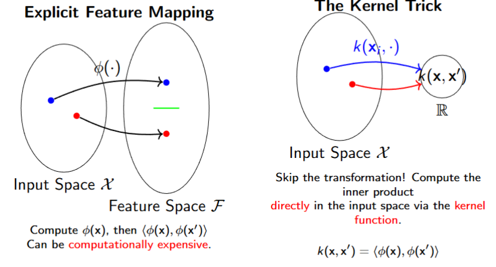
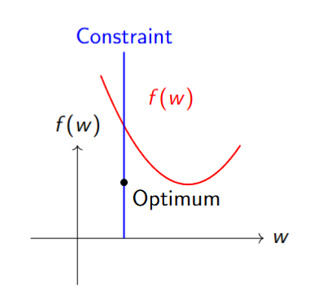
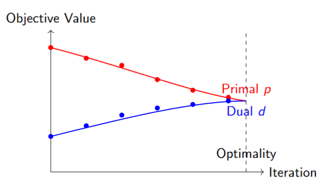
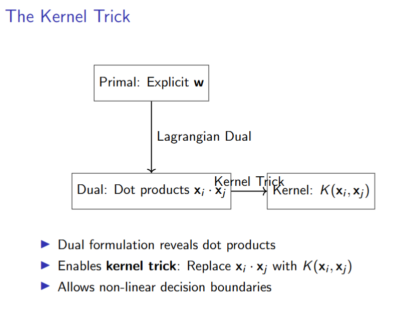
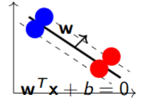
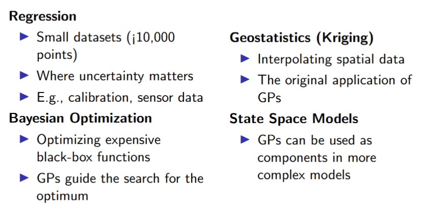

# Lecture 4.3: 核方法  
2025年10月12日 2025年10月15日

## 处理非线性问题  
我们可以通过两种主要方法来处理非线性效应：  
1. **显式特征变换**  
   - 使用一组**基函数** \((\phi(x))\) 来变换输入特征。  
   - 目标变量可以通过**链接函数** \((\mathbf{g}(\mu))\) 进行变换。  
   - 模型在参数上仍然是线性的：\(\mathbb{E}[y] = \mathbf{w}^T\phi(x)\)。  
2. **隐式表示学习**  
   - 均值是输入和参数的**复杂非线性函数**。  
   - 这个函数由像神经网络这样的模型**直接学习**。  

接下来，我们将探索一个强大的替代方案：基于**核**的方法，以及更广泛的**高斯过程**。  

### 特征映射 \(\phi\) 与核技巧  

**核技巧(Kernel trick)** 定义:如果一个算法可以仅用内积来表述，那么我们可以通过将每个 \(\langle x_i, x_j \rangle\) 替换为 \(k(x_i, x_j)\) 来使其非线性化。  

### 常见核函数  
线性核:最简单的核，无映射。等价于标准点积。  
\[k(x, x') = x^T x'\]  
多项式核:创建次数为 \( d \) 的多项式特征映射。学习多项式决策边界。  
\[k(x, x') = (x^T x' + c)^d\]  
径向基函数核 / 高斯核:最流行的核。隐式地将数据映射到无限维特征空间。非常灵活。  
\[k(x, x') = \exp\left(-\gamma\|x - x'\|^2\right)\]  
\(\gamma\) 控制单个训练样本的影响（边界的平滑度）。  

### 应用与总结  
- 核化算法  
许多经典算法都有核化版本：  
支持向量机：经典应用。核支持向量机非常强大。  
核岭回归：用于非线性回归。  
高斯过程：使用核的完整贝叶斯方法。  
- 总结：核的力量  
效率：在高维空间中工作，而无需计算开销。  
灵活性：建模复杂的非线性关系。  
通用性：通过设计一个衡量相似性的核，将机器学习应用于非向量数据（例如图、序列）。  

**核将设计特征空间的任务与学习的任务分离开.**

## 凸优化与对偶  
- 机器学习经常涉及**约束优化**  
- 我们希望在**满足约束**的同时最小化损失  
- 例子：  
  - 支持向量机：在正确分类的同时最大化间隔  
  - 正则化：在保持权重较小的同时最小化误差  
基本问题: 我们如何高效地解决约束优化问题？  
原始问题表述(约束优化的一般形式):  
**最小化：** \( f(w) \) ,**满足约束：**  
\[g_i(w) \leq 0, \quad i = 1, \ldots, k \quad (\text{不等式约束})\]  
\[h_j(w) = 0, \quad j = 1, \ldots, m \quad (\text{等式约束})\]  
- **w**：模型参数（权重）  
- \( f(w) \)：目标/损失函数  
- \( g_i(w) \)：不等式约束  
- \( h_j(w) \)：等式约束  

## 拉格朗日方法  
关键思想:通过引入**拉格朗日乘子**将约束问题转化为无约束问题  
### **拉格朗日乘子：**  
- \(\alpha_i \geq 0\) 对应 \(g_i(\mathbf{w}) \leq 0\)  
- \(\beta_j\) 对应 \(h_j(\mathbf{w}) = 0\)  
### 拉格朗日函数  
\[\mathcal{L}(\mathbf{w}, \alpha, \beta) = f(\mathbf{w}) + \sum_{i=1}^k \alpha_i g_i(\mathbf{w}) + \sum_{j=1}^m \beta_j h_j(\mathbf{w})\]  

### 拉格朗日乘子背后的直观理解  

- 约束定义了可行区域  
- 拉格朗日乘子充当约束违反的"**价格**"  
- 在目标和约束满足之间取得平衡  
 
拉格朗日对偶函数  
\[G(\alpha, \beta) = \min_{\mathbf{w}} L(\mathbf{w}, \alpha, \beta)\]  
对偶问题:**最大化：**$G(\alpha, \beta)$,**满足约束：**$\alpha_i \geq 0, \quad i = 1, \ldots, k$
- 我们从**最小化**切换到**最大化**  
- 约束变得**简单得多**  
- 通常更容易求解！  

### 对偶定理  
- 弱对偶性  
对于任何可行的 \( w \) 和 \( \alpha \geq 0 \)：  
\[G(\alpha, \beta) \leq f(w)\]  
对偶问题总是为原始问题提供一个**下界**。  

- 强对偶性  
在特定条件下（凸性 + Slater条件）：  
\[d^* = p^*\]  
其中 \( p^* \) 是最优原始值，\( d^* \) 是最优对偶值。  

► 原始值向最优点减小  
► 对偶值向最优点增大  
► 在最优点：\( p^* = d^* \)（强对偶性）  

## 支持向量机  
支持向量机原始问题  
**最小化：**  
\[\frac{1}{2} \|w\|^2 + C \sum_{i=1}^n \xi_i\]  
**满足约束：**  
\[y_i(w \cdot x_i + b) \geq 1 - \xi_i, \xi_i \geq 0\]  
支持向量机对偶问题  
**最大化：**  
\[\sum_{i=1}^n \alpha_i - \frac{1}{2} \sum_{i=1}^n \sum_{j=1}^n \alpha_i \alpha_j y_i y_j x_i \cdot x_j\]  
**满足约束：**  
\[0 \leq \alpha_i \leq C, \sum_{i=1}^n \alpha_i y_i = 0\]  

### 对偶形式的优点  
- 更简单的约束：通常只是对 \(\alpha\) 的边界约束
- 核技巧：实现非线性模型  
- 理论洞察：揭示问题结构（例如，支持向量）  
- 数值稳定性：通常条件更好  
- 特征空间解释：隐式地在高维空间中工作  

### 局限性与考虑因素  
计算问题  
- **变量数量** = 约束数量  
- 对于大数据集可能很大  
- 可能需要专门的求解器  

理论局限  
- 强对偶性并不总是保证  
- 可能存在对偶间隙  

实际挑战  
- 从对偶解恢复原始解  
- 解释对偶变量  
- 实现复杂性  

#**何时使用对偶形式？**  
- 约束复杂时  
- 需要核方法时  
- 问题具有特殊结构时  

### 总结  
- 拉格朗日对偶将**约束**问题 → 无约束问题  
- 通过弱对偶性提供**下界**  
- 在良好条件下：**强对偶性**（\( p^* = d^* \)）  
- 对**核方法**（支持向量机）至关重要  
- 揭示**问题结构**和洞察  
- 实现强大的机器学习算法  

## 核方法的使用案例
### 核岭回归(Kernel Ridge Regression)
问题表述:岭回归最小化惩罚最小二乘目标：  
\[J(w) = \|y - Xw\|^2 + \lambda \|w\|^2\]  
其中：  
- \( X \in \mathbb{R}^{n \times d} \) 是设计矩阵  
- \( y \in \mathbb{R}^n \) 是目标向量  
- \( w \in \mathbb{R}^d \) 是权重向量  
- \( \lambda \geq 0 \) 是正则化参数  

**推导:**   
\[ \nabla_w J(w) = -2X^T(y - Xw) + 2\lambda w \]  
\[ 0 = -X^Ty + X^TXw + \lambda w \]  
\[ X^Ty = (X^TX + \lambda I)w \]  
闭式解  
\[ \hat{W}_{ridge} = (X^TX + \lambda I)^{-1}X^Ty \]  
► 矩阵 \( X^TX + \lambda I \) 在 \( \lambda > 0 \) 时总是可逆的  
► 与普通最小二乘法相比，正则化提高了数值稳定性  
► 当 \( \lambda = 0 \) 时，解退化为普通最小二乘解  

### 岭回归：对偶形式  
原始问题  
\[\min_{\mathbf{w}} \frac{1}{2} \| \mathbf{y} - \mathbf{X} \mathbf{w} \|^2 + \frac{\lambda}{2} \| \mathbf{w} \|^2\]  
其中 \(\mathbf{X} \in \mathbb{R}^{n \times d}\), \(\mathbf{y} \in \mathbb{R}^n\), \(\mathbf{w} \in \mathbb{R}^d\), \(\lambda > 0\)。  
表示定理洞察  
解可以表示为：  
\[\mathbf{w} = \mathbf{X}^\top \alpha = \sum_{i=1}^n \alpha_i \mathbf{x}_i\]  
其中 \(\alpha \in \mathbb{R}^n\) 是对偶变量。  

**对偶形式推导:**  
将 \( w = X^\top \alpha \) 代入原始问题：  
\[\|y - Xw\|^2 = \|y - XX^\top \alpha\|^2 = \|y - K\alpha\|^2\]  
\[\|w\|^2 = \alpha^\top XX^\top \alpha = \alpha^\top K\alpha\]  
其中 \( K = XX^\top \) 是Gram矩阵。  
对偶问题  
\[\min_{\alpha} \frac{1}{2} \|y - K\alpha\|^2 + \frac{\lambda}{2} \alpha^{\top} K\alpha\]  
解：  
\[\hat{\alpha} = (K + \lambda I)^{-1} y\]  
对新点 \( x \) 的预测：  
\[\hat{y} = w^{\top} x = \alpha^{\top} Xx = \sum_{i=1}^{n} \alpha_i x_i^{\top} x\]  
核技巧：用不同的核函数 \( K(x, y) \) 替换平凡的核。  

### 核支持向量机(软间隔)
目标：找到超平面 \( w^T x + b = 0 \)，以最大间隔分离类别 \((y_i \in \{-1, +1\})\)。

一个点到超平面的距离是：  
\[\frac{|w^T x_i + b|}{\|w\|} = \frac{y_i(w^T x_i + b)}{\|w\|}\]  
我们想最大化间隔 \( M = \frac{2}{\|w\|} \)。这引出了优化问题：  
\[\min_{w, b} \frac{1}{2} \|w\|^2\]  
满足约束 \( y_i(w^T x_i + b) \geq 1 \) \(\forall i\)  
这是一个二次规划问题。  

处理噪声与重叠:真实数据很少完美可分。我们引入松弛变量 \(\xi_i\) 以允许错误分类。  
\[\min_{w, b, \xi} \frac{1}{2} \| w \|^2 + C \sum_{i=1}^n \xi_i\]  
满足约束  
\[y_i (w^T x_i + b) \geq 1 - \xi_i, \quad \xi_i \geq 0 \quad \forall i\]  
  
其中 \(\xi_i\) 是松弛变量，\(C > 0\) 是正则化参数。 (参数 \(C\) 控制大间隔和正确分类点之间的权衡) 
拉格朗日函数  
\[L(w, b, \xi, \alpha, \beta) = \frac{1}{2} \|w\|^2 + C \sum_{i=1}^n \xi_i - \sum_{i=1}^n \alpha_i [y_i (w^\top x_i + b) - 1 + \xi_i] - \sum_{i=1}^n \beta_i \xi_i\]  
其中 \(\alpha_i \geq 0\), \(\beta_i \geq 0\) 是拉格朗日乘子。  
对偶问题  
\[\max_{\alpha} \sum_{i=1}^n \alpha_i - \frac{1}{2} \sum_{i=1}^n \sum_{j=1}^n \alpha_i \alpha_j y_i y_j \boxed{x_i^\top x_j}\]  
满足约束  
\[\sum_{i=1}^n \alpha_i y_i = 0\]  
\[0 \leq \alpha_i \leq C, \quad i = 1, \ldots, n\]  

**核技巧：用不同的核函数 \( K(x, y) \) 替换平凡的核。**

### Summary:
classification:
- discriminate function
  - PPN
  - SVM ($\Rightarrow$ Kernel SVM)
  - MSE
- generative
  - LDA
  - QDA
  - naive bayes
- discriminate model
  - logistic $\to$ neural network
### 超越参数化模型  
参数化模型（例如线性回归）：  
\[y = w^\top \phi(x) + \epsilon\]  
学习参数 \(w\)。灵活性有限。  
非参数化模型（例如高斯过程）：  
► 不学习固定的参数集 \(w\)。  
► 而是定义一个在可能函数 \(f(x)\) 上的概率分布。  
► 复杂度随着数据量增长。  

## 高斯过程的核心思想  
定义: 高斯过程是一个随机变量的集合，其中任意有限数量的随机变量都具有一致的联合高斯分布。  
类比：  
- 高斯分布：向量上的分布。  
- 高斯过程：函数上的分布。  
一个高斯过程完全由其以下指定：  
- 均值函数：\( m(x) = \mathbb{E}[f(x)] \)  
- 协方差函数（核）：  
  \[  k(x,x') = \mathbb{E}[(f(x) - m(x))(f(x') - m(x'))]\]  
我们写作：  
  \[  f(x) \sim \mathcal{GP}(m(x), k(x,x'))\]  

### 高斯过程的核心：核  
核 \( k(x, x') \) 定义了函数值 \( f(x) \) 和 \( f(x') \) 之间的协方差。它编码了我们关于函数属性的先验假设。  
 
先验: 我们假设一个函数上的先验。通常我们将均值函数设为零：\( m(x) = 0 \)。  
\[f(x) \sim \mathcal{GP}(0, k(x, x'))\]  
对于任何有限点集 \( X = \{x_1, \ldots, x_N\} \)，函数值 \( f = [f(x_1), \ldots, f(x_N)]^\top \) 具有多元高斯先验：  
\[f \sim \mathcal{N}(0, K)\]  
其中 \( K \) 是 \( N \times N \) 的核矩阵，其元素 \( K_{ij} = k(x_i, x_j) \)。  
 
我们观测到含噪声的数据：  
\[y_i = f(x_i) + \epsilon_i, \quad \epsilon_i \sim \mathcal{N}(0, \sigma_n^2)\]  
观测目标 \( y \) 和潜在函数值 \( f \) 的联合分布是：  
\[\begin{bmatrix} y \\ f \end{bmatrix} \sim \mathcal{N}\left(0, \begin{bmatrix} K + \sigma_n^2 I & K \\ K & K \end{bmatrix}\right)\]  
 
后验预测分布: 对于一个新测试点 \( x_* \)，我们想要预测分布  
\[ p(f(x_*)|X, y, x_*) \]

后验预测分布是高斯分布：  
\[ p(f(x_*)|X, y, x_*) \sim \mathcal{N}(\bar{f}_*, \mathbb{V}[f_*]) \]  
预测均值：  
\[\bar{f}_* = k^T_*(K + \sigma^2_n I)^{-1}y\]  
预测方差：  
\[\mathbb{V}[f_*] = k(x_*, x_*) - k^T_*(K + \sigma^2_n I)^{-1}k_*\]  
其中 \( k_* = [k(x_*, x_1), \ldots, k(x_*, x_N)]^T \)。  

### 高斯过程的应用  

## 总结  
- 高斯过程提供了一种非参数、贝叶斯的回归方法。  
- 它们定义了一个函数上的分布。  
- 核编码了关于函数属性的先验知识。  
- 它们提供完整的预测分布（均值 + 不确定性）。  
- 主要限制是计算复杂度 \( O(N^3) \)。  
- 对于许多数据稀缺且不确定性量化至关重要的问题，它们是首选方法。